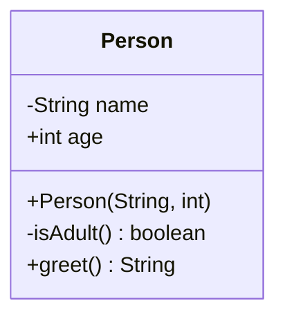

# Classes

Every `.smali` file declares exactly one class, using a small set of directives that read like assembly: statements starting with `.` (`.class`, `.super`, `.implements`, `.field`, `.method`, ...) followed by their arguments.

## Declaring a class

```smali
.class public LMyClass;
.super Ljava/lang/Object;
```

`.class` declares the class itself, together with its access flags (`public`, `final`, `abstract`, `interface`, ...) and its fully-qualified name as a [[Types|type descriptor]] (`L` + package/name with `/` separators + `;`). `.super` declares the parent class — almost every class ends up extending `Ljava/lang/Object;` directly or indirectly, since it sits at the root of the type hierarchy.

### Access flag combinations

| Flags | Meaning |
| --- | --- |
| `public` | visible from any package |
| (no flag) | package-private (default Java visibility) |
| `public final` | cannot be subclassed |
| `public abstract` | cannot be instantiated directly, may contain unimplemented methods |
| `public interface abstract` | an interface — always implicitly `abstract` |
| `public enum` | an enum type (compiles down to a final class extending `Ljava/lang/Enum;`) |

### Interfaces and multiple implementation

```smali
.class public interface abstract LDrawable;
.super Ljava/lang/Object;

.method public abstract draw()V
.end method
```

A class that implements one or more interfaces lists them with `.implements`, one directive per interface:

```smali
.class public LCircle;
.super Ljava/lang/Object;
.implements LDrawable;
.implements Ljava/io/Serializable;
```

Unlike `.super` (single parent, matching Java's single inheritance), `.implements` can appear multiple times.

### Fields

```smali
.field <access-flags> <name>:<type>
```

Declares an instance or static variable of the class. Common flags: `public`, `private`, `protected`, `static`, `final`, `volatile`, `transient`. A field can optionally carry a default value directly in the declaration (only meaningful for `static final` primitives/`String`, mirroring Java compile-time constants):

```smali
.field private nome:Ljava/lang/String;
.field public eta:I
.field public static final MAX_SIZE:I = 0x64
```

### Direct methods vs virtual methods

Method bodies are grouped, by convention, under two comments generated by `baksmali` when disassembling:

```smali
# direct methods
...
# virtual methods
...
```

**Direct methods** are constructors (`<init>`), `static` methods, and `private` methods: anything the runtime can resolve at compile time, without needing dynamic dispatch. **Virtual methods** are everything else — `public`/`protected` instance methods, which _can_ be overridden by a subclass and therefore must be resolved based on the object's actual runtime type. This distinction drives which `invoke-*` instruction is used to call them — see [[Methods]].

> [!tip] Why the constructor is a direct method
>
> `<init>` can never be overridden by a subclass (a subclass defines its _own_ constructor, which explicitly chains to the parent's via `invoke-direct ... Lparent;-><init>(...)V`). Because there is no override to resolve, the VM treats it like a private method: resolved statically, not through virtual dispatch.

## Worked example

```java
public class Person {
    private String name;
    public int age;

    public Person(String name, int age) {
        this.name = name;
        this.age = age;
    }

    private boolean isAdult() {
        return age >= 18;
    }

    public String greet() {
        return "Hello, I'm " + name;
    }
}
```

```smali
.class public LPerson;
.super Ljava/lang/Object;

# fields
.field private name:Ljava/lang/String;
.field public age:I

# direct methods (constructor + private methods)
.method public constructor <init>(Ljava/lang/String;I)V
    .locals 0
    .line 1
    invoke-direct {p0}, Ljava/lang/Object;-><init>()V
    iput-object p1, p0, LPerson;->name:Ljava/lang/String;
    iput p2, p0, LPerson;->age:I
    return-void
.end method

.method private isAdult()Z
    .locals 2
    iget v0, p0, LPerson;->age:I
    const/16 v1, 0x12
    if-lt v0, v1, :cond_0
    const/4 v0, 0x1
    return v0
    :cond_0
    const/4 v0, 0x0
    return v0
.end method

# virtual methods (public methods)
.method public greet()Ljava/lang/String;
    .locals 2
    new-instance v0, Ljava/lang/StringBuilder;
    invoke-direct {v0}, Ljava/lang/StringBuilder;-><init>()V
    const-string v1, "Hello, I\'m "
    invoke-virtual {v0, v1}, Ljava/lang/StringBuilder;->append(Ljava/lang/String;)Ljava/lang/StringBuilder;
    iget-object v1, p0, LPerson;->name:Ljava/lang/String;
    invoke-virtual {v0, v1}, Ljava/lang/StringBuilder;->append(Ljava/lang/String;)Ljava/lang/StringBuilder;
    invoke-virtual {v0}, Ljava/lang/StringBuilder;->toString()Ljava/lang/String;
    move-result-object v0
    return-object v0
.end method
```



| Java element | Smali directive | Section |
| --- | --- | --- |
| `class Person` | `.class public LPerson;` | header |
| `extends X` (implicit `Object`) | `.super Ljava/lang/Object;` | header |
| `implements X` | `.implements LX;` | header |
| instance/static variable | `.field <flags> <name>:<type>` | fields |
| constructor, private method | under `# direct methods` | [[Methods]] |
| public method | under `# virtual methods` | [[Methods]] |

## More examples

- [[Basic-Class-HelloWorld]] — the simplest possible class, end to end
- [[Interface-Implementation]] — `.implements`, abstract methods, `invoke-interface`

Real-world fragments illustrating this chapter live in `snippets/` — see [[Demo-Example-Class]] for the expected format.

## See also

- [[Methods]] — `.method`, constructors, and internal directives
- [[Registers]] — how `this` and parameters are passed to methods
- [[Types]] — type syntax used in `.field` and method signatures
- [[Dalvik-Instructions|Instructions]] — instruction categories referenced above (`invoke-*`, `iput`/`iget`, ...)

## References

- [[Dalvik-Bytecode-Bibliography|Bibliography]]

## Flashcards
#flashcards

What is the difference between a direct method and a virtual method in Dalvik?::Direct methods (constructors, `static`, `private`) are resolved at compile time; virtual methods (public/protected instance methods) are resolved at runtime based on the object's actual type, to support overriding.
Which directive declares the parent class of a smali class?::`.super`
How does a class declare that it implements an interface, and can it do so more than once?::With `.implements Linterface;`; yes, it can appear once per implemented interface.
