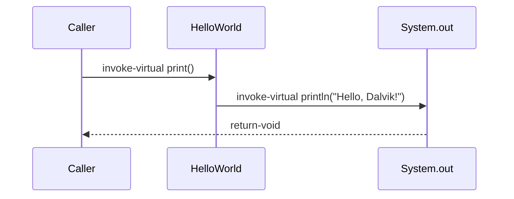

# Example: Basic Class HelloWorld

The classic "Hello World", to see every piece of [[Classes]] and [[Methods]] working together for the first time.

## Java source

```java
public class HelloWorld {
    public void print() {
        System.out.println("Hello, Dalvik!");
    }
}
```

## Generated smali

```smali
.class public LHelloWorld;
.super Ljava/lang/Object;
.source "HelloWorld.java"

# direct methods
.method public constructor <init>()V
    .locals 0
    invoke-direct {p0}, Ljava/lang/Object;-><init>()V
    return-void
.end method

# virtual methods
.method public print()V
    .locals 2
    sget-object v0, Ljava/lang/System;->out:Ljava/io/PrintStream;
    const-string v1, "Hello, Dalvik!"
    invoke-virtual {v0, v1}, Ljava/io/PrintStream;->println(Ljava/lang/String;)V
    return-void
.end method
```

## Step by step

1. `.class public LHelloWorld;` / `.super Ljava/lang/Object;` declare the class and its superclass ([[Classes]]).
2. The implicit default constructor becomes `<init>()V`, a _direct method_ that chains to `Object`'s constructor ([[Methods]]).
3. `print()` is a public _virtual method_; `.locals 2` reserves two local registers (`v0`, `v1`) — no parameters besides `this` ([[Registers]]).
4. `sget-object` reads a **static** field (`System.out`); `const-string` loads a string literal; `invoke-virtual` calls `println`, resolved at runtime.

## Diagram



## See also

- [[Classes]]
- [[Methods]]
- [[Constructor-and-Fields]]

## References

- [[Dalvik-Bytecode-Bibliography|Bibliography]]
