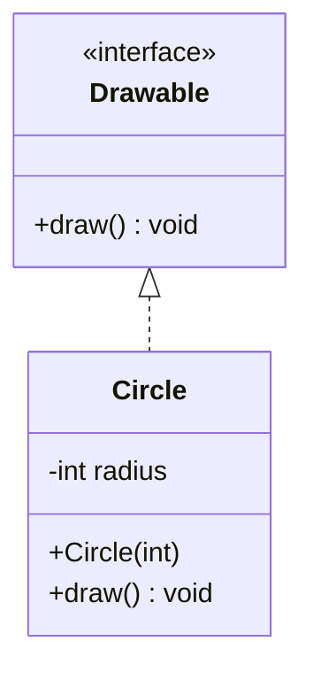

# Example: Interface Implementation

How an interface and an implementing class translate to smali, extending the `.implements` syntax introduced in [[Classes]].

## Java source

```java
public interface Drawable {
    void draw();
}

public class Circle implements Drawable {
    private int radius;

    public Circle(int radius) {
        this.radius = radius;
    }

    @Override
    public void draw() {
        System.out.println("Drawing a circle of radius " + radius);
    }
}
```

## Generated smali

```smali
.class public interface abstract LDrawable;
.super Ljava/lang/Object;

.method public abstract draw()V
.end method
```

```smali
.class public LCircle;
.super Ljava/lang/Object;
.implements LDrawable;

.field private radius:I

.method public constructor <init>(I)V
    .locals 0
    invoke-direct {p0}, Ljava/lang/Object;-><init>()V
    iput p1, p0, LCircle;->radius:I
    return-void
.end method

.method public draw()V
    .locals 3
    sget-object v0, Ljava/lang/System;->out:Ljava/io/PrintStream;
    new-instance v1, Ljava/lang/StringBuilder;
    invoke-direct {v1}, Ljava/lang/StringBuilder;-><init>()V
    const-string v2, "Drawing a circle of radius "
    invoke-virtual {v1, v2}, Ljava/lang/StringBuilder;->append(Ljava/lang/String;)Ljava/lang/StringBuilder;
    iget v2, p0, LCircle;->radius:I
    invoke-virtual {v1, v2}, Ljava/lang/StringBuilder;->append(I)Ljava/lang/StringBuilder;
    invoke-virtual {v1}, Ljava/lang/StringBuilder;->toString()Ljava/lang/String;
    move-result-object v1
    invoke-virtual {v0, v1}, Ljava/io/PrintStream;->println(Ljava/lang/String;)V
    return-void
.end method
```

## Step by step

1. `Drawable` compiles to a class flagged `interface abstract`; its single method has no body — just the signature followed directly by `.end method` (see [[Methods]]).
2. `Circle` lists the interface it implements with `.implements LDrawable;`, in addition to its regular `.super Ljava/lang/Object;`.
3. At the call site, code holding a `Drawable`-typed reference to a `Circle` invokes `draw()` with `invoke-interface`, not `invoke-virtual` — see the comparison table in [[Methods]].

```smali
# calling draw() through a Drawable-typed reference
invoke-interface {v0}, LDrawable;->draw()V
```

> [!tip] invoke-interface vs invoke-virtual
>
> Both resolve the target method at runtime based on the object's actual class. The distinction is about _how_ the call site itself refers to the method: through a class type (`invoke-virtual`) or through an interface type (`invoke-interface`), which uses a different runtime lookup table (the interface method table rather than the class vtable).

## Diagram



## See also

- [[Classes]] — `.implements`
- [[Methods]] — abstract methods, `invoke-interface`

## References

- [[Dalvik-Bytecode-Bibliography|Bibliography]]
