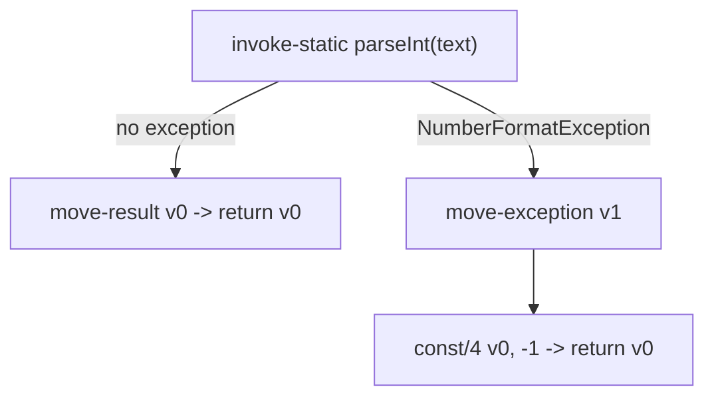

# Example: Exception Handling

How a `try`/`catch` block compiles down using the `.catch` directive introduced in [[Methods]].

## Java source

```java
public class SafeParser {
    public int parseOrDefault(String text) {
        try {
            return Integer.parseInt(text);
        } catch (NumberFormatException e) {
            return -1;
        }
    }
}
```

## Generated smali

```smali
.class public LSafeParser;
.super Ljava/lang/Object;

.method public constructor <init>()V
    .locals 0
    invoke-direct {p0}, Ljava/lang/Object;-><init>()V
    return-void
.end method

.method public parseOrDefault(Ljava/lang/String;)I
    .locals 2
    .catch Ljava/lang/NumberFormatException; {:try_start .. :try_end} :catch_block

    :try_start
    invoke-static {p1}, Ljava/lang/Integer;->parseInt(Ljava/lang/String;)I
    move-result v0
    return v0
    :try_end

    :catch_block
    move-exception v1
    const/4 v0, -0x1
    return v0
.end method
```

## Step by step

1. `.catch <type> {:start .. :end} :handler` declares a protected region: any `NumberFormatException` (or subtype) thrown between `:try_start` and `:try_end` transfers control to `:catch_block` ([[Methods]]).
2. Inside the try region, `invoke-static` calls `Integer.parseInt`, and `move-result` captures its `int` return value into `v0`.
3. At the top of the catch block, `move-exception` captures the thrown exception object into a register — even when, as here, the handler doesn't use it beyond returning a default value.
4. Both paths converge on the same kind of `return v0`, but reach it through different control flow.

> [!tip] `.catchall`
>
> A `catch (Throwable t)` block, or the compiler-generated cleanup code for a `finally` block, is expressed the same way but with `.catchall {:start .. :end} :handler` — no exception type is specified, since it matches everything.

## Diagram



## See also

- [[Methods]] — `.catch`/`.catchall`
- [[Dalvik-Instructions|Instructions]] — `throw`, `move-exception`

## References

- [[Dalvik-Bytecode-Bibliography|Bibliography]]
