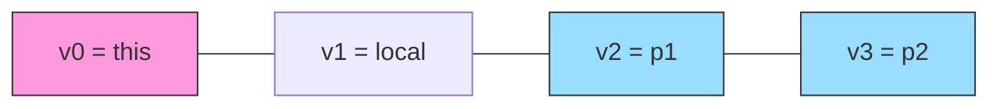
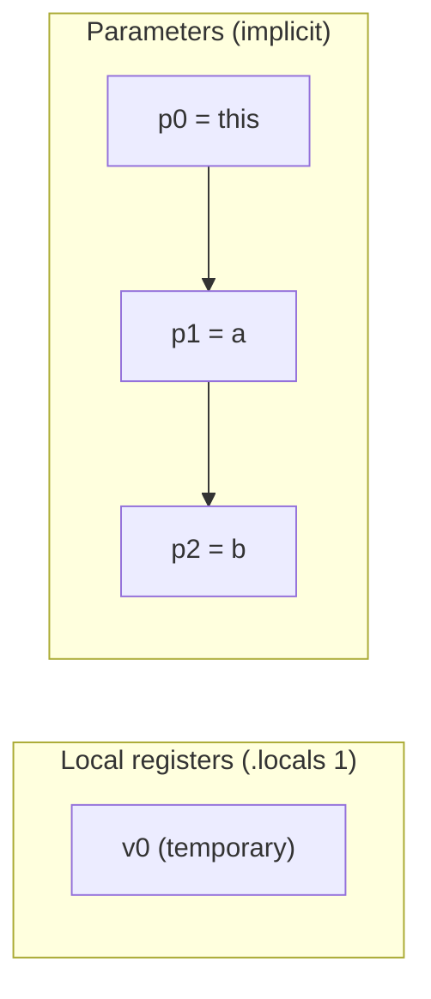

# Registers

Dalvik is a **register-based** virtual machine (unlike the stack-based classic JVM). Every method operates on its own set of numbered registers `v0, v1, v2, ...`, of which the last N are also addressable as `p0, p1, ...` — the method's parameters.

## Storage size and wide values

Each register holds up to 32 bits of data. Whenever a value needs 64 bits (`long`, `double` — see [[Types]]), it is split across **two consecutive registers**: the low-order half in the lower-numbered register, the high-order half in the next one. Such a register pair is usually referred to by its first register only (e.g. "the `long` in `v2`" really means `v2`-`v3`).

```smali
# c = a + b, where a, b, c are all `long` (each spanning 2 registers)
add-long v0, v2, v4     # v0-v1 = (v2-v3) + (v4-v5)
```

Because of this pairing, once a wide value occupies `v2`-`v3`, the next _free_ register is `v4`, not `v3` — a common source of off-by-one confusion when hand-editing smali.

## `.registers` — total register count

```smali
.registers <NUM_REGISTERS>
```

Declares the **total** number of registers used by the method, parameters included. When a method has parameters, they occupy the _last_ N registers of this total.

## `.locals` — local-only count (the common case)

```smali
.locals <NUM_REGISTERS>
```

Declares only the number of **local** registers — the ones that do _not_ hold parameters. Parameters are still available, addressed separately as `p0, p1, ...`, and are not counted here. This is by far the more common directive, since it doesn't require recomputing indices when the parameter list changes.

```
v0, v1, v2, v3, v<N>...
p0, p1, p2, p3, p<N>...
```

`v` registers are used for local variables and temporaries; `p` registers are used for parameters. `p0` is equivalent to Java's `this` keyword — unless the method is `static`, in which case there is no implicit receiver and `p0` is already the first real parameter.

## How `.registers` maps parameters onto `v` registers

When `.registers` is used instead of `.locals`, parameters are stored in the **last** N `v` registers. For example, a method with one local variable and two parameters, declared with `.registers 4`, occupies `v0`-`v3` as follows:

| Register | Role | Notes |
| --- | --- | --- |
| `v0` | `this` | object reference (absent for `static` methods) |
| `v1` | local variable | free for the method's own use |
| `v2` | first parameter (`p1`) | mapped automatically by `.registers` |
| `v3` | second parameter (`p2`) | last register → last parameter |



> [!warning] Changing `.registers` shifts every index
>
> If you go from `.registers 4` to `.registers 5` to make room for one more local variable, **the parameters' indices shift** — because they always sit in the last N registers. Every reference to a parameter or pre-existing local must be updated consistently; forgetting this is one of the most common bugs when hand-patching smali.

### `.locals` — the same example, the common way

```smali
.method public example(II)V
    .locals 1
    # v0 = local variable; p0 = this, p1, p2 = parameters, addressed separately
    ...
.end method
```

Here `.locals 1` declares a **single local register** (`v0`); the parameters (`p0` = `this`, `p1`, `p2`) are automatically available on the side and are not counted in `.locals`.



## Static methods: no `this`

```smali
.method public static sum(II)I
    .locals 1
    add-int v0, p0, p1
    return v0
.end method
```

Being `static`, there is no `this`: `p0` is already the first real parameter (not `v0`/`this` as in the instance-method examples above).

## The `move-*` family and register-to-register copies

Values don't automatically flow between registers — an explicit `move` is required whenever a value needs to be relocated, e.g. after a method call whose result must be read out of the "result register":

| Instruction | Moves |
| --- | --- |
| `move` | a 32-bit value between two registers |
| `move-wide` | a 64-bit value between two register pairs |
| `move-object` | an object reference between two registers |
| `move-result` | the 32-bit return value of the last `invoke-*` into a register |
| `move-result-wide` | the 64-bit return value of the last `invoke-*` |
| `move-result-object` | the object reference returned by the last `invoke-*` |
| `move-exception` | the currently-handled exception into a register, at the start of a catch block (see [[Methods]]) |

## More examples

- [[Constructor-and-Fields]] — an explicit `.registers` layout in practice

## See also

- [[Classes]] — direct vs virtual methods
- [[Methods]] — method declaration and `.locals`/`.line`
- [[Types]] — size of 64-bit types and register pairs
- [[Dalvik-Instructions|Instructions]] — full instruction catalogue, including the `move-*`/arithmetic families

## References

- [[Dalvik-Bytecode-Bibliography|Bibliography]]

## Flashcards
#flashcards

Why do `long` and `double` values occupy two registers instead of one?::Because Dalvik registers are 32 bits wide, and both types are 64-bit; the value is split across two consecutive registers.
What is the key difference between `.locals` and `.registers`?::`.locals` counts only local (non-parameter) registers, with parameters addressed separately as `p0..pN`; `.registers` counts the total (locals + parameters), with parameters occupying the last N registers of that total.
What happens to `p0` in a static method compared to an instance method?::In an instance method `p0` holds `this`; in a static method there is no `this`, so `p0` is already the first real parameter.
