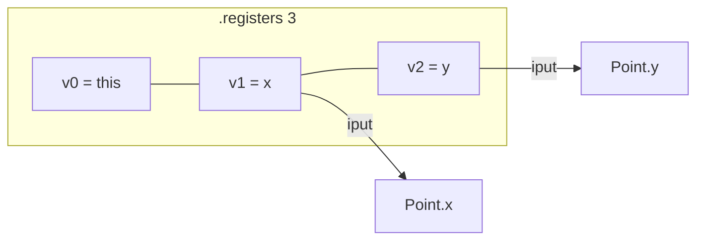

# Example: Constructor and Fields

How a constructor initializes an instance's fields (`.field`), reading/writing them through `iput`/`iget`, and how an explicit `.registers` layout maps parameters onto registers in practice.

## Java source

```java
public class Point {
    private int x;
    private int y;

    public Point(int x, int y) {
        this.x = x;
        this.y = y;
    }

    public int distanceFromOriginSquared() {
        return x * x + y * y;
    }
}
```

## Generated smali

```smali
.class public LPoint;
.super Ljava/lang/Object;

.field private x:I
.field private y:I

.method public constructor <init>(II)V
    .registers 3
    # v0 = this, v1 = p1 (x), v2 = p2 (y)
    invoke-direct {v0}, Ljava/lang/Object;-><init>()V
    iput v1, v0, LPoint;->x:I
    iput v2, v0, LPoint;->y:I
    return-void
.end method

.method public distanceFromOriginSquared()I
    .locals 2
    iget v0, p0, LPoint;->x:I
    iget v1, p0, LPoint;->y:I
    mul-int v0, v0, v0
    mul-int v1, v1, v1
    add-int/2addr v0, v1
    return v0
.end method
```

## Step by step

1. The two fields become two `.field private <name>:I` directives ([[Types]]).
2. The constructor uses `.registers 3` instead of `.locals` to make the mapping explicit: `v0`=`this`, `v1`=`x`, `v2`=`y` ([[Registers]]).
3. `iput <source>, <object>, <Class>;-><field>:<type>` writes an instance field; `iget` reads it, with the same operand order.
4. `distanceFromOriginSquared()` uses `.locals 2` (the more common style) and computes `x*x + y*y` with `mul-int`/`add-int/2addr` (see [[Dalvik-Instructions|Instructions]]).

## Diagram



## See also

- [[Registers]] — `.locals` vs `.registers`
- [[Classes]] — `.field`
- [[Basic-Class-HelloWorld]]

## References

- [[Dalvik-Bytecode-Bibliography|Bibliography]]
