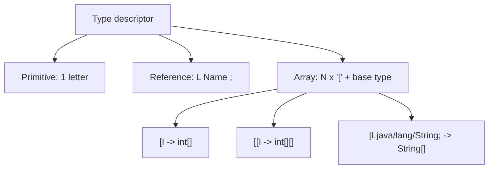

# Types

Dalvik identifies every type with a compact textual **descriptor**: a single letter for primitive types, `L<Name>;` for object references, and one or more leading `[` for arrays.

## Primitive types

| Symbol | Java type | Size |
| --- | --- | --- |
| `V` | `void` | — (return type only) |
| `Z` | `boolean` | 32 bit (in registers) |
| `B` | `byte` | 32 bit (in registers) |
| `S` | `short` | 32 bit (in registers) |
| `C` | `char` | 32 bit (in registers) |
| `I` | `int` | 32 bit — 1 register |
| `F` | `float` | 32 bit — 1 register |
| `J` | `long` | 64 bit — **2 consecutive registers** (e.g. `v0`-`v1`) |
| `D` | `double` | 64 bit — **2 consecutive registers** (e.g. `v0`-`v1`) |
| `L<Class>;` | object / reference | 32 bit (pointer) — 1 register |

> See the quick-reference version in [[Dalvik-Type-Table]].

> [!tip] Why `long`/`double` occupy two registers
>
> Dalvik registers are 32 bits wide (see [[Registers]]); a 64-bit value is split across a pair of consecutive registers. If a `long` occupies `v2`-`v3`, the next free register is `v4`, **not** `v3`.

Note that only `Z`, `B`, `S`, `C`, `I`, `F` actually fit a _single_ register at the bit level even though the JVM/Dalvik spec formally lists them as distinct types — the verifier still tracks them as distinct types for type-safety purposes, even though at the bytecode level `boolean`/`byte`/`short`/`char` are frequently manipulated with plain `int` arithmetic instructions and only re-narrowed when stored back into a field or array of that exact type.

## Reference types

A reference to a class instance is written as `L` + fully-qualified name (with `/` instead of `.` as the package separator) + `;`:

```
Ljava/lang/Object;
Ljava/lang/String;
Lcom/example/myapp/MainActivity;
```

There is no unboxed/boxed distinction at the descriptor level for wrapper classes: `java.lang.Integer` is simply `Ljava/lang/Integer;`, a plain reference type like any other — boxing/unboxing is expressed through explicit calls to `valueOf`/`intValue` and friends, not through special syntax.

## Arrays

Dalvik declares arrays by prefixing the base type's descriptor with the `[` character. Adding more than one `[` creates multi-dimensional arrays:

```
I      -> int
[I     -> int[]
[[I    -> int[][]

Ljava/lang/Object;     -> Object
[Ljava/lang/Object;    -> Object[]
[[Ljava/lang/Object;   -> Object[][]
```



```java
int[] numbers;
int[][] grid;
String[] names;
```

```smali
.field private numbers:[I
.field private grid:[[I
.field private names:[Ljava/lang/String;
```

> [!note] An `int[][]` is an array of `int[]`, not a flat block
>
> `[[I` is really "array of (array of int)": each row is an independent `[I` object with its own length. This matters when reading/writing elements — see [[Multidimensional-Arrays|the worked example]].

## Method descriptors

The general syntax used to refer to a method (used by `invoke-*`, see [[Methods]]) is:

```
L<ClassName>;-><methodName>(<param-type-1><param-type-2>...)<return-type>
```

Completing the classic example — the Java method:

```java
Object method(int, int, String, boolean)
```

declared inside, say, a class `Example`, becomes in smali:

```smali
.class public LExample;
.super Ljava/lang/Object;

.method public method(IILjava/lang/String;Z)Ljava/lang/Object;
    .locals 1
    # p0 = this, p1 = int, p2 = int, p3 = String, p4 = boolean
    const/4 v0, 0x0
    return-object v0
.end method
```

and its full descriptor, as it would appear inside an `invoke-virtual` instruction, is:

```
LExample;->method(IILjava/lang/String;Z)Ljava/lang/Object;
```

| Descriptor portion | Meaning |
| --- | --- |
| `LExample;` | class declaring the method |
| `->` | class/member separator (also used for fields, see [[Classes]]) |
| `method` | method name |
| `(IILjava/lang/String;Z)` | parameters, **with no separators**: `int, int, String, boolean` |
| `Ljava/lang/Object;` | return type |

> [!warning] No commas, no spaces
>
> Parameter types in a signature have **no commas and no spaces**: `(IILjava/lang/String;Z)` is simply the four descriptors `I`, `I`, `Ljava/lang/String;`, `Z` written back to back. The trailing `;` on every reference type is exactly what lets a parser tell one descriptor from the next.

## More examples

- [[Multidimensional-Arrays]] — `int[][]` end to end, with `aget`/`aput`

## See also

- [[Classes]] — `.field` uses the same type descriptors
- [[Methods]] — method signatures and return values
- [[Registers]] — how 64-bit types affect register allocation
- [[Dalvik-Type-Table]] (quick reference)

## References

- [[Dalvik-Bytecode-Bibliography|Bibliography]]

## Flashcards
#flashcards

What descriptor represents `String[][]`?::`[[Ljava/lang/String;`
Why must every reference-type descriptor end with `;`?::Because it's the only delimiter that lets a parser know where one type descriptor ends and the next one (e.g. the next parameter) begins.
In the descriptor `(IILjava/lang/String;Z)V`, how many parameters does the method take, and what are their types?::Four parameters: `int`, `int`, `java.lang.String`, `boolean`; the method returns `void`.
