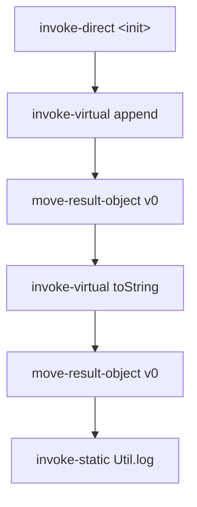

# Example: Invoke-Kinds-And-Move-Result

## Goal

Show how the five `invoke-*` kinds encode *which dispatch rule* a call uses, and how `move-result*` is a separate instruction that must immediately follow an invoke to capture its return value. Belongs to [[Dalvik-Instructions]]. Reading these correctly is the difference between reconstructing a real call graph and misattributing a call to the wrong class.

## Walkthrough

```smali
# String s = new StringBuilder().append("id=").append(n).toString();
new-instance v0, Ljava/lang/StringBuilder;
invoke-direct {v0}, Ljava/lang/StringBuilder;-><init>()V        # constructor -> invoke-direct

const-string v1, "id="
invoke-virtual {v0, v1}, Ljava/lang/StringBuilder;->append(Ljava/lang/String;)Ljava/lang/StringBuilder;
move-result-object v0                                           # capture the returned builder

invoke-virtual {v0, p1}, Ljava/lang/StringBuilder;->append(I)Ljava/lang/StringBuilder;
move-result-object v0

invoke-virtual {v0}, Ljava/lang/StringBuilder;->toString()Ljava/lang/String;
move-result-object v0                                          # v0 now holds the String

invoke-static {v0}, Lcom/example/Util;->log(Ljava/lang/String;)V   # static helper -> invoke-static
```

## Step by step

1. `invoke-direct {v0}, ...-><init>()V` runs the constructor on the freshly `new-instance`'d object — `invoke-direct` is for non-virtual instance calls: constructors and `private` methods. The receiver is the first register in the list (`v0`).
2. `invoke-virtual` is dynamic dispatch on `append`/`toString` — the actual method run depends on the receiver's runtime type. This is the common case for public/protected instance methods; a call graph edge here is "to whatever overrides this at runtime", which for a `final`/concrete class like `StringBuilder` is unambiguous.
3. **`move-result-object` is not part of the invoke** — it's a distinct instruction that must come *immediately after* the invoke to grab the just-returned reference into a register. Miss it and the return value is discarded; a stray instruction between the invoke and the `move-result*` is illegal. `move-result` (32-bit), `move-result-wide` (64-bit), and `move-result-object` (reference) pick the width, matching the method's return type.
4. `invoke-static {v0}` names the helper directly with no receiver object — `v0` is the first *argument*, not a `this`. The other two kinds not shown here: `invoke-interface` (call through an interface reference, resolved to the implementing class at runtime) and `invoke-super` (explicit superclass implementation, used inside overrides).
5. Every one of these carries the full target `Class;->name(params)ret` inline — which is exactly what a reflective call (see [[Reflection-and-Runtime-Internals]]) hides by routing through `Method.invoke` instead.

## Diagram



## See also

- [[Dalvik-Instructions]]
- [[Methods]] — the dispatch rules behind each invoke kind.
- [[Reflection-and-Runtime-Internals]] — how a reflective call erases the target these instructions name explicitly.

## References

- [[Dalvik-Bytecode-Bibliography|Bibliography]]
