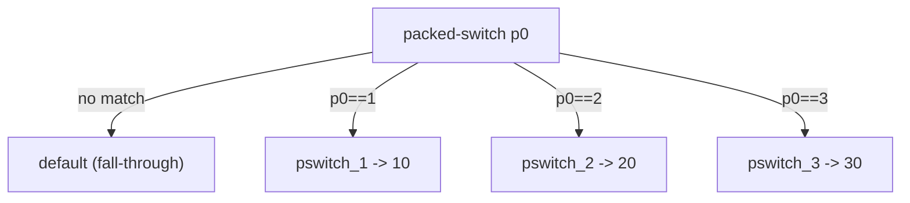

# Example: Packed-Switch-Multi-Way-Branch

## Goal

Show how a Java `switch` compiles to `packed-switch` (or `sparse-switch`) plus a `.packed-switch` payload table, and how to read the branch targets back into cases. Belongs to [[Dalvik-Instructions]]. Switch tables look intimidating cold, but they're mechanical once you know the payload's shape.

## Walkthrough

```smali
# switch (cmd) { case 1: ...; case 2: ...; case 3: ...; default: ... }
packed-switch p0, :pswitch_data_0

# fall-through here == the default branch
const/4 v0, 0x0
return v0

:pswitch_1                # case 1
const/4 v0, 0xa
return v0

:pswitch_2                # case 2
const/4 v0, 0x14
return v0

:pswitch_3                # case 3
const/4 v0, 0x1e
return v0

:pswitch_data_0
.packed-switch 0x1        # first case key = 1; subsequent keys are 2, 3, ... consecutively
    :pswitch_1
    :pswitch_2
    :pswitch_3
.end packed-switch
```

## Step by step

1. `packed-switch p0, :pswitch_data_0` tests `p0` against a **contiguous** range of keys whose targets are listed in the `.packed-switch` payload at `:pswitch_data_0`. The payload's argument `0x1` is the *first* key; the entries that follow map to keys `1, 2, 3` in order (packed = no gaps).
2. Control falls through the `packed-switch` instruction only when `p0` matches **no** key — so the instructions immediately after it are the `default:` branch. This is easy to misread as "case 1"; the labeled `:pswitch_N` blocks are the real cases.
3. Each payload entry is a label; the Nth entry is the target for key `first_key + (N-1)`. Here `:pswitch_1` → key 1, `:pswitch_2` → key 2, `:pswitch_3` → key 3.
4. `sparse-switch` is the sibling for **non-contiguous** keys (e.g. `case 1, case 100, case 5000`): its `.sparse-switch` payload lists explicit `key -> label` pairs instead of a single starting key, because the keys can't be inferred by counting. A compiler picks packed vs sparse based on how dense the case values are.
5. Reconstructing the `switch` is just inverting the table: default = fall-through, and each `:pswitch_N` block is the case for its computed key.

## Diagram



## See also

- [[Dalvik-Instructions]]
- [[Reading-Raw-Dalvik]] — reading switch-driven state machines in obfuscated code.
- [[Control-Flow-Patterns]] in [[ARM64-Android]] — how the same `switch` looks as a native jump table.

## References

- [[Dalvik-Bytecode-Bibliography|Bibliography]]
