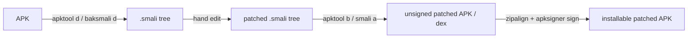

# Reading-Raw-Dalvik

## In short

Every example in [[Classes]] through [[Dalvik-Instructions|Instructions]] is clean, hand-written smali — real method names, no dead code, one idea per snippet — because that's what makes each concept legible in isolation. A real release APK almost never looks like that: a commercial hardening/obfuscation tool has typically renamed every non-public identifier to a short, non-descriptive token (`$$a`, `$10`, or a real Android API name borrowed as camouflage — `onNavigationEvent`, `ICustomTabsCallback`), encrypted every string literal into a byte/char array decoded only at runtime, wrapped security-relevant API calls behind custom reflection helpers so the call site never names its real target, and interleaved all of it with opaque-predicate bookkeeping designed to look identical whether or not it does anything. `jadx` (see [[Dalvik-Bytecode-Bibliography|Bibliography]]) will often choke on code like this — its Java-reconstruction either fails outright or produces something that no longer resembles real Java — which pushes you back to the one thing that's always faithful to what actually executes: raw `baksmali` output, read with no synthesized comments and no decompiler's guesses to lean on. This chapter takes real methods from a single hardened app (the `net.pluservice.tua` case study — see [[Tua-Case-Study]] and its source under `Case-Studies/tua/source/smali/`) and reads them cold, then covers the other half of the same skill: once you've understood what a method does, how to hand-edit its `.smali` to change what it does. As in [[Reading-Raw-Disassembly]], each code block below carries `#` comments — but those are the **reader's own working notes, written after doing the deduction**, not something `baksmali` produced; the prose beneath each block is where the actual reasoning happens.

## Explanation

### The checklist

Seven things to check, roughly in order, whenever a method has non-identifier names and no readable strings:

1. **Separate real control flow from opaque-predicate bookkeeping.** A recurring quadruple — `sget vX, ...:I` / `add-int/lit8 vX, vX, <k>` / `rem-int/lit16 vY, vX, 0x80` / `sput vY, ...:I` / `rem-int/2addr vX, v0` (with `v0` a small constant, usually `2`) — updates a pair of static counters that cycle mod 128. Whether it *matters* depends entirely on one thing: is the final `rem-int/2addr` result register read by anything afterward, or overwritten/discarded before it's ever used? The shape alone never tells you; you have to trace the one register forward.
2. **Identify decoder helper methods by signature, not name.** `private static` methods taking a handful of `B`/`S`/`I`/`C[]` parameters (often with cheap `mul-int/lit8`/`rsub-int/lit8`/`add-int/lit8` transforms applied to them immediately) and returning `Ljava/lang/String;`, or taking a trailing `[Ljava/lang/Object;` out-parameter and writing index `0`, are string decoders — called repeatedly, each call site supplying different literal arguments and a different `fill-array-data` block, never a plain `const-string`.
3. **Recognize reflection indirection.** A call to a one-`int`-argument static method (a cache lookup by an opaque numeric key) immediately `if-nez`-checked; on a cache miss, a slow path builds a class/member name (often via a decoder from #2) and calls a second, differently-shaped static method that actually resolves it; either way the result is `check-cast` to `Ljava/lang/reflect/{Field,Method,Constructor}` and immediately `.get`/`.set`/`.invoke`d. The real API being called never appears as a plain `invoke-*` anywhere in the method.
4. **Treat a null-check on a `private static final` field as almost always dead.** A field written exactly once, inside `<clinit>`, is guaranteed non-null by the time any other static method on that class becomes reachable — Dalvik runs `<clinit>` first. `if-nez <that field>, :cond_X` guarding an alternate path is boilerplate for confusing CFG-recovery tools, not a real branch; the live path is the one that runs after the class has obviously already finished initializing.
5. **Follow register aliasing across merge points.** Blocks of `move vA, vB` / `move vB, vA`-style shuffling right before a `goto` that rejoins another branch exist so that whichever path you came from, the registers hold values in the positions the joined code expects — this is data plumbing, not computation; skip past it once you've confirmed what ends up where.
6. **Don't hand-simulate a self-referential decode loop under time pressure.** A loop that indexes its own key/delta table using a value it *just produced* (rather than a fixed `+1` stride) is a deliberately-designed stream decoder — recognize the shape, but reimplement the handful of arithmetic instructions in a short script (or just call the real method dynamically, see [[Frida-Dynamic-Instrumentation]]) rather than trace it by eye; a single sign or off-by-one mistake produces a wrong answer that still looks plausible, with no local signal that you got it wrong.
7. **Separate shape from identity, same as in [[Reading-Raw-Disassembly]].** "This resolves some reflective member via a decoded name and invokes it" is a shape-only conclusion, reachable from the bytes alone. "This is `PackageManager.getPackageInfo`" or "this string is `SCRTYMANAGER`" is identity — supplied by dynamic tracing (as in [[Anti-Tampering-Pattern-Workflow]]) or by actually running the decoder, never by staring at the arithmetic harder.

### A note on honesty

Nothing below claims to divine a decoded string's exact contents from the arithmetic alone where doing so would require hand-simulating a loop with data-dependent addressing — checklist item 6 exists precisely because that kind of hand-tracing is where confident-sounding static analysis quietly goes wrong. Where the bytes genuinely can't settle a question without running the code, the prose says so and says what to do instead, the same policy [[Reading-Raw-Disassembly]] follows for stripped ARM64.

## Worked example 1 (simple): a lazy-init cache mistaken for a security check

`DeviceIdProvider.onMessageChannelReady()`, from `Case-Studies/tua/source/smali/net/pluservice/plugins/DeviceInformation/DeviceIdProvider.smali` — the one obfuscated-looking method in an otherwise plain, readable class, which is exactly why it's worth reading cold first:

```smali
.method public static onMessageChannelReady()I
    .locals 2
    sget v0, Lnet/pluservice/plugins/DeviceInformation/DeviceIdProvider;->onNavigationEvent:I   # v0 = call counter (starts at 0, never reset)
    const v1, 0x944f68                    # v1 = 9,762,664 (an odd, specific modulus)
    rem-int v1, v0, v1                    # v1 = v0 mod 9762664
    add-int/lit8 v0, v0, 0x1              # v0 += 1
    sput v0, Lnet/pluservice/plugins/DeviceInformation/DeviceIdProvider;->onNavigationEvent:I   # persist the incremented counter
    if-eqz v1, :cond_0                    # first call (v0 was 0, so v0 mod anything == 0) -> recompute
    sget v0, Lnet/pluservice/plugins/DeviceInformation/DeviceIdProvider;->onMessageChannelReady:I  # every later call -> return the cached value
    return v0
    :cond_0
    invoke-static {}, Landroid/os/Process;->getElapsedCpuTime()J
    move-result-wide v0
    long-to-int v0, v0
    sput v0, Lnet/pluservice/plugins/DeviceInformation/DeviceIdProvider;->onMessageChannelReady:I  # cache it
    return v0
.end method
```

Reading it cold: two static `int` fields, one used purely as a call counter (checklist #1's quadruple shape is nowhere in sight — this is a *different*, simpler idiom). `v0 mod 0x944f68` is zero exactly when `v0` is a multiple of 9,762,664 — which, since `v0` only ever increments by one starting from zero, is true on the very first call and then not again for 9.7 million subsequent calls, i.e. for all practical purposes "true once, then never." That makes the `:cond_0` block a one-time initializer and everything past `if-eqz` on every later call a plain cache read — the entire method is `getElapsedCpuTime()`, computed once and memoized behind a modulus check standing in for a boolean flag. Nothing here reads like the `(JJ)V`-signature reflection hideouts [[Anti-Tampering-Pattern-Workflow]] found dynamically elsewhere in this same app, and nothing here is gated by anything an attacker or a debugger could meaningfully trip — it's just an odd way to write "if this is the first call, compute; otherwise, return the cached value."

**Shape-only conclusion:** a modulus-against-a-large-constant check that is true on call zero and structurally cannot be true again for millions of calls is a disguised one-shot lazy-init guard, not a security gate. **Needs a lookup:** nothing — this one resolves completely from the bytes, which is exactly the point of starting here: not every unusual-looking arithmetic gate in a hardened app is a trap, and confusing "looks like the obfuscator's other tricks" with "is one" wastes real investigation time. Compare directly against the `if-eqz`/`if-nez` gates in worked example 2, which use the checklist-#1 quadruple and *do* gate something adversarial.

## Worked example 2 (medium): three lifecycle overrides, one shared bookkeeping shape, two different intents

Four methods from `MainActivity.smali`, all overriding `CordovaActivity` lifecycle callbacks, all built from the exact same checklist-#1 quadruple — but only some of them actually consume what it computes.

`onCreate` first, since it's the control case — the quadruple appears **three times**, and every single occurrence is dead:

```smali
.method public onCreate(Landroid/os/Bundle;)V
    .locals 3
    const/4 v0, 0x2
    rem-int v1, v0, v0                     # v1 = 0, dead: overwritten below before any read
    invoke-super {p0, p1}, Lorg/apache/cordova/CordovaActivity;->onCreate(Landroid/os/Bundle;)V
    invoke-virtual {p0}, Lnet/pluservice/tua/MainActivity;->getIntent()Landroid/content/Intent;
    move-result-object p1
    invoke-virtual {p1}, Landroid/content/Intent;->getExtras()Landroid/os/Bundle;
    move-result-object p1
    if-eqz p1, :cond_1                     # <- the one REAL branch in this method: "were there extras at all?"
    sget v1, Lnet/pluservice/tua/MainActivity;->extraCallbackWithResult:I
    add-int/lit8 v1, v1, 0x69
    rem-int/lit16 v2, v1, 0x80
    sput v2, Lnet/pluservice/tua/MainActivity;->ICustomTabsCallbackStub:I
    rem-int/2addr v1, v0                   # v1 computed... and never read: overwritten by the next line
    const-string v1, "cdvStartInBackground" # <- the real work starts here
    const/4 v2, 0x0
    invoke-virtual {p1, v1, v2}, Landroid/os/Bundle;->getBoolean(Ljava/lang/String;Z)Z
    move-result p1
    const/4 v1, 0x1
    if-eq p1, v1, :cond_0                  # <- the other REAL branch: "was that extra true?"
    goto :goto_0
    :cond_0
    sget p1, Lnet/pluservice/tua/MainActivity;->extraCallbackWithResult:I
    add-int/lit8 p1, p1, 0x2b
    rem-int/lit16 v2, p1, 0x80
    sput v2, Lnet/pluservice/tua/MainActivity;->ICustomTabsCallbackStub:I
    rem-int/2addr p1, v0                   # again dead: p1 is overwritten right after
    invoke-virtual {p0, v1}, Lnet/pluservice/tua/MainActivity;->moveTaskToBack(Z)Z
    :cond_1
    :goto_0
    iget-object p1, p0, Lnet/pluservice/tua/MainActivity;->launchUrl:Ljava/lang/String;
    invoke-virtual {p0, p1}, Lnet/pluservice/tua/MainActivity;->loadUrl(Ljava/lang/String;)V
    sget p1, Lnet/pluservice/tua/MainActivity;->extraCallbackWithResult:I
    add-int/lit8 p1, p1, 0x55
    rem-int/lit16 v1, p1, 0x80
    sput v1, Lnet/pluservice/tua/MainActivity;->ICustomTabsCallbackStub:I
    rem-int/2addr p1, v0                   # dead a third time: the method returns immediately after
    return-void
.end method
```

The actual logic here is ordinary Cordova boilerplate — read the `cdvStartInBackground` intent extra, optionally call `moveTaskToBack`, then `loadUrl`, gated by two genuine `if`s that have nothing to do with counters. Every one of the three quadruples computes a `mod 2` result that gets immediately clobbered or the method returns before it's read; they exist purely so that grepping for "a counter update right before a branch" can't distinguish this method from `onPause` below by syntax alone.

`onPause`, `onResume`, and `onStart` share the identical quadruple shape, but here the mod-2 result is the branch condition itself, and each gates a different crash:

```smali
.method public onPause()V
    .locals 3
    const/4 v0, 0x2
    rem-int v1, v0, v0
    sget v1, Lnet/pluservice/tua/MainActivity;->ICustomTabsCallbackStub:I
    add-int/lit8 v1, v1, 0x4f
    rem-int/lit16 v2, v1, 0x80
    sput v2, Lnet/pluservice/tua/MainActivity;->extraCallbackWithResult:I
    rem-int/2addr v1, v0                   # v1 IS read next -- this quadruple is live
    invoke-super {p0}, Lorg/apache/cordova/CordovaActivity;->onPause()V
    if-eqz v1, :cond_0
    const/16 v1, 0x21
    div-int/lit8 v1, v1, 0x0                # ArithmeticException: divide by zero, unconditionally on this path
    :cond_0
    sget v1, Lnet/pluservice/tua/MainActivity;->ICustomTabsCallbackStub:I
    add-int/lit8 v1, v1, 0x1f
    rem-int/lit16 v2, v1, 0x80
    sput v2, Lnet/pluservice/tua/MainActivity;->extraCallbackWithResult:I
    rem-int/2addr v1, v0                    # dead: method returns right after
    return-void
.end method
```

```smali
.method public onResume()V
    .locals 3
    const/4 v0, 0x2
    rem-int v1, v0, v0
    sget v1, Lnet/pluservice/tua/MainActivity;->extraCallbackWithResult:I
    add-int/lit8 v1, v1, 0x65
    rem-int/lit16 v2, v1, 0x80
    sput v2, Lnet/pluservice/tua/MainActivity;->ICustomTabsCallbackStub:I
    rem-int/2addr v1, v0                    # live
    invoke-super {p0}, Lorg/apache/cordova/CordovaActivity;->onResume()V
    if-eqz v1, :cond_0
    return-void
    :cond_0
    const/4 v0, 0x0
    throw v0                                 # NullPointerException: throwing a null reference directly
.end method
```

```smali
.method public onStart()V
    .locals 3
    const/4 v0, 0x2
    rem-int v1, v0, v0
    sget v1, Lnet/pluservice/tua/MainActivity;->extraCallbackWithResult:I
    add-int/lit8 v1, v1, 0xb
    rem-int/lit16 v2, v1, 0x80
    sput v2, Lnet/pluservice/tua/MainActivity;->ICustomTabsCallbackStub:I
    rem-int/2addr v1, v0                     # dead: v1 is overwritten by the very next sget
    invoke-super {p0}, Lorg/apache/cordova/CordovaActivity;->onStart()V
    sget v1, Lnet/pluservice/tua/MainActivity;->ICustomTabsCallbackStub:I
    add-int/lit8 v1, v1, 0x19
    rem-int/lit16 v2, v1, 0x80
    sput v2, Lnet/pluservice/tua/MainActivity;->extraCallbackWithResult:I
    rem-int/2addr v1, v0                     # this SECOND quadruple is the live one
    if-nez v1, :cond_0
    return-void
    :cond_0
    const/4 v0, 0x0
    invoke-virtual {v0}, Ljava/lang/Object;->hashCode()I  # NullPointerException fires HERE, on the virtual call
    throw v0                                 # unreachable: control never gets here, the line above already threw
.end method
```

Reading these cold in sequence is the actual exercise: `onPause` and `onResume` each contain exactly one quadruple, and it's trivially live (nothing overwrites `v1` between the `rem-int/2addr` and the `if-*z`); `onStart` contains **two**, back to back, and only checking whether each result register survives to the following `if` tells you the first is dead filler and the second is the real gate — you cannot tell which is which from the shape of the quadruple itself, only from what happens to the register it writes. Three different crash primitives are used across the three methods — `div-int/lit8 ..., 0x0` (ArithmeticException), `throw` on a register known to hold `0`/null (NullPointerException), and `invoke-virtual` on that same null register (also NullPointerException, one instruction earlier than the redundant trailing `throw` that follows it) — which is worth noticing on its own: an obfuscator that only ever inserted `div-int ..., 0x0` would be defeated by a single grep for that one pattern, exactly the gap [[Anti-Tampering-Pattern-Workflow]] ran into when it found only 224 of an unknown larger total and had to keep widening its search.

**Shape-only conclusion:** four methods, one shared bookkeeping idiom, three genuine crash traps (one per non-`onCreate` method) and a matching pile of dead instances of the identical shape used as camouflage in all four — distinguishable from each other only by tracing one register forward from the quadruple to its next (or absent) use. **Needs a lookup:** what actually toggles `ICustomTabsCallbackStub`/`extraCallbackWithResult` between "the mod-2 result is 0" and "it's 1" at real run time (i.e. whether these traps ever fire during normal use, or only under conditions the app considers tampering) — exactly what [[Anti-Tampering-Pattern-Workflow]] answers dynamically for the sibling `(JJ)V` hideouts, via the same "observe with Frida first, generalize the shape second" method.

## Worked example 3 (deep): a self-referential byte-stream string decoder

`MainActivity.$$i(ISB)Ljava/lang/String;`, one of three near-identical decoder helpers in this class (the others, `a(BBI[Ljava/lang/Object;)V` and `c(SSS[Ljava/lang/Object;)V`, differ only in parameter shapes and which static byte array they read from):

```smali
.method private static $$i(ISB)Ljava/lang/String;
    .locals 6
    mul-int/lit8 p1, p1, 0x2        # p1 *= 2         )
    rsub-int/lit8 v0, p1, 0x1       # v0 = 1 - p1     ) cheap linear disguise --
    mul-int/lit8 p2, p2, 0x2        # p2 *= 2         ) v0/p2/p0 are really just
    add-int/lit8 p2, p2, 0x7a       # p2 += 0x7a      ) "length", "seed" and
    mul-int/lit8 p0, p0, 0x3        # p0 *= 3         ) "table start index"
    rsub-int/lit8 p0, p0, 0x3       # p0 = 3 - p0     )
    sget-object v1, Lnet/pluservice/tua/MainActivity;->$$c:[B   # v1 = the static key/delta table (private static final)
    new-array v0, v0, [B            # output = new byte[v0]        <- v0 is the disguised length
    const/4 v2, 0x0
    rsub-int/lit8 p1, p1, 0x0       # p1 = -p1                     <- loop-termination value
    if-nez v1, :cond_0              # ALWAYS taken: v1 is a private static final field, set once in <clinit>
    move v4, p2
    move v3, v2
    move p2, p0
    goto :goto_1                    # dead path -- register-shuffling twin of the live one below, never reached
    :cond_0
    move v3, v2                     # v3 = 0 (output write index) -- the real entry point
    :goto_0
    add-int/lit8 p0, p0, 0x1        # advance the table cursor
    int-to-byte v4, p2               # truncate the running value to a byte
    aput-byte v4, v0, v3             # output[v3] = that byte
    if-ne v3, p1, :cond_1            # loop until the write index reaches the (disguised) length
    new-instance p0, Ljava/lang/String;
    invoke-direct {p0, v0, v2}, Ljava/lang/String;-><init>([BI)V
    return-object p0
    :cond_1
    add-int/lit8 v3, v3, 0x1
    aget-byte v4, v1, p0             # read the NEXT delta from the key table, at the CURSOR just advanced above
    move v5, p2
    move p2, p0
    move p0, v5                      # register reshuffle to realign with the :goto_1 join point
    :goto_1
    add-int/2addr p0, v4              # running value += delta just read
    move v5, p2
    move p2, p0
    move p0, v5
    goto :goto_0
.end method
```

Reading it cold: the first six instructions are pure algebra on the three parameters — `mul`/`rsub`/`add` by small literal constants — which is checklist item #2's "cheap transform disguising length/seed/offset" in its purest form; undoing `v0 = 1 - 2*p1` and `p0 = 3 - 3*p0` is ordinary linear-equation work, safe to do by hand, and it's what turns three meaningless-looking call-site integers into "how many bytes come out," "what value the decode starts from," and "where in the key table to start reading." The `if-nez v1, :cond_0` right after is checklist item #4 exactly: `$$c` is `private static final`, assigned once inside `<clinit>` (see the array-data block in the same file), so by the time any instance method on `MainActivity` can call this static helper, `$$c` is unconditionally non-null — the `:cond_0`-vs-fall-through split is a second, permanently-unreachable copy of the same logic (compare the register moves in each branch: `v3, v2` vs `v4, p2` — same values, different names, feeding the same `:goto_0`/`:goto_1` join), present purely to give a decompiler two paths to reconcile instead of one. What's actually new here, and where checklist item #6 applies, is the loop body: each iteration writes `truncate-to-byte(running value)` into the output, then advances the running value by a delta read out of `$$c` **at a position that is itself derived from the running value produced the same iteration** (`add-int/lit8 p0, p0, 0x1` advances the cursor, but the register shuffle immediately after routes the *previous* running value back through `p0`/`p2` before the next `aget-byte`) — a data-dependent stride, not a fixed `+1` walk over the output array. That's the tell that separates this from ordinary array iteration: an index that depends on a value the loop only just computed can't be predicted by looking at the loop bounds alone, only by carrying the actual running value forward step by step.

**Shape-only conclusion:** `$$i` is a keyed, self-referential stream decoder — three call-site integers (each disguised behind cheap linear arithmetic) select an output length, a starting value, and a starting cursor into a shared static delta table; the loop then walks that table at a stride controlled by its own output, one byte at a time, until it has produced `length` bytes, and wraps them in a `String`. **Needs a lookup:** the exact decoded text of any given call site — deliberately *not* attempted here by further hand-simulation, per checklist item #6: the five-instruction loop body is short enough to reimplement faithfully in a few lines of Python (or any language with byte arithmetic), and doing that — or simply calling `$$i` dynamically via Frida and reading back its real return value, the same style of technique [[Anti-Tampering-Pattern-Workflow]] used throughout its own investigation — is both faster and immune to the sign/off-by-one mistakes that hand-tracing a data-dependent loop invites.

## Worked example 4 (expert): reflection indirection, and the same decode-then-consume shape repeated N times

Two excerpts, both showing checklist item #3 in the wild: first a single reflective field read from `MainActivity.attachBaseContext`, arguably the single most obfuscated method in this app; then a repeated pattern from `PlusNetworking.post()` that is structurally the same idea used for something completely different.

`attachBaseContext`'s first reflective field read (the full method repeats this six-step shape more than a dozen times end to end — only one instance is walked here, the rest are exercises in recognizing the same seven-step shape already learned):

```smali
const v0, 0x2f51eb39                          # opaque literal: a memoization key, not a meaningful constant
invoke-static {v0}, Lo/ResultReceiver;->extraCallbackWithResult(I)Ljava/lang/Object;   # step 1: cache lookup by that key
move-result-object v0
if-nez v0, :cond_0                            # cache hit -> skip straight to step 2's result
    invoke-static {}, Landroid/view/ViewConfiguration;->getMaximumFlingVelocity()I
    move-result v0
    shr-int/2addr v0, v5
    add-int/2addr v0, v2
    int-to-char v9, v0                         # )
    ...                                         # ) build the resolver's CIIIZ + decoded-String + Class[] arguments
    invoke-static {v1, v2, v0, v3}, Lnet/pluservice/tua/MainActivity;->a(BBI[Ljava/lang/Object;)V  # decode a name (checklist #2)
    aget-object v0, v3, v8
    check-cast v14, Ljava/lang/String;
    invoke-static/range {v9 .. v15}, Lo/ResultReceiver;->onMessageChannelReady(CIIIZLjava/lang/String;[Ljava/lang/Class;)Ljava/lang/Object;  # step 2: the real resolver
    move-result-object v0
:cond_0
check-cast v0, Ljava/lang/reflect/Field;       # either way, v0 is now a reflective Field
invoke-virtual {v0, v6}, Ljava/lang/reflect/Field;->getLong(Ljava/lang/Object;)J   # step 3: actually use it
```

Reading it cold: `extraCallbackWithResult(I)` takes one bare `int` and is immediately `if-nez`-checked — a cache-lookup-by-opaque-key shape identical to worked example 1's, except here a cache *miss* doesn't compute a value directly, it falls through to build arguments (several of them themselves disguised as unrelated `ViewConfiguration`/`Color`/`TextUtils` API results added to constants, then narrowed with `int-to-char`) for a *second* static call, `onMessageChannelReady(CIIIZLjava/lang/String;[Ljava/lang/Class;)Ljava/lang/Object;`, whose name and five-`char`/`int`-plus-`boolean`-plus-`String`-plus-`Class[]` signature is exactly what you'd expect from a general-purpose "resolve and cache a reflective member" helper — enough parameters to encode a target class, a member name (built here via the `a(...)` decoder from worked example 3's family), a member kind, and the parameter types needed to disambiguate an overload. Whichever path is taken, the result is `check-cast` to `Ljava/lang/reflect/Field` and its value read with `.getLong(Object)` — the real API being reached for is never named as a plain `invoke-*` anywhere in this method; only `check-cast Ljava/lang/reflect/Field` and the shape of the call that follows (`.getLong`, `.get`, `.set`, or `Ljava/lang/reflect/Method;->invoke`) say what kind of member it ultimately is. This is the same `onMessageChannelReady`/`extraCallbackWithResult` name pair [[Anti-Tampering-Pattern-Workflow]] found dynamically hiding the root-check call in `UPCEANExtension2Support` — seeing it here, gating a `Field.getLong` instead, confirms it's a general-purpose indirection helper reused throughout the app, not a one-off.

The same three-step shape (cache-check, resolve-if-miss, then act on the resolved member) repeats with `Ljava/lang/reflect/Method;->invoke`, `.get`, and `.set` targets throughout the rest of `attachBaseContext` — recognizing it once, per checklist item #7, is what lets you skim the remaining dozen-plus instances by their *outcome type* (`getLong` vs `invoke` vs `.set`) instead of re-deriving the cache/resolve machinery from scratch each time.

`PlusNetworking.post()` reuses the *decoder* half of the same instinct (checklist #2, not #3) for something unrelated — building HTTP request headers — repeating one shape once per header:

```smali
new-array v11, v3, [C
fill-array-data v11, :array_0          # )
...                                      # ) four char[] literals + assorted int noise:
new-array v13, v9, [C                    # ) the exact argument shape j([CI[CC[C[Ljava/lang/Object;)V expects
fill-array-data v13, :array_1            # )
...
invoke-static/range {v11 .. v16}, Lnet/pluservice/plusnetworking/PlusNetworking;->j([CI[CC[C[Ljava/lang/Object;)V
aget-object v4, v3, v10
check-cast v4, Ljava/lang/String;
invoke-virtual {v4}, Ljava/lang/String;->intern()Ljava/lang/String;
move-result-object v4
...
invoke-virtual {v2, v3, v4}, Lokhttp3/Request$Builder;->header(Ljava/lang/String;Ljava/lang/String;)Lokhttp3/Request$Builder;   # <- the only line that differs in intent across repetitions
```

This block — build four `char[]` literals via `fill-array-data`, call `j(...)`, `check-cast` and `.intern()` the result, then feed it to `.header(...)` — appears (with only the literal array contents differing) once for the request URL, then again for each HTTP header name and, for most of them, again for the header value, exactly the same "same seven instructions, once per field" idiom [[Reading-Raw-Disassembly]] documents for a Dart JSON deserializer: recognizing the repeated shape tells you "this function is building N headers" without needing to decode a single one of the `char[]` literals by hand. The one call that *isn't* this shape is `Lnet/pluservice/plusnetworking/a/a;->a(Ljava/lang/String;Ljava/lang/String;)Ljava/lang/String;`, invoked on a helper object built in the constructor from two already-decoded strings (`d`/`e`) and fed a base string assembled from the request path, a millisecond timestamp, and a per-instance UUID (`f`) — `a/a.smali` itself was never imported into this case study (see [[Tua-Case-Study]]'s "only import the fragments actually needed" note), so this call can only be reasoned about by its **surroundings**: something that combines a secret-shaped pair of strings with a timestamped, per-request base string and returns one more string, fed straight into a signature-shaped header, is a request-signing/HMAC call whether or not its body is ever read — black-box shape reasoning is sometimes the honest final answer, not a placeholder for "should look this up later."

**Shape-only conclusion:** `attachBaseContext` resolves upward of a dozen reflective class members through one shared cache-then-resolve helper pair, never naming a single one of them as a plain `invoke-*`; `PlusNetworking.post()` reuses the string-decoder idiom from worked example 3 once per HTTP header, plus one opaque call that is legible only as "sign this request" from its inputs and placement. **Needs a lookup:** which concrete `Field`/`Method` each `attachBaseContext` call site resolves (the case study's dynamic-triage method — hook `Log`/stack-trace, or here, hook `Field.getLong`/`Method.invoke` themselves — settles this far faster than decoding every argument by hand), and what `a/a.smali`'s signing algorithm actually is, which needs importing that file before it can be answered at all.

## More patterns worked cold

Three shorter, isolated call-outs, each reinforcing one checklist item without a full end-to-end walk.

### The dead null-check on a just-initialized static final field

Seen fully in worked example 3 (`if-nez $$c, :cond_0`). The general test: is the checked field declared `private static final`, and is it written exactly once, inside `<clinit>`? If so, every other method in the class can only ever observe it as non-null, and a null-check branch on it is dead by construction — no need to trace registers to confirm this one, the field's own declaration already answers it.

### Cache-then-resolve-via-custom-reflection, generalized

Worked example 4's `extraCallbackWithResult(I)` / `onMessageChannelReady(CIIIZLjava/lang/String;[Ljava/lang/Class;)` pair is one instance of a broader idiom: any single-`int`-argument static call, immediately `if-nez`-checked, where the miss path builds a name (usually via a decoder) and calls a second, differently-shaped static method before `check-cast`ing the result to a `java.lang.reflect.*` type. Once you've matched this shape once in a given app, grepping for the same two method names (`extraCallbackWithResult`/`onMessageChannelReady` here, but the obfuscator's naming is per-build) finds every other call site without re-deriving the pattern — exactly [[Anti-Tampering-Pattern-Workflow]]'s "generalize a confirmed shape into a static grep" step, applied to reflection indirection instead of `div-int ..., 0x0`.

### The same decode-then-consume idiom, once per argument

Worked example 4's header-building loop in `PlusNetworking.post()` is the general case of "the same N-instruction block, repeated once per field, only its literal arguments differing" — the same shape [[Reading-Raw-Disassembly]] calls out for a Dart JSON deserializer. Counting how many times the block repeats before the surrounding code changes intent (here: URL, then each header) tells you how many things are being built without decoding a single one.

## Manipulating Dalvik methods

Reading a method is half the skill; the other half is changing what it does once you understand it — either to strip a check like the ones above, or to add your own instrumentation directly into the `.smali` rather than at runtime with Frida.

### The edit-reassemble-resign loop



`apktool d app.apk -o out/` (or the lower-level `baksmali d classes.dex -o out/`, which `apktool` wraps) turns a `.dex` into the `.smali` tree this whole vault has been reading; any text editor can then change it. Rebuilding (`apktool b out/ -o patched.apk`, or `smali a out/ -o classes.dex` followed by repacking the APK by hand) produces a new `.dex`/APK from the edited text — but modifying `classes.dex` invalidates the original developer's signature, so a rebuilt APK must be re-signed with your own key (`apksigner sign`, after `zipalign`) before Android will install it; it will install as a *different* app from Android's point of view (different signing certificate), never as an in-place update of the original. See [[Dalvik-Bytecode-Bibliography|Bibliography]] for `smali`/`baksmali`/`Apktool` links.

> [!tip] Verify each change in isolation, exactly as [[Anti-Tampering-Pattern-Workflow]] recommends for its Frida patches
>
> Patch one method, rebuild, reinstall, and confirm the app still behaves as expected before stacking a second edit on top — a hand-edited `.smali` file that satisfies the verifier can still be behaviorally wrong (see patch 4 below), and finding that out after five combined edits is much harder than after one.

### What the Dalvik verifier will and won't let you get away with

The verifier is a dataflow type-checker, not a behavior-checker — it rejects edits that are structurally inconsistent, and says nothing about whether the result still makes sense:

| Constraint | What breaks it |
| --- | --- |
| Register range | Referencing `vN`/`pN` beyond what `.locals`/`.registers` declares (see [[Registers]]'s warning about `.registers` shifting parameter indices) |
| Type consistency at merge points | A register holding incompatible types along different paths into the same label — this is exactly why the obfuscator's register-shuffle-before-`goto` idiom (worked example 3) exists in the first place |
| `move-result*` placement | Must be the instruction immediately after the `invoke-*` it captures, with nothing in between — see [[Methods]] |
| `try`/`catch` ranges | `:try_start`/`:try_end` labels must still bracket exactly the instructions meant to be protected after an edit; deleting or moving code inside a protected region without updating the range leaves it silently wrong |
| Object construction order | A `new-instance` result is "uninitialized" until passed to `invoke-direct ...-><init>(...)V`; any other use before that (even just moving it to another register) is rejected |
| Labels | Purely textual, resolved by the assembler — safe to add/remove as long as every `goto`/`if-*`/`:try_start` reference still points at a label that exists somewhere in the same method |

### Patch 1 (simple): force a branch unconditionally

The cheapest, safest edit: turn a conditional gate into an unconditional jump to its "safe" arm, leaving everything else byte-for-byte identical. Neutralizing `onPause`'s div/0 trap from worked example 2:

```diff
     rem-int/2addr v1, v0
     invoke-super {p0}, Lorg/apache/cordova/CordovaActivity;->onPause()V
-    if-eqz v1, :cond_0
-    const/16 v1, 0x21
-    div-int/lit8 v1, v1, 0x0
+    goto :cond_0
     :cond_0
```

`goto` (rather than deleting the `if-eqz`/trap lines outright) keeps every other label reference and the instruction stream's shape intact; `v1` simply becomes a dead value nobody reads again, which the verifier has no objection to (dead registers are fine — inconsistent ones across a merge are not). This single technique — replace a conditional with an unconditional jump to whichever arm is "safe" — already covers most of what a runtime Frida patch does (as in `Case-Studies/tua/source/investigate.js`, which neutralizes this exact trap dynamically instead), just made permanent and static instead of applied at attach time.

### Patch 2 (medium): patch a check's outcome, not its internals

The same technique generalizes to checks whose *result* feeds a comparison rather than a direct trap. `attachBaseContext` repeatedly does `cmp-long` / `if-ltz` (or `if-eqz`) on a reflectively-read `long` against a threshold derived from a `Resources.getString(...)` computation — for example:

```smali
invoke-virtual {v9}, Ljava/lang/Long;->longValue()J
move-result-wide v9
cmp-long v0, v0, v9
if-ltz v0, :cond_4
```

Patching the branch itself, exactly as in patch 1, is preferable to trying to spoof the reflectively-read `long` at its source: the source is buried behind a `check-cast Ljava/lang/reflect/Field;` / `.getLong(Object)` pair whose arguments are themselves obfuscated (worked example 4), so intercepting *that* would mean re-deriving the whole resolve chain, while the comparison that consumes its result is a single two-instruction `cmp-long`/`if-*` pair with an obvious "did the check pass" semantics regardless of what it's actually comparing. Forcing `if-ltz v0, :cond_4` to `goto :cond_4` (or the inverse target, depending on which arm is the non-tampered one — confirmed dynamically first, per checklist item #6's advice, never assumed) bypasses whatever the comparison was checking without needing to understand the reflective read that fed it at all — the same principle [[Anti-Tampering-Pattern-Workflow]] applies by hooking `Log`/`Runtime.exit` instead of reverse-engineering each hideout's internals: neutralize at the narrowest point where the check's *outcome*, not its *mechanism*, is legible.

### Patch 3 (deep): insert instrumentation without disturbing register state

Adding new code, rather than removing/redirecting existing code, has to respect the register-range constraint from the table above. Logging every string `$$i` decodes, right before its existing `return-object p0`:

```diff
     new-instance p0, Ljava/lang/String;
     invoke-direct {p0, v0, v2}, Ljava/lang/String;-><init>([BI)V
+    const-string v3, "tua-decode"
+    invoke-static {v3, p0}, Landroid/util/Log;->d(Ljava/lang/String;Ljava/lang/String;)I
     return-object p0
 .end method
```

`.locals 6` already declares `v0`-`v5`; the inserted block reuses `v3`, which by this point in the method holds nothing live (its last use was as the output index earlier in the loop, long since superseded by `v3`'s role changing across the method) — reusing a dead register avoids having to bump `.locals` and therefore avoids the trap in [[Registers]]'s own warning about `.registers`/`.locals` changes shifting other indices. `Log.d(String, String)` returns an `int`, but since nothing needs it, the `move-result` after `invoke-static` is simply omitted — exactly the "omit `move-result*` if the value isn't needed" rule from [[Methods]]. Checking whether a register is truly dead at the insertion point (not just "not obviously used nearby") is the one step worth being careful about: inserting into the middle of a live register's lifetime, rather than after its last real use, is the most common way a hand-added instrumentation edit silently corrupts an otherwise-correct patch.

### Patch 4 (expert): reimplement a method's logic outright, and trace the change forward

The most invasive edit replaces a method's body wholesale rather than redirecting or augmenting it — which means the verifier's approval is no longer sufficient evidence the patch is correct; every caller has to be checked by hand too. Spoofing `DeviceIdProvider.getDeviceID`'s return value:

```diff
 .method private static getDeviceID(Landroid/content/Context;)Ljava/lang/String;
-    .locals 6
-    const-string v0, "android.permission.READ_PHONE_STATE"
-    invoke-static {p0, v0}, Lo/MediaMetadataCompatBitmapKey;->checkSelfPermission(Landroid/content/Context;Ljava/lang/String;)I
-    ...
-    :catch_0
-    move-exception p0
-    ...
-    throw p0
-    :cond_1
-    return-object v3
+    .locals 1
+    const-string v0, "00000000-0000-0000-0000-000000000000"
+    return-object v0
 .end method
```

Three things the verifier checks but a naive text edit can easily get wrong: `.locals` must be lowered to match what the new body actually references (`6` down to `1` here, since none of the original temporaries survive) or left too high, which is legal but wasteful, never left too low, which the verifier rejects outright; the `.catch Ljava/lang/SecurityException; {...}` directive (elided above) must be deleted along with the `try`/`catch` block it protected, since a `.catch` whose range no longer brackets anything meaningful is at best dead weight and at worst references labels that no longer exist; and the return type must still satisfy every caller. That last point is the one the verifier cannot check for you: `DeviceIdProvider.getHashedDeviceID`, in the same file, calls `AeSimpleSHA1.SHA1(String)` directly on this method's return value with no null-check in between — returning a placeholder *string* keeps that caller working, but returning `null` instead (also verifier-legal, `Ljava/lang/String;` accepts it) would pass reassembly cleanly and then crash `SHA1(...)`'s first `.getBytes()` call at runtime, the exact class of bug the verifier is structurally unable to catch, and the reason patch 1 and 2's narrower "redirect a branch" approach is preferable whenever it's available: reimplementing a method's body means re-establishing every guarantee its callers were relying on, by hand, one caller at a time.

## See also

- [[Classes]], [[Methods]], [[Registers]], [[Types]], [[Dalvik-Instructions|Instructions]] — the fundamentals this chapter assumes
- [[Reading-Raw-Disassembly]] — the same skill applied to stripped ARM64 disassembly, including the "same N instructions repeated once per field" idiom reused above
- [[Tua-Case-Study]] and [[Anti-Tampering-Pattern-Workflow]] — the dynamic-triage investigation this chapter's static reading complements; the full smali this chapter excerpts from lives under `Case-Studies/tua/source/smali/`
- [[Frida-Dynamic-Instrumentation]] — the dynamic alternative to hand-simulating a decoder (checklist item #6) or hand-tracing a reflective resolve chain (worked example 4)

## References

- [[Dalvik-Bytecode-Bibliography|Bibliography]]

## Flashcards
#flashcards

A method contains the exact same `sget`/`add-int/lit8`/`rem-int/lit16`/`sput`/`rem-int/2addr` quadruple in three places; in two of them the result register is overwritten before ever being read, and in one it feeds an `if-eqz` right after. What does this tell you?::The shape alone never distinguishes real gates from dead camouflage — only two of the three instances are live, and you can only tell which by tracing the one result register forward to its next use (or lack of one).
Why is `if-nez <field>, :cond_X` on a `private static final` field almost always dead code, when the identical check on an ordinary field could matter?::A field written exactly once, inside `<clinit>`, is guaranteed non-null by the time any other static method on that class becomes reachable, since Dalvik runs `<clinit>` before the class's other static methods do — so the branch it guards can never actually execute.
What's the signal that a pair of calls like `extraCallbackWithResult(I)` followed by a conditional `onMessageChannelReady(CIIIZLjava/lang/String;[Ljava/lang/Class;)` is reflection indirection, without knowing either method's real body?::The first call takes a bare opaque `int` and is immediately null-checked as a cache lookup; the miss path builds a class/member name (often via a decoder) and calls a differently-shaped second method; either way the result is `check-cast` to `Ljava/lang/reflect/{Field,Method,Constructor}` and immediately used — the real API is never named as a plain `invoke-*` anywhere in the method.
Why shouldn't you hand-simulate a decode loop that indexes its own key table using a value it just produced, and what should you do instead?::A single sign or off-by-one error produces a wrong "decoded" answer that still looks plausible with no local signal that it's wrong; reimplementing the same handful of instructions as a short script, or calling the real method dynamically and reading back its actual return value, is both faster and immune to that failure mode.
When hand-patching `if-eqz v1, :cond_0` into an unconditional `goto :cond_0` to neutralize a trap, why is this usually safer than deleting the branch and the trap instructions outright?::`goto` keeps every label reference and the instruction stream's shape intact, and the now-unread register simply becomes dead (which the verifier allows); deleting instructions risks silently breaking other structure that referenced them, like a `.catch` range or a relative offset a naive text edit didn't account for.
Why is redirecting a branch (patch 1/2) generally preferable to reimplementing a method's body outright (patch 4), even when both pass the verifier?::The verifier only checks structural/type consistency, not behavior — reimplementing a body means every caller's assumptions about the return value (nullability, format, etc.) have to be re-verified by hand one at a time, while redirecting a branch changes which of the method's own, already-correct code paths runs, leaving everything callers depend on unchanged.
