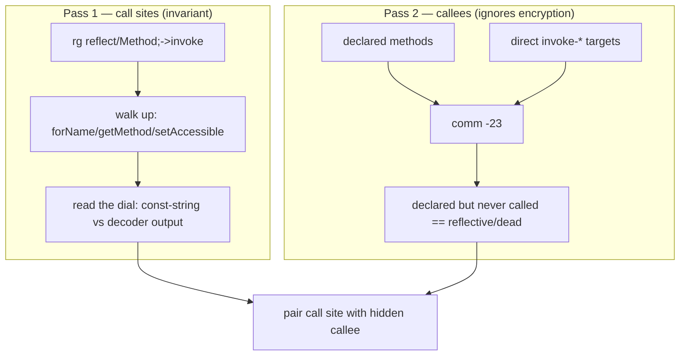

# Example: Hunting-Reflection-With-Grep-And-Set-Difference

## Goal

Turn "how do you *identify* reflection" into a concrete, repeatable procedure you can run on a whole decompiled app — not by reading methods hoping to notice something, but by grepping for the fixed fingerprints reflection can't avoid leaving, and by finding reflective *targets* via set difference even when every name is encrypted. Belongs to [[Reflection-and-Runtime-Internals]]. This is the mechanical version of the recognition tells in [[Reflective-Hidden-Method-Call]], applied at tree scale.

## Walkthrough

Assume a `smali/` (or `smali_classes*/`) tree from apktool. Two passes: locate call sites, then locate hidden callees.

```bash
# --- PASS 1: find every reflective CALL SITE (invariant signatures) ---
# The single highest-value search: every reflective method call ends here.
rg -n 'Ljava/lang/reflect/Method;->invoke\(' smali*/

# The lookups that feed it, and the "reaching a private member" tell:
rg -n 'Ljava/lang/Class;->(forName|getDeclaredMethod|getMethod)\(' smali*/
rg -n 'Ljava/lang/reflect/(Constructor;->newInstance|AccessibleObject;->setAccessible)\(' smali*/

# --- PASS 2: find reflective TARGETS without decrypting any name string ---
# (a) every method the app DECLARES, as Class;->name(sig)ret keys:
rg -No '^\.method.*? ([^ ]+\(.*)$' -r '$1' smali*/ | sort -u > /tmp/declared.txt

# (b) every method that is an EXPLICIT invoke-* target somewhere:
rg -No 'invoke-[a-z/]+ \{[^}]*\}, (L[^;]+;->[^ ]+)' -r '$1' smali*/ | sort -u > /tmp/called.txt

# (c) declared-but-never-directly-called == reached only via reflection (or dead):
comm -23 /tmp/declared.txt /tmp/called.txt
```

## Step by step

1. **Pass 1 is about invariance.** `Method;->invoke(...)` and `Constructor;->newInstance(...)` are the exact signatures *every* reflective call compiles to — no obfuscator can rename `java.lang.reflect`. So one grep enumerates all reflective call sites in the app, obfuscated or not. This is where you always start.
2. **The lookups pin down the target's provenance.** For each `invoke` hit, the nearby `forName`/`getDeclaredMethod`/`getMethod` hits tell you which `Class`/`Method` object flowed in. `setAccessible` hits are your shortlist of "deliberately reaching something private" — usually the most interesting sites.
3. **Reading the dial (per site).** Open each call site and look at what feeds the name `String`: a `const-string` (grep would've already found the name — easy), or a `move-result-object` from an app decoder (encrypted — note it for dynamic recovery, see [[Reflection-Hidden-Check-With-Decoded-Names]]). The `check-cast` after the invoke gives the return type even when the name is encrypted.
4. **Pass 2 is the callee-side net that ignores encryption entirely.** `declared` = every method that exists; `called` = every method named as a direct `invoke-*` target. `comm -23` (lines only in `declared`) yields methods that exist but are never *directly* invoked — which, in a real app, are overwhelmingly either reflective targets or dead code. Because it works from the method *definitions*, it finds hidden targets **without ever reading an encrypted name string**, catching what Pass 1's dial-reading can't when the strings are decoder output.
5. **Triage the difference set.** Reflective targets in that set are usually security-relevant (a lone `boolean`/`long`-returning method with no callers, in a class full of normally-called methods, is a classic disguised check). Cross-reference with the `setAccessible`/`invoke` sites from Pass 1 to pair each hidden call site with its hidden callee.

> [!tip] Confirm dynamically what the strings hide
> When a name is decoder-output, don't reimplement the decoder by hand — hook `Method.invoke`/`getDeclaredMethod` with Frida and log the resolved class+method at runtime (see [[Hooking-Log-And-Runtime-Exit-To-Find-The-Culprit]] for the same "let the app tell you" tactic). Static hunting *locates* reflection; dynamic confirmation *reads through* the encryption.

## Diagram



## See also

- [[Reflection-and-Runtime-Internals]]
- [[Reflective-Hidden-Method-Call]] — the per-site recognition tells this automates.
- [[Reflection-Hidden-Check-With-Decoded-Names]] — an encrypted-name site Pass 1's dial-reading flags and Pass 2 still catches.
- [[Anti-Tampering-Pattern-Workflow]] and [[Tua-Case-Study]] in [[Case-Studies]] — the real investigation this procedure came from.

## References

- [[Dalvik-Bytecode-Bibliography|Bibliography]]
