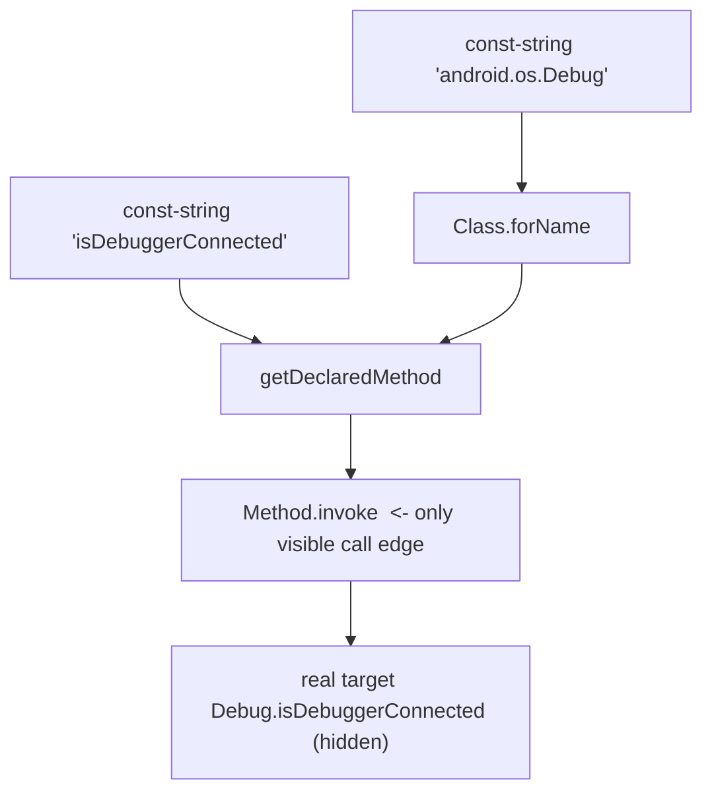

# Example: Reflective-Hidden-Method-Call

## Goal

Read the smali of a reflective call and see concretely *why the target vanishes from a disassembler's call graph*: the bytecode names only `Method.invoke`, while the real callee lives in a `String` built at runtime. Belongs to [[Reflection-and-Runtime-Internals]]. This is the bytecode-level view of the concept that whole chapter is about.

## Walkthrough

```smali
# Equivalent Java:
#   Class<?> c = Class.forName("android.os.Debug");
#   Method m = c.getDeclaredMethod("isDebuggerConnected");
#   boolean r = (Boolean) m.invoke(null);
const-string v0, "android.os.Debug"
invoke-static {v0}, Ljava/lang/Class;->forName(Ljava/lang/String;)Ljava/lang/Class;
move-result-object v0

const-string v1, "isDebuggerConnected"
const/4 v2, 0x0
new-array v2, v2, [Ljava/lang/Class;                    # empty parameter-types array
invoke-virtual {v0, v1, v2}, Ljava/lang/Class;->getDeclaredMethod(Ljava/lang/String;[Ljava/lang/Class;)Ljava/lang/reflect/Method;
move-result-object v1

const/4 v2, 0x0
new-array v2, v2, [Ljava/lang/Object;                   # empty args array
invoke-virtual {v1, v0, v2}, Ljava/lang/reflect/Method;->invoke(Ljava/lang/Object;[Ljava/lang/Object;)Ljava/lang/Object;
move-result-object v0                                    # v0 = Boolean result of the hidden call
```

## Step by step

1. The only method actually *named* as a call target here that does real work is the generic `Ljava/lang/reflect/Method;->invoke(...)` — the same instruction that would appear for **any** reflective call anywhere in the app. A call-graph tool draws an edge to `Method.invoke` and stops; it has no edge to `Debug.isDebuggerConnected`.
2. The real target is spread across two **string** operands: `"android.os.Debug"` (the class) and `"isDebuggerConnected"` (the method). Here they're plaintext `const-string`s, so a `strings`/grep pass would still find them — but in hardened code these strings are produced by a decoder (`invoke-static ...->decrypt(...)` returning the name), and then even grep fails.
3. `getDeclaredMethod` + the empty `[Ljava/lang/Class;` array selects the no-argument overload; the empty `[Ljava/lang/Object;` passed to `invoke` means "call with no arguments". A parameterized call would populate those arrays, adding another layer where the shapes are visible but the intent isn't.
4. This is exactly why the TUA investigation (see [[Anti-Tampering-Pattern-Workflow]]) hunts reflection by **set difference**: enumerate every declared method, enumerate every method that is an explicit `invoke-*` target, and the methods in the first set but not the second are reached only through reflection like this — invisible to a normal call graph.

## Diagram



## How to identify a reflective call cold

You almost never start by reading a method top-to-bottom hoping to notice reflection. In practice you recognize it from a small set of **fixed signatures** that reflection *must* leave in the bytecode no matter how the surrounding code is obfuscated — because the reflection API itself is a fixed set of classes. These are the tells, roughly in the order you'd lean on them:

1. **The anchor instruction.** Every reflective *call* ends in one of exactly two invokes: `Ljava/lang/reflect/Method;->invoke(Ljava/lang/Object;[Ljava/lang/Object;)Ljava/lang/Object;` or (for constructors) `Ljava/lang/reflect/Constructor;->newInstance([Ljava/lang/Object;)Ljava/lang/Object;`. Grep the whole smali tree for those two strings and you have the location of *every* reflective call in the app — this is the single highest-value search, because these signatures are invariant.
2. **The resolver instructions upstream.** Walk backwards from the `invoke` and you'll find the `Method`/`Constructor` object was produced by one of a fixed handful of lookups: `Class;->getDeclaredMethod`, `Class;->getMethod`, `Class;->getDeclaredConstructor`, `Class;->getConstructor`. And the `Class` itself came from `Class;->forName`, `Class;->getClass`, or a `const-class`. Seeing this `forName → getMethod → invoke` chain is the shape; once you've seen it a few times it's unmistakable.
3. **`setAccessible(true)` is a loud giveaway.** A call to `AccessibleObject;->setAccessible(Z)V` sitting between the lookup and the invoke means the code is deliberately reaching a `private`/`protected` member it isn't supposed to touch — legitimate reflection (serialization libraries, DI frameworks) does this too, but in app code it's a strong "something is being hidden here" signal.
4. **Where the name strings come from — the obfuscation dial.** Look at what feeds the `String` arguments to `forName`/`getDeclaredMethod`:
   - a plain `const-string "android.os.Debug"` → **not really hidden** from a `strings`/grep pass, only from a naive call-graph tool. Easy case.
   - a `move-result-object` coming out of an app decoder (`invoke-static ...->b(...)`/`->decrypt(...)`) → the name is **encrypted**; grep for the class/method name finds nothing, and you must run or reimplement the decoder (this is the [[Reflection-Hidden-Check-With-Decoded-Names]] case).
   - a `StringBuilder` concatenation assembling the name from fragments → a middle ground meant to beat literal grep.
5. **The result cast tells you the return type even when the name is gone.** The `check-cast` right after `move-result-object` from `invoke` (`check-cast v0, Ljava/lang/Long;`, `Ljava/lang/Boolean;`, ...) leaks the *shape* of the hidden method — a no-arg method returning `Long` reads like an uptime/timing check; returning `Boolean` reads like a yes/no probe (rooted? debuggable?). You can often guess the intent from the return type and argument-array size alone.
6. **The whole-app negative signal.** The structural search from [[Anti-Tampering-Pattern-Workflow]]: enumerate every `.method` declared, enumerate every method that appears as an explicit `invoke-{virtual,static,direct,interface,super}` target, and take the difference. A method that *exists* but is *never* a direct invoke target is, by elimination, reached only reflectively (or is dead code) — this finds reflective *targets* even when you can't decrypt the name that points at them, by coming at it from the callee side instead of the call site.

Applied to this example: a grep for `reflect/Method;->invoke` lands on line-with-`invoke` (step 1); walking up finds `getDeclaredMethod` and `forName` (step 2); the two `const-string`s are plaintext, so it's the easy case (step 4); and `Debug.isDebuggerConnected` returning `boolean` (step 5) says "this is an anti-debug probe" before you've reasoned about anything else.

## See also

- [[Reflection-and-Runtime-Internals]]
- [[Reflection-Hidden-Debuggable-Check]] — a real, encrypted-string instance of this shape from the TUA app.
- [[Methods]] and [[Dalvik-Instructions]] — the `invoke-*`/`move-result` mechanics.

## References

- [[Dalvik-Bytecode-Bibliography|Bibliography]]
