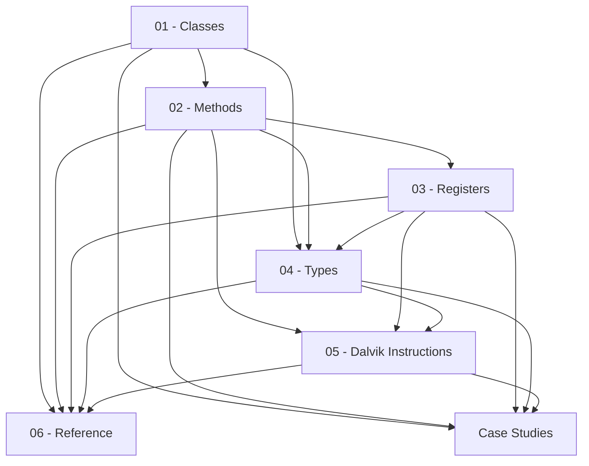

# Dalvik-Bytecode

Studying **Dalvik bytecode**, the assembly language of the Android virtual machine (Dalvik/ART), as seen in the `.smali` files produced by disassembling APKs. This topic started as an expanded, digitized version of a set of handwritten notes taken while first learning to read it — see this topic's own `README.md` for the full background story and the original scanned pages.

> [!warning] Ethical use
>
> This material is for educational and personal-research purposes around reverse engineering. Reversing third-party applications should always respect licenses, terms of service, and applicable local regulations.

## Map of this topic

| Section | Covers |
| --- | --- |
| [[Dalvik-Bytecode-Reference\|Reference]] | glossary, bibliography, type table, vault-wide opcode/example/snippet listings for this topic |

## Relevant standalone notes

Case studies, cheatsheets, tools, reading notes, and projects aren't scoped to this topic alone —
they live once, shared vault-wide. This is the one that draws on Dalvik-Bytecode so far:

- [[Tua-Case-Study]] in [[Case-Studies]] — anti-tampering/obfuscation patterns in a real app's smali

## Chapters

Reading order matters here more than usual — each chapter leans on the ones before it:

1. [[Classes]] (`01-Classes/`) — `.class`, `.super`, `.implements`, `.field`, direct vs virtual methods
2. [[Methods]] (`02-Methods/`) — `.method`, constructors, `<init>`/`<clinit>`, `invoke-*`, exception handling
3. [[Registers]] (`03-Registers/`) — `.registers`, `.locals`, `v`/`p`, `this`, wide register pairs
4. [[Types]] (`04-Types/`) — primitive types, arrays, method descriptors
5. [[Dalvik-Instructions|Instructions]] (`05-Dalvik-Instructions/`) — catalogue of instruction families
6. [[Dalvik-Bytecode-Reference|Reference]] (`06-Reference/`) — glossary, bibliography, type table, vault-wide opcode/example/snippet listings

## Where to start

1. Start with [[Classes]] to see how Dalvik represents Java classes.
2. Continue with [[Methods]] and [[Registers]].
3. Round it off with [[Types]] and [[Dalvik-Instructions|Instructions]].
4. Each chapter's own `examples/` subfolder has worked walkthroughs — or browse them all at once via the Dataview table in [[Dalvik-Bytecode-Reference|Reference]].
5. For a full, real-world investigation of one app at a time (rather than a small chapter-scoped fragment), see [[Case-Studies]].

## See also

- [[Home]]
- [[ARM64-Android]] — the native/register-machine side of Android reverse engineering: what you're reversing whenever there's no more Dalvik bytecode left to read (a JNI `.so`, or a Flutter app's Dart AOT snapshot)
