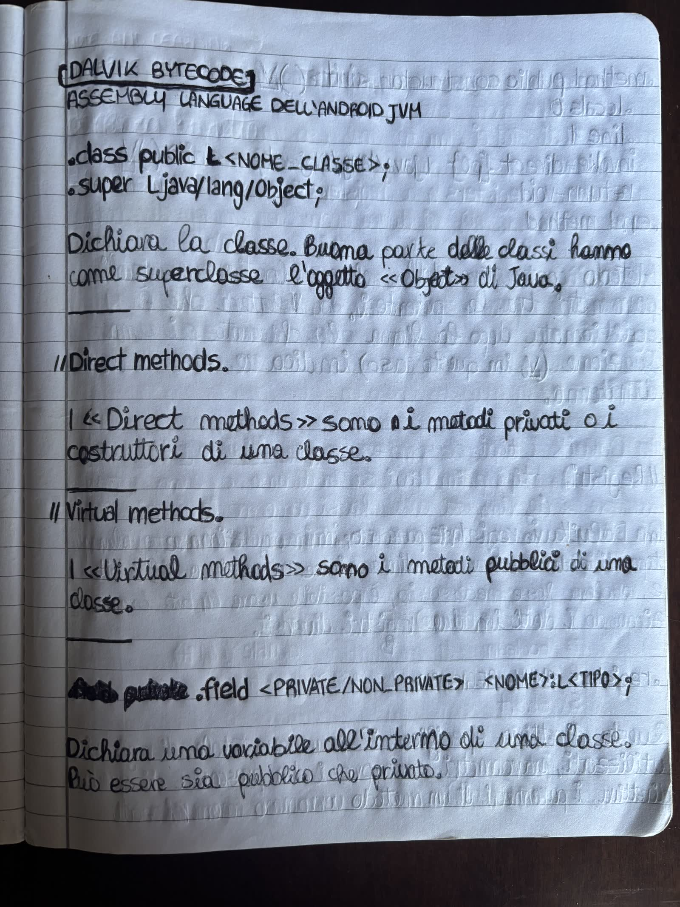
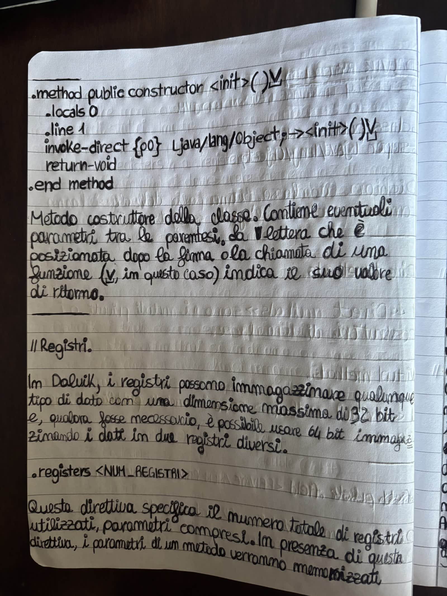
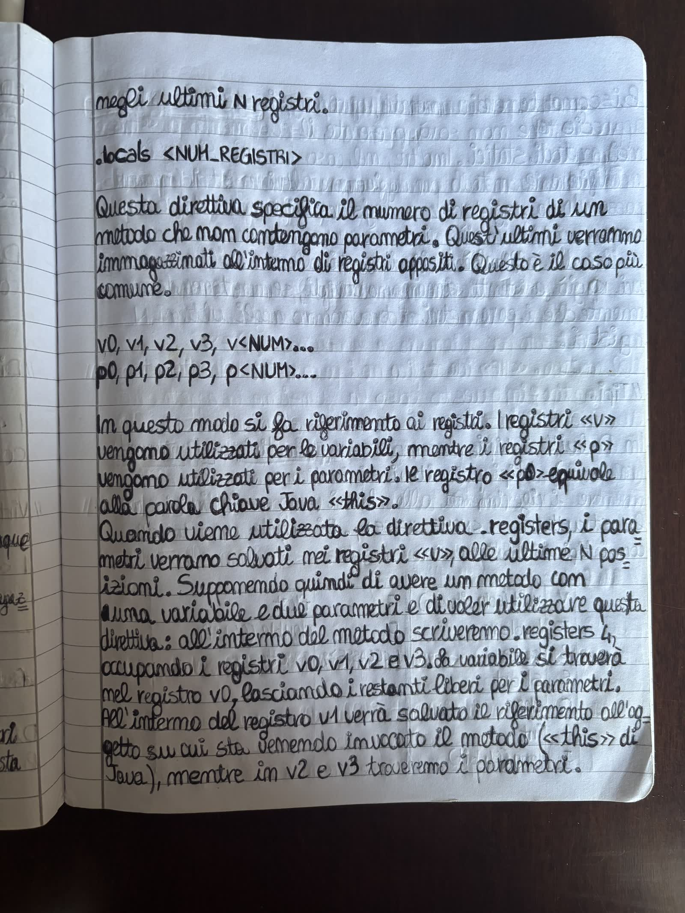
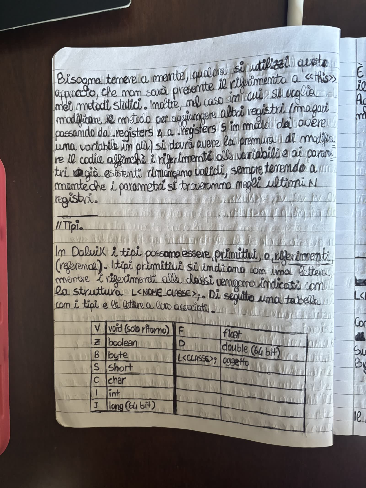
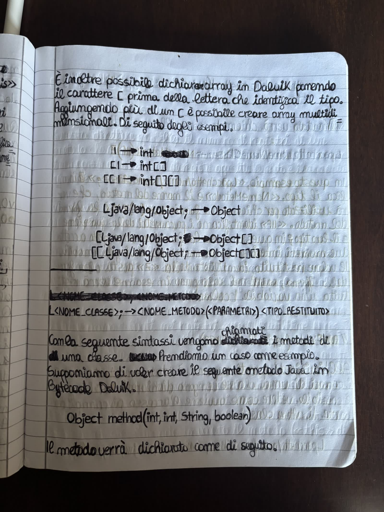

# Dalvik-Bytecode

Guide on reverse engineering apps made for Android by reading the Dalvik bytecode stored in `.smali` files. This folder is one topic inside a larger multi-topic Obsidian vault — see the [repository root README](../README.md) and [`CLAUDE.md`](../CLAUDE.md) for how the vault as a whole is organized; this file covers only what's specific to this topic.

## 📓 Background

This topic is an expanded, digitized version of a set of handwritten notes taken while first learning to read Dalvik bytecode.

The motivation was fairly practical: in the current Android landscape, watching an app talk to its backend by intercepting network traffic has gotten a lot less reliable — certificate pinning and similar protections routinely defeat that kind of dynamic analysis. Static analysis — actually reading the disassembled `.smali` bytecode of an APK — doesn't have that problem, so I wanted to get comfortable with it. The **ClasseViva** app (an Italian school grades/register app) was the practical subject I used while working through this, cross-referencing it against the official Android/AOSP documentation on the Dalvik bytecode format.

The five original scanned pages are kept in [`../assets/dalvik-bytecode-handwritten-notes/`](../assets/dalvik-bytecode-handwritten-notes/) as a record of where this started:

  
  
  
  
  

Everything else in this folder — the [`01-Classes/`](01-Classes/Classes.md) through [`08-Reference/`](08-Reference/Dalvik-Bytecode-Reference.md) chapters — carries forward everything written on those pages, complemented with additional worked examples, diagrams, tables, and a structure meant to keep growing.

## 📚 Chapters

If you're just browsing on GitHub, here they are (open the vault in [Obsidian](https://obsidian.md/) for the fully cross-linked, properly-rendered version — see the repository root README):

| Chapter | Content |
| --- | --- |
| [`01-Classes/`](01-Classes/Classes.md) | `.class`, `.super`, `.implements`, `.field`, direct vs virtual methods |
| [`02-Methods/`](02-Methods/Methods.md) | `.method`, constructors, `<init>`/`<clinit>`, `invoke-*`, exception handling |
| [`03-Registers/`](03-Registers/Registers.md) | `.registers`, `.locals`, `v`/`p`, `this`, wide register pairs |
| [`04-Types/`](04-Types/Types.md) | primitive types, arrays, method descriptors |
| [`05-Dalvik-Instructions/`](05-Dalvik-Instructions/Dalvik-Instructions.md) | catalogue of instruction families |
| [`06-Reading-Raw-Dalvik/`](06-Reading-Raw-Dalvik/Reading-Raw-Dalvik.md) | reading obfuscated smali cold (no annotations), and hand-patching Dalvik methods |
| [`07-Reflection-and-Runtime-Internals/`](07-Reflection-and-Runtime-Internals/Reflection-and-Runtime-Internals.md) | reflection as an anti-analysis technique, JVM/ART runtime architecture, method dispatch internals, memory management |
| [`08-Reference/`](08-Reference/Dalvik-Bytecode-Reference.md) | glossary, bibliography, type table, topic-wide opcode/example/snippet listings |

Each chapter folder (`01-Classes/` … `07-Reflection-and-Runtime-Internals/`) contains the concept note itself, plus an `examples/` subfolder (worked walkthroughs) and a `snippets/` subfolder (fragments from real apps), one subfolder per app, once either has content worth adding.

Full real-app investigations — one whole app's worth of imported source and analysis at a time, not scoped to a single chapter's concept — live in the vault-wide [`Case-Studies/`](../Case-Studies/Case-Studies.md) instead of inside this topic folder, since a real investigation is rarely scoped to just one topic.
