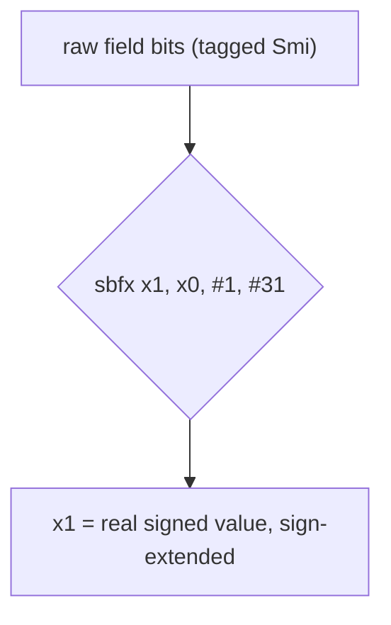

# Example: Register-Width-And-Sign-Extension

## Goal

Show why the choice between a plain load and a sign-/zero-extending load matters, and how it shows up constantly in Dart-compiled code as the "untag a Smi" idiom. Belongs to [[Registers-And-Data]] (data types/sizes) and links forward to [[Memory-And-Data-Structures]] (tagged integers).

## Walkthrough

```asm
ldrb   w0, [x1]         ; load 1 byte, zero-extend into w0 (top 24 bits cleared)
ldrsb  w0, [x1]         ; load 1 byte, SIGN-extend into w0
ldrsw  x0, [x1]         ; load 4 bytes, sign-extend into the full x0
sbfx   x1, x0, #1, #0x1f  ; Signed Bitfield eXtract: x1 = sign-extend(bits[31:1] of x0)
```

The last line is exactly the "untag a Smi" pattern you'll see throughout the Dart-AOT case study: a small integer is stored shifted left by one bit (the low bit is the tag), so recovering the real value means an _arithmetic_ shift right by one — `sbfx dst, src, #1, #31` does exactly that in one instruction, sign bit included, which is why it appears instead of a plain `asr`.

## Step by step

1. `ldrb`/`ldrh`/`ldr` zero-extend by default — reading a smaller field into a bigger register pads the top with zeros, appropriate for values you know are unsigned (lengths, flags, tag bits).
2. `ldrsb`/`ldrsh`/`ldrsw` sign-extend instead — necessary when the smaller field holds a signed quantity (a signed byte/half/word you need to keep negative correctly when widened).
3. `sbfx`/`ubfx` (signed/unsigned bitfield extract) generalize this to arbitrary bit ranges, not just byte/half/word boundaries — this is exactly the instruction used to both extract a class id from an object header (`ubfx`, unsigned — class ids are never negative) and to untag a signed Smi (`sbfx`, signed — the value itself can be negative).

## Diagram



## See also

- [[Registers-And-Data]]
- [[Memory-And-Data-Structures]]
- [[Flutter-Dart-AOT]]

## References

- [[ARM64-Android-Bibliography|Bibliography]]
