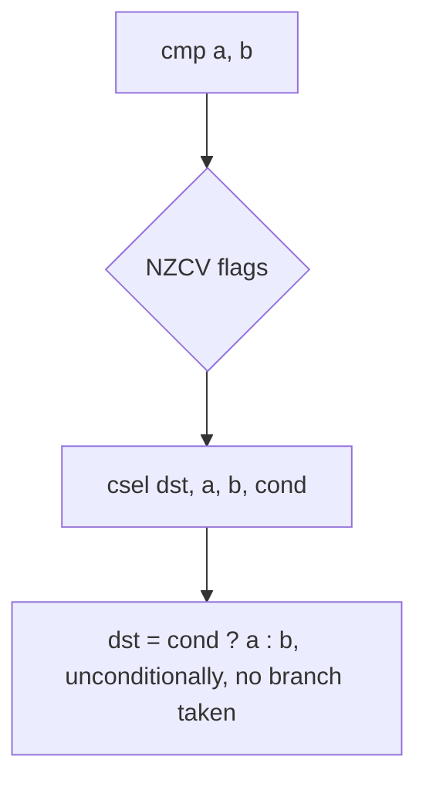

# Example: Compare-And-Conditional-Select

## Goal

Show the branch-free idioms compilers prefer for boolean results and simple `?:` expressions, so you don't waste time looking for a branch that was never emitted. Belongs to [[Instructions]].

## Walkthrough

```c
bool is_equal(int a, int b) { return a == b; }
int max2(int a, int b) { return a > b ? a : b; }
```

```asm
is_equal:
    cmp     w0, w1
    cset    w0, eq        ; w0 = (flags == eq) ? 1 : 0  -- cset is csinc Xd, xzr, xzr, !cond in disguise
    ret

max2:
    cmp     w0, w1
    csel    w0, w0, w1, gt  ; w0 = (a > b) ? a : b
    ret
```

## Step by step

1. `cmp w0, w1` sets NZCV as if by `subs xzr, w0, w1` — nothing else changes.
2. `cset w0, eq` is a convenience alias: "set `w0` to 1 if the condition holds, else 0" — you'll see this anywhere a language boolean is being materialized from a comparison, including in the real Dart-compiled excerpt in this chapter's [[Bitfield-Class-Id-Extraction|snippets]], where the canonical `true`/`false` **objects** (not raw 1/0) get selected the same way via `csel`.
3. `csel w0, w0, w1, gt` reads as "if greater-than, keep `w0` (which already holds `a`), else take `w1` (`b`)" — both operands are always computed, the CPU just picks which one survives, so there is no branch misprediction risk and no control-flow edge to trace.

## Diagram



## See also

- [[Instructions]]
- [[Control-Flow-Patterns]]

## References

- [[ARM64-Android-Bibliography|Bibliography]]
