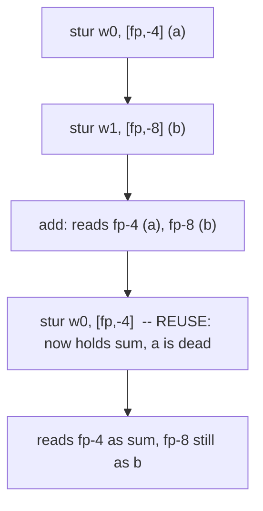

# Example: Tracking-A-Stack-Slots-Meaning

## Goal

Walk the anchor-then-follow technique from [[Functions-And-Calling-Convention#Reading what a stack slot actually holds|the parent chapter]] end to end on a small hand-written example, including a slot getting reused for a second, unrelated value partway through the function — the exact situation that trips people up in real disassembly. Belongs to [[Functions-And-Calling-Convention]].

## Walkthrough

```c
int compute(int a, int b) {
    int sum = a + b;          // needs `a` and `b` only up to here
    int doubled = sum * 2;    // from here on, `a`'s slot is dead...
    return doubled + b;
}
```

A plausible compiled form, spilling both parameters to the stack instead of keeping them in registers the whole time (exaggerated on purpose, to make the reuse visible):

```asm
compute:
    stp     x29, x30, [sp, #-0x20]!
    mov     x29, sp
    stur    w0, [fp, #-4]     ; anchor: fp-4 = `a` (first argument, W0 per AAPCS64)
    stur    w1, [fp, #-8]     ; anchor: fp-8 = `b` (second argument, W1)

    ldur    w0, [fp, #-4]     ; read `a`
    ldur    w1, [fp, #-8]     ; read `b`
    add     w0, w0, w1        ; sum = a + b
    stur    w0, [fp, #-4]     ; *** REUSE: fp-4 now holds `sum`, not `a` -- `a` is dead ***

    ldur    w0, [fp, #-4]     ; read `sum`
    lsl     w0, w0, #1        ; doubled = sum * 2
    ldur    w1, [fp, #-8]     ; read `b` (still live, still at its original slot)
    add     w0, w0, w1        ; doubled + b

    ldp     x29, x30, [sp], #0x20
    ret
```

## Step by step

1. **Anchor**: the two `stur`s right after the prologue are the anchor points — `fp-4` starts as `a`, `fp-8` starts as `b`. Nothing before this tells you that; it's the first write to each offset that establishes it.
2. **Follow**: the next two `ldur`s confirm the reads match — `a + b` reads exactly `fp-4` and `fp-8`, consistent with the anchors.
3. **Reuse**: the `stur w0, [fp, #-4]` right after the `add` is the moment `fp-4`'s meaning changes. Nothing marks this except that it's a _write_ to an offset you already have logged — from this instruction onward, `fp-4` means `sum`, and treating it as still meaning `a` would be a misread of everything that follows.
4. **`fp-8` never gets reused** in this example — `b` stays live (and at the same offset) all the way to the final `add`, simply because its last use happens to be the very last instruction before the epilogue. Reuse only happens _when the compiler's liveness analysis says a slot's old value is truly dead_ — it's not automatic just because time has passed.

Real Dart-AOT output reuses slots far more aggressively than this toy example (it also frequently carries a value forward in a _register_ for one extra instruction right at the moment its stack slot gets overwritten — see the parent chapter), a genuine, considerably busier instance of exactly this pattern than a hand-written example can show.

## Diagram



## See also

- [[Functions-And-Calling-Convention]]
- [[Registers-And-Data]]

## References

- [[ARM64-Android-Bibliography|Bibliography]]
