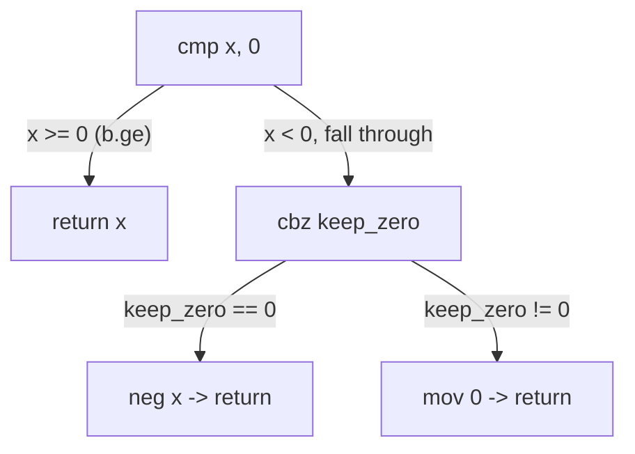

# Example: If-Else-As-Branches

## Goal

Walk the two ways a compiler renders the same `if`/`else`: as branches, and — when both arms are cheap — branchlessly. Belongs to [[Control-Flow-Patterns]].

## Walkthrough

```c
int abs_or_zero(int x, bool keep_zero) {
    if (x < 0) {
        return keep_zero ? 0 : -x;
    }
    return x;
}
```

```asm
abs_or_zero:
    cmp     w0, #0
    b.ge    .Lreturn_x        ; x >= 0 -> skip straight to returning x
    cbz     w1, .Lnegate      ; keep_zero == false -> go negate
    mov     w0, #0
    ret
.Lnegate:
    neg     w0, w0
    ret
.Lreturn_x:
    ret
```

## Step by step

1. `cmp w0, #0` / `b.ge .Lreturn_x` is the outer `if (x < 0)`, inverted: branch _past_ the whole `if`-body when the condition is false. This inversion (testing the opposite of the source condition to jump over the body) is the default shape for `if` without `else` reachable at the end — always read `b.<inverse-cond>` past a block as "this is skipping an `if`-body."
2. `cbz w1, .Lnegate` is the inner `keep_zero ? 0 : -x` — `cbz` (compare-and-branch-if-zero) is preferred over `cmp`+`b.eq` when comparing a register against literal zero, saving an instruction and not touching the flags at all.
3. Three distinct `ret`s, one per reachable exit — a giveaway that this function was _not_ compiled with tail-merging of the epilogue (compilers vary on whether they factor a shared `ret`/epilogue into one copy or duplicate it per exit path; both are common, and duplicated returns don't imply anything about the source having multiple `return` statements).

## Diagram



## See also

- [[Control-Flow-Patterns]]
- [[Compare-And-Conditional-Select]]

## References

- [[ARM64-Android-Bibliography|Bibliography]]
