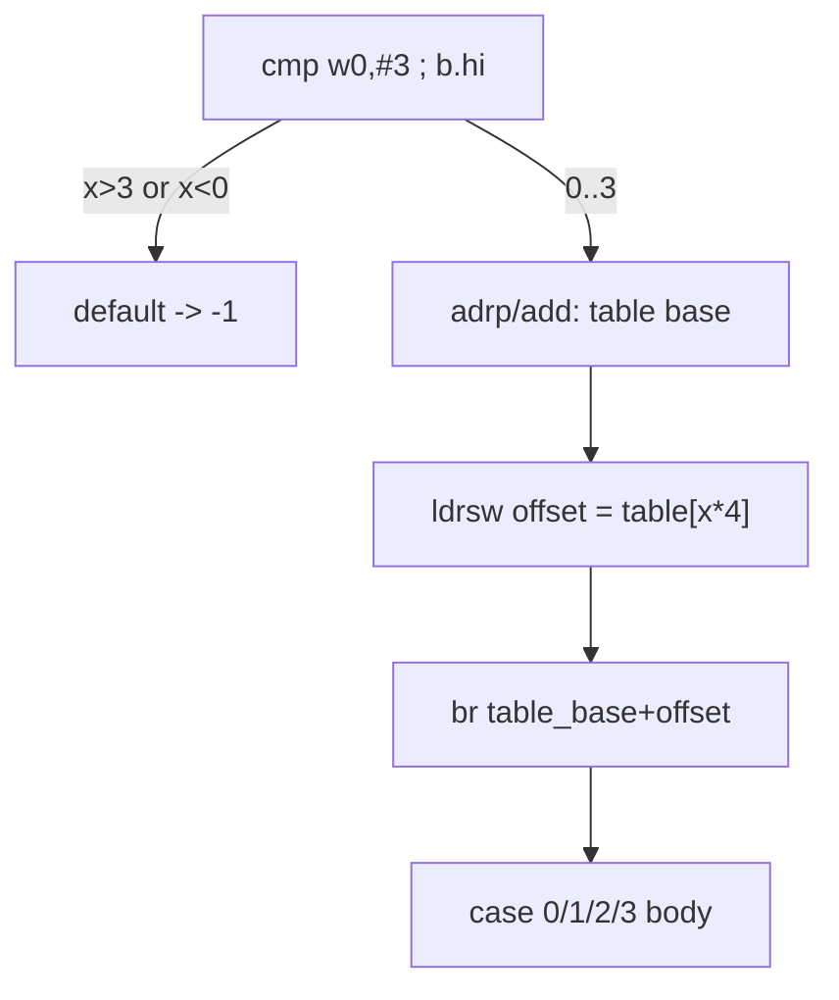

# Example: Switch-As-Jump-Table

## Goal

Show how a dense `switch` compiles to a **jump table**: a bounds check, a table-base load with `adrp`/`add`, an indexed load of a relative offset, and a computed `br`. Belongs to [[Control-Flow-Patterns]]. This is the one control-flow shape a disassembler can't fully resolve statically — the `br` target is computed — so recognizing it matters (and see [[Resolving-An-Indirect-Call-With-Stalker]] in [[Frida-Dynamic-Instrumentation]] for finishing the job dynamically).

## Walkthrough

```c
int f(int x) {
    switch (x) { case 0: return 10; case 1: return 20; case 2: return 30; case 3: return 40; default: return -1; }
}
```

```asm
f:
    cmp     w0, #3                 ; x vs the max case (3)
    b.hi    .Ldefault              ; unsigned > 3 -> default (also catches negative x)
    adrp    x1, .Ljmp_tbl          ; page address of the jump table
    add     x1, x1, :lo12:.Ljmp_tbl
    ldrsw   x2, [x1, w0, uxtw #2]  ; x2 = table[x] (a 32-bit signed offset, index scaled by 4)
    add     x1, x1, x2             ; target = table_base + offset
    br      x1                     ; computed jump -> the selected case
.Lcase0: mov w0, #10 ; ret
.Lcase1: mov w0, #20 ; ret
.Lcase2: mov w0, #30 ; ret
.Lcase3: mov w0, #40 ; ret
.Ldefault: mov w0, #-1 ; ret
```

## Step by step

1. **`cmp w0, #3` + `b.hi .Ldefault`** is the bounds check. `b.hi` is *unsigned* greater-than, which is deliberate: a negative `x` reinterpreted as unsigned is huge, so this single check rejects both `x > 3` and `x < 0` at once — a very common idiom worth recognizing on sight.
2. **`adrp x1, .Ljmp_tbl` + `add x1, x1, :lo12:...`** materializes the table's runtime address in two steps (page base + 12-bit page offset) — the standard PIE address-formation pattern (see [[Instructions]]/[[Android-Native-Internals]]), needed because the binary is position-independent.
3. **`ldrsw x2, [x1, w0, uxtw #2]`** indexes the table: `w0` (the case value) zero-extended (`uxtw`) and scaled by 4 (`#2` = shift left 2, i.e. 4-byte entries), loaded as a **signed** 32-bit value (`ldrsw`). The table stores *relative offsets*, not absolute addresses — smaller and position-independent.
4. **`add x1, x1, x2` + `br x1`** turns the relative offset into an absolute target and jumps. This is where a static disassembler stops resolving: the `br x1` destination depends on a runtime table read, so the tool shows `br x1` with no outgoing edges unless it specially recognizes the jump-table idiom.
5. Recovering the cases means reading the table's entries (each `table_base + entry` is one case's address). When the tool can't, a Stalker trace over one execution per input reveals each concrete `br` target — the static/dynamic handoff.

## Diagram



## See also

- [[Control-Flow-Patterns]]
- [[Enum-Switch-Via-Pointer-Comparison]] — a different real-app switch shape (chained pointer compares, no table).
- [[Instructions]] and [[Android-Native-Internals]] in [[ARM64-Android]] — `adrp`/`add` PIE addressing.
- [[Resolving-An-Indirect-Call-With-Stalker]] in [[Frida-Dynamic-Instrumentation]] — resolving the computed `br` at runtime.

## References

- [[ARM64-Android-Bibliography|Bibliography]]
