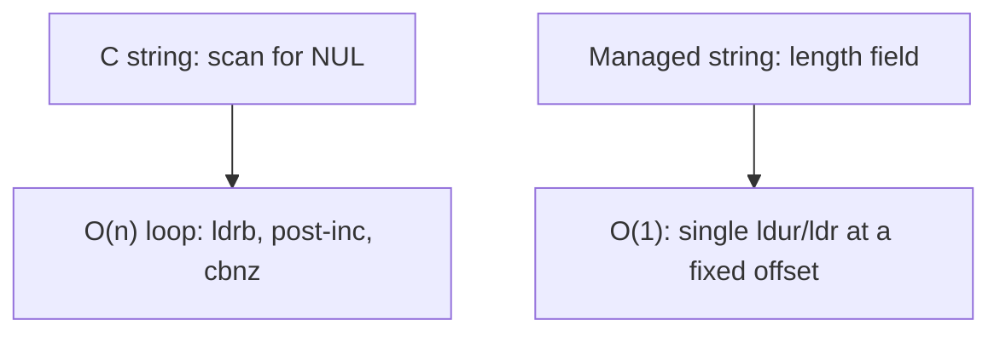

# Example: String-Length-And-Pointer

## Goal

Contrast a NUL-terminated C string with a length-prefixed managed string, since the two demand completely different disassembly patterns for "how long is this string?". Belongs to [[Memory-And-Data-Structures]].

## Walkthrough

```asm
; (a) C-style strlen loop, NUL-terminated
strlen_like:
    mov     x1, x0
.Lloop:
    ldrb    w2, [x1], #1        ; load byte, THEN post-increment the pointer
    cbnz    w2, .Lloop          ; keep going until we read a 0 byte
    sub     x0, x1, x0
    sub     x0, x0, #1
    ret

; (b) length-prefixed managed string (e.g. Dart's String/_OneByteString shape)
managed_string_length:
    ldur    x0, [x0, #0xf]      ; length stored as a field -- O(1), no scanning
    ; (in real Dart output this value would still be a tagged Smi -- see Memory-And-Data-Structures)
    ret
```

## Step by step

1. The C-style version has no length field at all — it _must_ scan byte-by-byte looking for a terminating `0`, using a post-incrementing load (`ldrb w2, [x1], #1`) inside a tight loop. Seeing this exact shape (byte load, post-increment, compare-and-branch-if-nonzero, repeat) is itself enough to identify "this is computing a C string's length" even with zero symbol information.
2. The managed-string version instead **stores its length as a field**, so getting the length is a single field load, O(1), no loop at all. This is a strong, easy-to-spot signal that you're looking at a managed-runtime string type (Dart `String`, Java `String` on the ART native side, ...) rather than a raw C buffer.
3. The absence of a loop is informative on its own: if you expected a length computation and see a single field load instead, that's your cue to go figure out the object's layout (see [[Memory-And-Data-Structures]]) rather than assume the length is hardcoded or missing.

## Diagram



## See also

- [[Memory-And-Data-Structures]]
- [[Flutter-Dart-AOT]]

## References

- [[ARM64-Android-Bibliography|Bibliography]]
