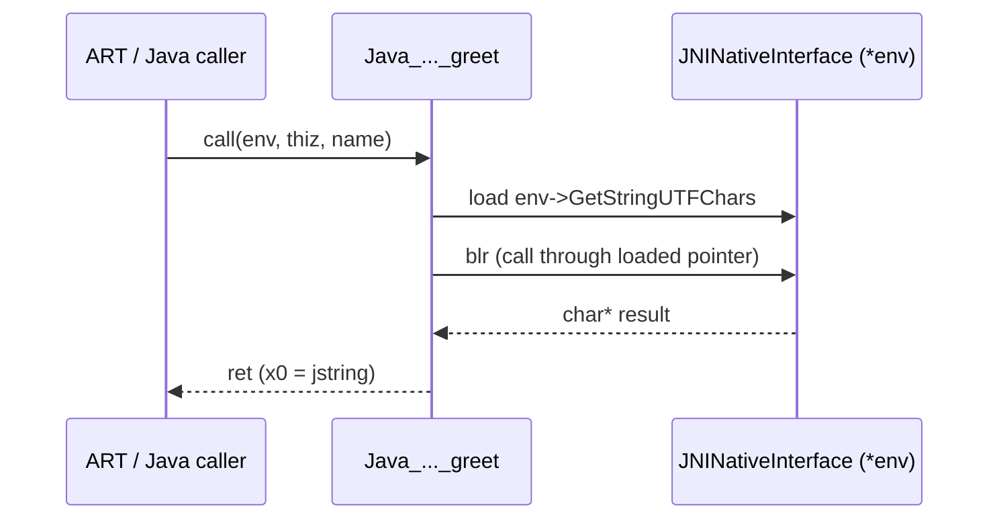

# Example: JNI-Native-Method-Signature

## Goal

Annotate a full JNI entry point end to end: the implicit `env`/`thiz` arguments, a callback into the JVM through the `JNIEnv` table, and the return-value convention. Belongs to [[Android-Native-Internals]].

## Walkthrough

```java
class Foo {
    native String greet(String name);
}
```

```asm
; jstring Java_com_example_app_Foo_greet(JNIEnv *env, jobject thiz, jstring name)
Java_com_example_app_Foo_greet:
    stp     x29, x30, [sp, #-0x20]!
    mov     x29, sp
    stp     x19, x20, [sp, #0x10]
    mov     x19, x0          ; keep env (X0) around across the call below
    mov     x20, x2          ; keep name (X2 -- NOT X1, that's thiz) around

    ldr     x1, [x19]        ; *env  -- the JNINativeInterface table pointer
    ldr     x2, [x1, #0x298] ; a fixed offset into that table -- e.g. GetStringUTFChars
    mov     x0, x19          ; args: env, ...
    mov     x1, x20          ;       ..., name
    mov     x2, xzr          ;       ..., isCopy = NULL
    blr     x2               ; call through the loaded function pointer

    ; x0 now holds a `const char *` -- build a greeting, call NewStringUTF, etc. (elided)

    ldp     x19, x20, [sp, #0x10]
    ldp     x29, x30, [sp], #0x20
    ret                       ; return value (a jstring) is already in x0
```

## Step by step

1. `X0` = `env`, `X1` = `thiz` (unused here, so never even read), `X2` = `name` — the Java signature's _only_ declared parameter lands in the _third_ physical argument register, which is the detail most worth internalizing from this whole chapter.
2. `ldr x1, [x19]` dereferences `env` once to get the interface table pointer (`JNIEnv` is conventionally a pointer to a pointer to the function-pointer struct — `struct JNINativeInterface **env`, hence the two levels).
3. `ldr x2, [x1, #0x298]` reads one specific function pointer out of that table at a fixed offset — offsets are stable per NDK/Android API level and published in `jni.h`; a table of offset→function-name is worth building once per project rather than re-deriving from scratch.
4. `blr x2` performs the actual callback into the JVM; every JNI function call has this same three-instruction shape (load env's table pointer once, load a specific entry, `blr`) — only the fixed offset changes.
5. The return value convention is unchanged from plain AAPCS64 — whatever ends up in `X0` at `ret` is the method's return value, here a `jstring` (itself just an opaque reference type from the JVM's point of view).

## Diagram



## See also

- [[Android-Native-Internals]]
- [[Functions-And-Calling-Convention]]

## References

- [[ARM64-Android-Bibliography|Bibliography]]
