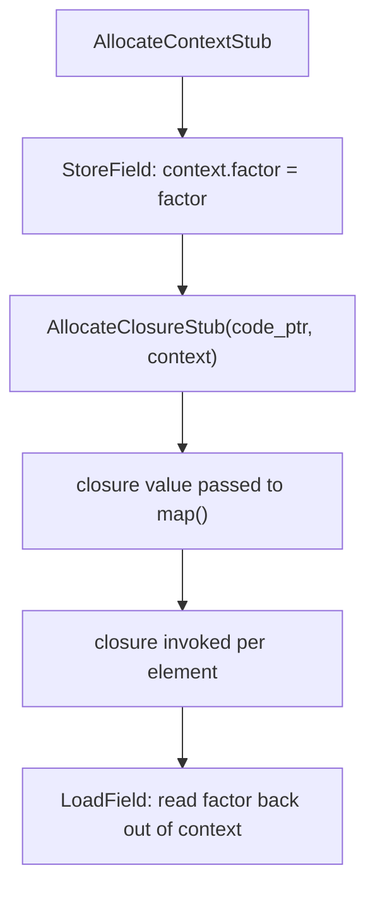

# Example: Closure-Capture-And-Invocation

## Goal

Show the two-step "capture a variable, then create a closure over it" pattern end to end, generalizing the real `AllocateContextStub`/`AllocateClosureStub` calls seen in real Dart-AOT disassembly. Belongs to [[Flutter-Dart-AOT]].

## Walkthrough

```dart
List<double> scaleAll(List<double> xs, double factor) {
    return xs.map((x) => x * factor).toList();
}
```

The lambda `(x) => x * factor` **captures** `factor` from the enclosing scope, so the compiler can't just hand over a bare function pointer — it needs to bundle that captured value alongside it:

```
; roughly, inside scaleAll's body, before the map() call:
r1 = 1                                  ; one captured slot
r0 = AllocateContext()
    bl   AllocateContextStub            ; heap-allocate a small context object
StoreField: context->field_f = factor   ; stash the captured value into the context
r1 = Function '<anonymous closure>'     ; PP-relative load of the closure's code address
r2 = <the context object just built>
r0 = AllocateClosure()
    bl   AllocateClosureStub            ; bundle (code address, context) into one closure object
; r0 now holds the closure -- passed to map() as an ordinary argument
```

Separately, disassembled as its own standalone block:

```
[closure] static double <anonymous closure>(dynamic context, double x) {
    ldr   x1, [fp, #0x10]        ; the context argument
    LoadField: r2 = r1->field_f  ; recover the captured `factor`
    ; ... x * factor, return ...
}
```

## Step by step

1. `AllocateContextStub` builds a small heap object whose only job is holding captured variables — one field per variable actually captured (not every local, only ones the closure body references).
2. The closure's own code is a **separate, already-compiled function** (shown as its own `[closure] ...` block) — `AllocateClosureStub` doesn't compile anything at runtime, it just pairs a pointer to that pre-existing code with the freshly-built context object into one closure value.
3. When the closure is later invoked (here, once per element by `map`), it receives the context as an implicit extra argument and loads captured variables out of it by field offset — structurally identical to reading any other object's fields, per [[Memory-And-Data-Structures]].
4. If a closure captures _nothing_, the compiler can skip the context allocation and even reuse a single pre-built closure instance across calls — so the absence of `AllocateContextStub` before an `AllocateClosureStub` is itself informative ("this lambda is capture-free").

## Diagram



## See also

- [[Flutter-Dart-AOT]]
- [[Memory-And-Data-Structures]]
- [[Dart-Function-Prologue-In-The-Wild]]

## References

- [[ARM64-Android-Bibliography|Bibliography]]
