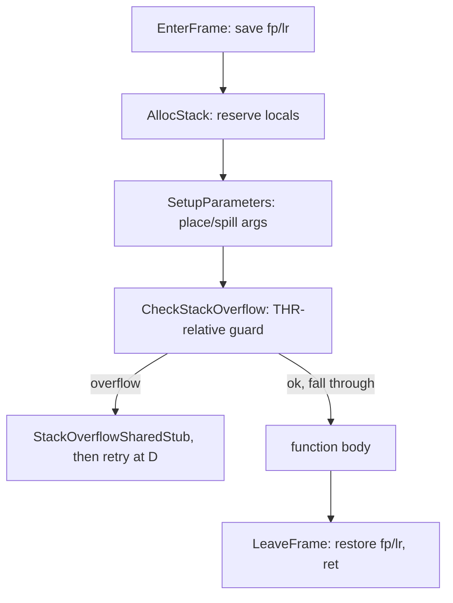

# Example: Dart-Frame-Prologue

## Goal

Restate the Dart-AOT prologue/epilogue shape from [[Functions-And-Calling-Convention]] as a standalone reference, annotated purely in terms of the reserved registers from [[Flutter-Dart-AOT]] — useful once you've internalized both and just want the compact version. Belongs to [[Flutter-Dart-AOT]].

## Walkthrough

```
EnterFrame
    stp   fp, lr, [SP, #-0x10]!     ; standard AAPCS64 frame save...
    mov   fp, SP                     ; ...nothing Dart-specific yet
AllocStack(0xNN)
    sub   SP, SP, #0xNN               ; reserve locals -- size alone hints at function complexity
SetupParameters(...)
    ; incoming args (X1, X2, ... -- X0 is often unused/implicit) moved/spilled per the IR's needs
CheckStackOverflow
    ldr   x16, [THR, #0x38]           ; THR::stack_limit -- Dart-specific from here on
    cmp   SP, x16
    b.ls  <StackOverflowSharedWith[out]FPURegsStub, then retry>
; ... body: PP-relative constant loads, GDT calls, field access, closures, stubs ...
LeaveFrame
    mov   SP, fp
    ldp   fp, lr, [SP], #0x10
    ret
```

## Step by step

1. `EnterFrame`/`AllocStack` are pure AAPCS64 — a plain NDK function's prologue can look identical up to this point.
2. `CheckStackOverflow` is the tell: a `THR`-relative load at a fixed, always-identical offset, compared against `SP`, is not something a hand-written C function has any reason to do — it exists because Dart's stack is smaller and independently managed from the OS thread stack, and every function must cooperate with growing/detecting overflow of it.
3. Everything between `CheckStackOverflow` and `LeaveFrame` is where the actual logic — and every Dart-specific idiom from [[Memory-And-Data-Structures]] and this chapter — lives.
4. `LeaveFrame` is the textbook AAPCS64 epilogue again, symmetric with `EnterFrame`.

## Diagram



## See also

- [[Flutter-Dart-AOT]]
- [[Functions-And-Calling-Convention]]
- [[Dart-Function-Prologue-In-The-Wild]]

## References

- [[ARM64-Android-Bibliography|Bibliography]]
