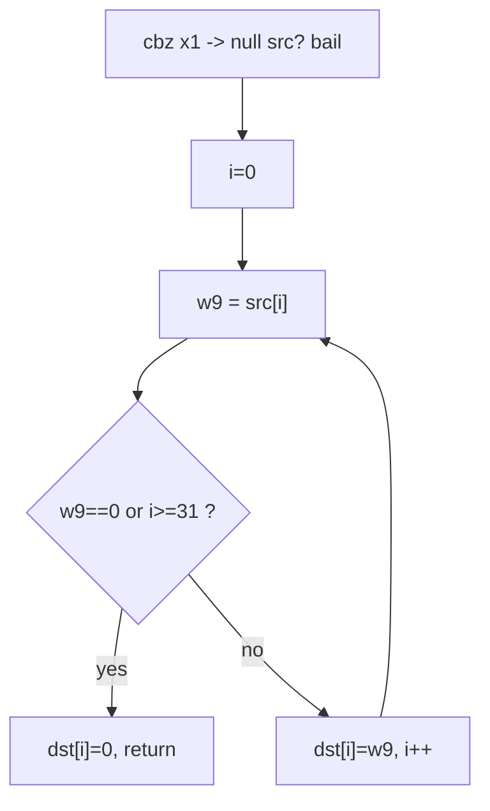

# Example: Walking-An-Unknown-Function-Cold

## Goal

Read a short, unlabeled ARM64 function end-to-end with no symbols and no comments — the core skill [[Reading-Raw-Disassembly]] is about — and recover what it does (a bounded string copy) purely from register dataflow. Belongs to [[Reading-Raw-Disassembly]]. The method is: track what each register holds, one instruction at a time, and let the memory-access widths tell you the types.

## Walkthrough

```asm
sub_1a40:
    stp     x29, x30, [sp, #-0x20]!   ; prologue: save fp/lr, open 0x20 frame
    mov     x29, sp
    cbz     x1, .Lret                 ; if x1 == 0, bail immediately
    mov     x8, #0                    ; x8 = 0  (an index/counter)
.Lloop:
    ldrb    w9, [x1, x8]              ; w9 = src[x8]  (byte load -> char*)
    cbz     w9, .Lterm                ; if byte == 0, hit the NUL terminator
    cmp     x8, #0x1f                 ; index vs 31
    b.hs    .Lterm                    ; if index >= 31 (unsigned), stop -> bounded
    strb    w9, [x0, x8]              ; dst[x8] = w9
    add     x8, x8, #1                ; index++
    b       .Lloop
.Lterm:
    strb    wzr, [x0, x8]             ; dst[x8] = 0  (NUL-terminate)
.Lret:
    ldp     x29, x30, [sp], #0x20     ; epilogue
    ret
```

## Step by step

1. **Prologue + arguments.** `stp x29,x30,[sp,#-0x20]!` saves the frame pointer and link register (see [[Functions-And-Calling-Convention]]); by AAPCS64 the incoming args are `x0`, `x1`, ... — so `x0` and `x1` are the first two parameters, still unnamed.
2. **`cbz x1, .Lret`** guards against `x1 == 0`: a null check on the second argument. That plus the loop below strongly types `x1` as a **source pointer** and `x0` as a **destination pointer**.
3. **The loop body reads bytes:** `ldrb w9, [x1, x8]` is a *byte* load (`ldrb` → 8-bit), indexed by `x8` — so `x1` is a `char*`/`uint8_t*` and `x8` is the index. `cbz w9, .Lterm` stops at a zero byte: this is C-string iteration looking for the NUL terminator.
4. **The bound:** `cmp x8, #0x1f` + `b.hs .Lterm` (`hs` = unsigned ≥) caps the copy at index 31 — a fixed-size destination of 32 bytes. This is the detail that turns "it's a `strcpy`" into "it's a bounded copy into a 32-byte buffer", the kind of thing that matters for spotting an off-by-one or a truncation.
5. **The store + terminate:** `strb w9,[x0,x8]` writes each byte to `dst[x8]`; after the loop, `strb wzr,[x0,x8]` writes a zero (via the `wzr` zero register) to NUL-terminate. Reconstructed C:

```c
void sub_1a40(char *dst, const char *src) {
    if (!src) return;
    size_t i = 0;
    for (; src[i] && i < 31; i++) dst[i] = src[i];
    dst[i] = '\0';                 // dst is a 32-byte buffer
}
```

6. Nothing here needed a symbol or a comment — only the discipline of naming each register by what flows into it and reading `ldrb`/`strb`/`wzr` widths literally. That's the whole technique; longer functions are just more of it, plus the branch-reading from [[Control-Flow-Patterns]].

## Diagram



## See also

- [[Reading-Raw-Disassembly]]
- [[Functions-And-Calling-Convention]] — prologue/epilogue and `x0`/`x1` as arguments.
- [[Control-Flow-Patterns]] — the backward-branch loop shape.
- [[Memory-And-Data-Structures]] — `ldrb`/`strb` widths and what they imply about types.

## References

- [[ARM64-Android-Bibliography|Bibliography]]
