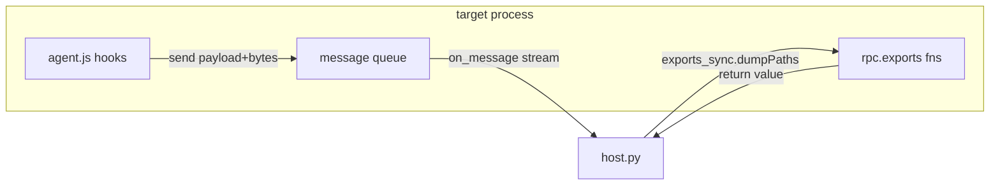

# Example: RPC-Exports-And-Host-Messaging

## Goal

Show the two ways a script talks back to your host — `send(payload[, data])` for a one-way stream of events, and `rpc.exports` for a request/response API the host calls on demand — and when each is the right choice. Belongs to [[Frida-Fundamentals]]; `console.log` is fine for exploration, but the moment you want to *collect* data across many hook hits or *drive* the script from Python, you need these instead.

## Walkthrough

```javascript
// agent.js — injected into the target process
let seen = [];

// One-way, high-volume: fire an event every time the hook hits.
const open = Module.findExportByName("libc.so", "open");
Interceptor.attach(open, {
    onEnter(args) {
        const path = args[0].readCString();
        seen.push(path);
        send({ type: "open", path });          // streamed to the host as it happens
    }
});

// Request/response: the host pulls accumulated state whenever it wants.
rpc.exports = {
    dumpPaths() { return seen; },               // return value is marshalled back to the host
    clear() { seen = []; return true; }
};
```

```python
# host.py — runs on your machine, drives the agent
import frida, sys

def on_message(message, data):
    if message["type"] == "send":
        print("[stream]", message["payload"])
    elif message["type"] == "error":
        print("[error]", message["stack"])      # uncaught JS errors surface here, not in the CLI

device = frida.get_usb_device()
pid = device.spawn(["net.pluservice.tua"])
session = device.attach(pid)
script = session.create_script(open("agent.js").read())
script.on("message", on_message)                # wire up the send() stream first
script.load()
device.resume(pid)

input("[*] press enter to pull the accumulated list...\n")
print("[rpc] total opens:", len(script.exports_sync.dump_paths()))  # calls rpc.exports.dumpPaths
```

## Step by step

1. `send(payload)` is **fire-and-forget from the script's side**: it queues a message the host's `on_message` handler receives asynchronously. Use it for a continuous event stream (every `open`, every `SSL_write`) where you don't want to block the target thread waiting for the host.
2. The optional second argument to `send(payload, data)` is a raw `ArrayBuffer` — this is how you ship a `Memory.readByteArray(...)` dump back without base64-encoding it into the JSON payload (see [[Static-Dynamic-Integration]]'s module-dump example, which uses exactly this).
3. `rpc.exports` is the **inverse direction**: the host calls a function *inside* the process and gets its return value back. `exports_sync.dump_paths` (Python snake-cases the JS `dumpPaths`) blocks until the script returns. Use it for "give me the current state on demand" rather than "tell me about every event".
4. `script.on("message", ...)` must be registered **before** `script.load()`, or you miss any `send()` fired during the script's top-level execution (e.g. from a hook that fires immediately). The `error` message type is where uncaught exceptions in the agent land — easy to miss if you only watch for `send`.

## Diagram



## See also

- [[Frida-Fundamentals]]
- [[Static-Dynamic-Integration]] — uses `send(payload, data)` to ship a live memory dump back to disk.
- [[Frida-JS-API-Cheatsheet]] in [[Cheatsheets]]

## References

- [[Frida-Dynamic-Instrumentation-Bibliography|Bibliography]]
