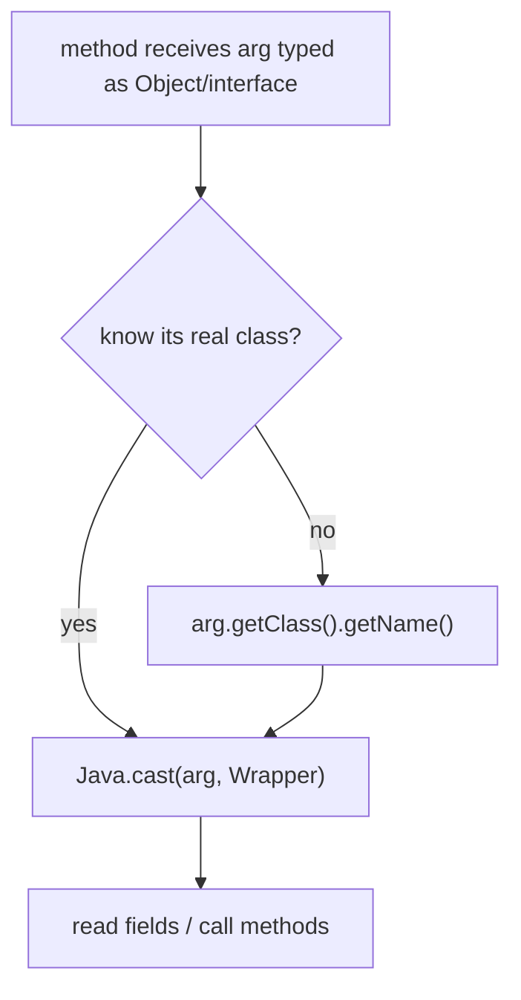

# Example: Hooking-A-Constructor-And-Casting-Arguments

## Goal

Show two things `Java.use` gives you beyond replacing a plain method: hooking a **constructor** (`$init`) to catch an object at the moment it's built, and using `Java.cast` to turn an opaque argument reference into a wrapper whose fields and methods you can actually read. Belongs to [[Java-Layer-Hooking]]. This is the everyday move when the value you care about is a field *inside* an object passed to a method, not the method's return value.

## Walkthrough

```javascript
Java.perform(() => {
    // 1. Hook a constructor: fires the instant an OkHttp Request is built.
    const Request = Java.use("okhttp3.Request");
    Request.$init.overload("okhttp3.Request$Builder").implementation = function (builder) {
        const req = this.$init(builder);           // build the real object first
        console.log("[*] new Request -> " + this.url().toString());
        return req;
    };

    // 2. Hook a method that receives an interface type, then cast the arg to read it.
    const RealCall = Java.use("okhttp3.internal.connection.RealCall");
    RealCall.getResponseWithInterceptorChain.implementation = function () {
        const response = this.getResponseWithInterceptorChain();
        const Response = Java.use("okhttp3.Response");
        const resp = Java.cast(response, Response);  // wrap the returned jobject
        console.log("[*] " + this.request().url() + " -> HTTP " + resp.code());
        return response;
    };
});
```

## Step by step

1. A constructor is exposed as `$init` and is overloaded exactly like any other method — pass the parameter type strings to `.overload(...)`. Inside the replacement, `this.$init(...)` runs the real constructor; you must call it (and return its result) or you get a half-built object.
2. Hooking the constructor rather than a later getter catches the object at its earliest point — useful when a field is set at construction and mutated afterwards, so a getter would show you the *wrong* (mutated) value.
3. `Java.cast(ref, WrapperClass)` is needed whenever you hold a bare object reference (a method argument, a return value, something from `Java.choose`) typed as `Object` or an interface: Frida doesn't know its concrete class, so `.code()`/`.url()` aren't available until you cast it to the wrapper for the class you know it really is.
4. Getting the concrete class wrong throws a `ClassCastException` at runtime — if you're unsure, `ref.getClass().getName()` (every Java object has `getClass()`) tells you what to cast to before you commit.

## Diagram



## See also

- [[Java-Layer-Hooking]]
- [[Network-Interception]]
- [[Classes]] and [[Methods]] in [[Dalvik-Bytecode]] — where the constructor signatures and class names come from.

## References

- [[Frida-Dynamic-Instrumentation-Bibliography|Bibliography]]
