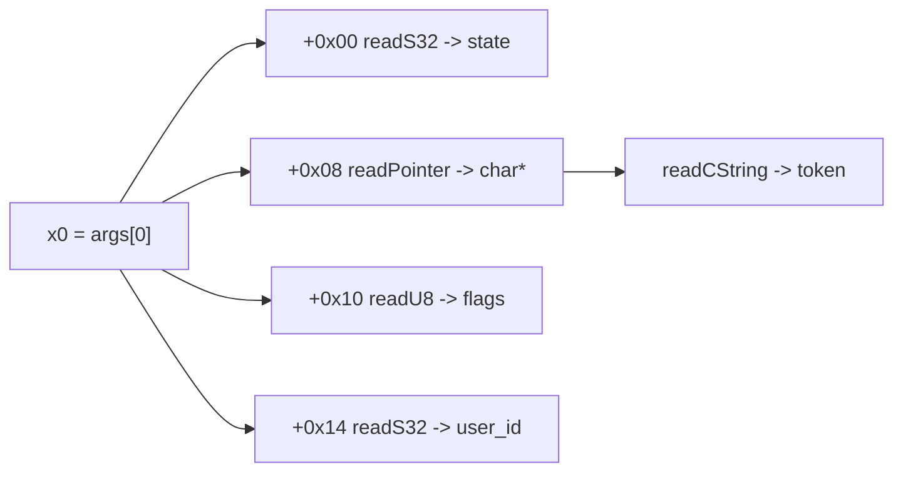

# Example: Reading-Struct-Args-With-A-Reconstructed-Layout

## Goal

Bridge static struct-layout reconstruction and dynamic reading: take a struct layout recovered by hand from disassembly (exactly the [[Struct-Field-Access]] exercise in [[ARM64-Android]]) and read its fields live in a Frida hook, where `args[0]` is a pointer to that struct. Belongs to [[Native-Memory-And-ARM64]]. The point is that `args[i]` being "just a `NativePointer`" is only useful once ARM64 analysis has told you *what it points to*.

## Walkthrough

Suppose static analysis (per [[Struct-Field-Access]]) reconstructed this layout for the pointer passed in `x0`:

```c
struct Session {
    int32_t  state;      // +0x00
    // 4 bytes padding
    char    *token;      // +0x08  (pointer to a C string)
    uint8_t  flags;      // +0x10
    int32_t  user_id;    // +0x14
};
```

```javascript
const fn = Module.findBaseAddress("libnative-lib.so").add(0x81d0); // session_commit(), from Ghidra

Interceptor.attach(fn, {
    onEnter(args) {
        const s = args[0];                          // x0 = struct Session*
        const state  = s.add(0x00).readS32();
        const token  = s.add(0x08).readPointer().readCString();
        const flags  = s.add(0x10).readU8();
        const userId = s.add(0x14).readS32();
        console.log(`[*] session_commit(state=${state}, token="${token}", flags=0x${flags.toString(16)}, user=${userId})`);
    }
});
```

## Step by step

1. `args[0]` is the `NativePointer` in `x0`. Every field read is `base.add(offset).read<Type>()` — the offsets are exactly the ones the disassembly's `ldr`/`ldrb` instructions used, so this hook is a direct transcription of what the function itself does to its argument.
2. `.readS32()` vs `.readU8()` vs `.readPointer()` must match the *access width* seen statically: a `ldrb` (byte) at `+0x10` means `readU8()`, an `ldr w` (32-bit) means `readS32()`/`readU32()`, an `ldr x` (64-bit) at `+0x08` that's used as an address means `readPointer()`.
3. The `token` field holds a *pointer to* a string, so it's a double dereference: `.readPointer()` gets the `char*`, then `.readCString()` follows it to the bytes. Getting this one level of indirection wrong is the most common mistake — reading `+0x08` as a string directly would try to interpret the pointer's raw bytes as text.
4. This hook is also how you *validate* a reconstructed layout: if `token` reads back as a sensible string and `state`/`user_id` as sane numbers across several calls, the layout is right; garbage means an offset or width is off, and you go back to the disassembly.

## Diagram



## See also

- [[Native-Memory-And-ARM64]]
- [[Struct-Field-Access]] and [[Memory-And-Data-Structures]] in [[ARM64-Android]] — the static side this example reads live.
- [[Functions-And-Calling-Convention]] in [[ARM64-Android]] — why `args[0]` maps to `x0`.

## References

- [[Frida-Dynamic-Instrumentation-Bibliography|Bibliography]]
