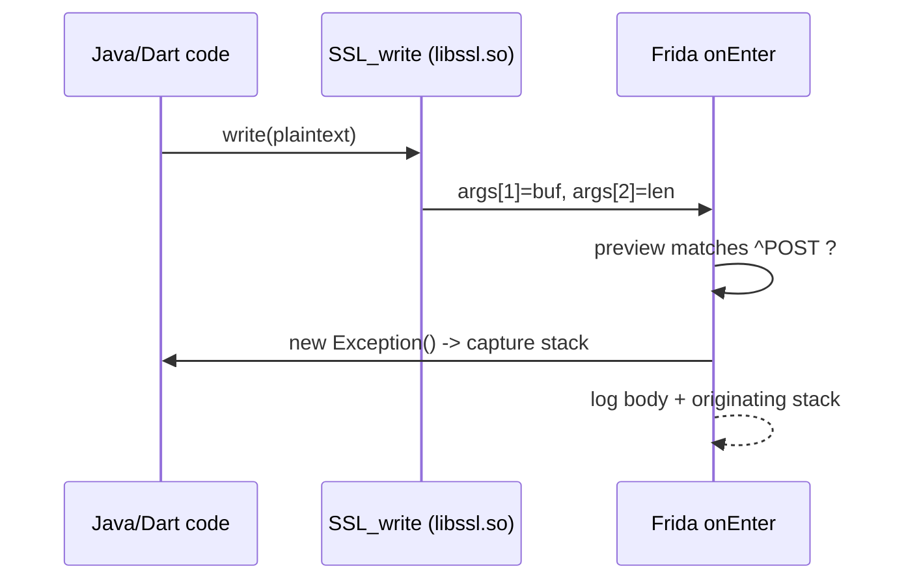

# Example: Correlating-SSL-Write-With-A-Java-Stack

## Goal

Turn a raw `SSL_write` dump into something actionable by attaching a **Java stack trace** to each write, so you know *which code path* produced each plaintext buffer instead of a flat, uncorrelated stream of bytes. Belongs to [[Network-Interception]]. Useful the moment an app makes many concurrent requests and the `hexdump` output alone can't tell you which buffer belongs to the login call.

## Walkthrough

```javascript
Java.perform(() => {
    const sslWrite = Module.findExportByName("libssl.so", "SSL_write");
    const Log = Java.use("android.util.Log");
    const Exception = Java.use("java.lang.Exception");

    Interceptor.attach(sslWrite, {
        onEnter(args) {
            const len = args[2].toInt32();
            const preview = args[1].readUtf8String(Math.min(len, 200));
            // Only bother building a stack for writes that look like an HTTP request line.
            if (preview && /^(GET|POST|PUT|DELETE) /.test(preview)) {
                const stack = Log.getStackTraceString(Exception.$new());
                console.log("[*] SSL_write " + len + " bytes:\n" + preview);
                console.log("[*] originated from:\n" + stack);
            }
        }
    });
});
```

## Step by step

1. `SSL_write`'s plaintext is valid on entry (unlike `SSL_read`, whose buffer is filled during the call — see [[Network-Interception]]), so reading it in `onEnter` is correct.
2. Filtering on an HTTP method prefix keeps the log readable — TLS also carries keep-alives, protocol framing, and non-HTTP payloads you rarely care about, and building a stack trace for every single write is expensive.
3. The stack-trace trick is `Log.getStackTraceString(new Exception())`: constructing a throwable captures the current Java call stack without throwing it, and `getStackTraceString` formats it. This works because even a Flutter app's `SSL_write` is usually reached through *some* JNI boundary you can name — and for a pure-native call stack with no Java frames, `Thread.backtrace(this.context, Backtracer.ACCURATE)` is the native equivalent.
4. The output pairs each request body with the exact method chain that emitted it — this is what lets you say "the login POST comes from `AuthService.login`" rather than "some buffer somewhere contained a password".

## Diagram



## See also

- [[Network-Interception]]
- [[Java-Layer-Hooking]] — the `Java.use`/`$new` mechanics used to build the throwable.
- [[Flutter-Dart-AOT]] in [[ARM64-Android]] — why a Flutter app forces the native `SSL_write` hook in the first place.

## References

- [[Frida-Dynamic-Instrumentation-Bibliography|Bibliography]]
