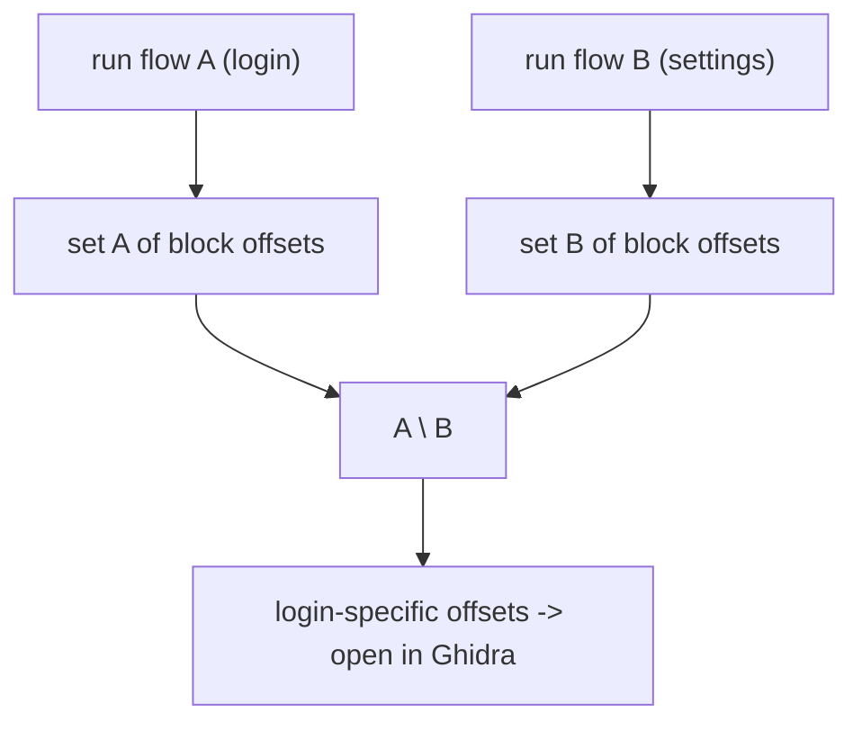

# Example: Coverage-Diff-To-Locate-A-Feature

## Goal

Use Stalker **block** coverage to find *where in a large `.so` a specific feature lives*, before opening a disassembler at all: record the set of basic blocks visited during the flow you care about, record a second set during an unrelated flow, and diff them. Belongs to [[Stalker-And-Code-Tracing]]. This is the fastest way to narrow "somewhere in this 4 MB library" down to a handful of functions.

## Walkthrough

```javascript
const mod = Process.getModuleByName("libnative-lib.so");
const base = mod.base, end = base.add(mod.size);
let blocks = new Set();

function startCoverage(tid) {
    blocks = new Set();
    Stalker.follow(tid, {
        events: { block: true },
        onReceive(events) {
            Stalker.parse(events, { annotate: false }).forEach(ev => {
                const addr = ev[1];                 // block start address
                if (addr.compare(base) >= 0 && addr.compare(end) < 0) {
                    blocks.add(addr.sub(base).toString(16)); // store as module-relative offset
                }
            });
        }
    });
}

rpc.exports = {
    start() { startCoverage(Process.getCurrentThreadId()); return true; },
    stop() { Stalker.unfollow(Process.getCurrentThreadId()); Stalker.flush(); return Array.from(blocks); }
};
```

Drive it from the host: `start()`, perform flow A (e.g. tap "login"), `stop()` → set A. Repeat for flow B (e.g. tap "settings") → set B. Then `A \ B` (offsets only in the login run) are strong candidates for login-specific code.

## Step by step

1. `events: { block: true }` records each basic block the first time it executes in a Stalker session — much lower volume than `exec` (every instruction) but still fine-grained enough to distinguish code paths.
2. Filtering to the target module's address range drops all the noise from libc, libart, and the rest — you only care about coverage inside the library you're reversing.
3. Storing **module-relative offsets** (`addr.sub(base)`) instead of absolute addresses makes the sets comparable across runs even though ASLR gives the module a different base each launch, and makes the surviving offsets directly openable in Ghidra (which uses file offsets).
4. The set difference is the whole trick: code that runs in *both* flows (framework, logging, UI plumbing) cancels out, leaving only what's unique to the flow of interest. Feed those offsets straight into [[Static-Dynamic-Integration]]'s workflow.

## Diagram



## See also

- [[Stalker-And-Code-Tracing]]
- [[Static-Dynamic-Integration]] — where the surviving offsets go next.
- [[Control-Flow-Patterns]] in [[ARM64-Android]] — reading the branches inside a block once you've found it.

## References

- [[Frida-Dynamic-Instrumentation-Bibliography|Bibliography]]
