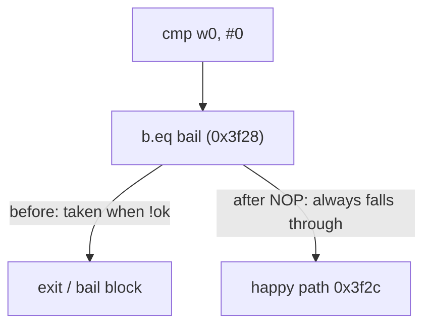

# Example: Forcing-A-Conditional-Branch-With-PatchCode

## Goal

Show the surgical end of code patching: flipping a single conditional branch so a check always "passes", using `Memory.patchCode` and Frida's `Arm64Writer`, when a full `Interceptor.replace` would be overkill. Belongs to [[Memory-Patching-And-Code-Redirection]]. The worked case is neutralizing an inline `if (tampered) exit()` guard that lives mid-function, not at a hookable entry point.

## Walkthrough

Static analysis found this at `libnative-lib.so + 0x3f28`:

```asm
; 0x3f24: cmp   w0, #0          ; w0 = integrity_ok?
; 0x3f28: b.eq  #0x3f60         ; if not ok, jump to the "bail out / exit" block
; 0x3f2c: ...                   ; happy path continues here
```

We want the `b.eq` at `0x3f28` to never be taken — the happy path should always fall through:

```javascript
const branch = Module.findBaseAddress("libnative-lib.so").add(0x3f28);

Memory.patchCode(branch, 4, code => {                 // one AArch64 instruction = 4 bytes
    const w = new Arm64Writer(code, { pc: branch });
    w.putNop();                                       // replace `b.eq #0x3f60` with a no-op
    w.flush();
});
console.log("[*] integrity branch at 0x3f28 neutralized");
```

## Step by step

1. Every AArch64 instruction is exactly 4 bytes, so patching one branch means a 4-byte region — pass `4` as the size and emit exactly one replacement instruction. Emitting more, or fewer, corrupts the following instruction (see [[Instructions]] in [[ARM64-Android]] for encodings).
2. `Memory.patchCode` transparently flips the page to writable, applies your writer's bytes, flushes the CPU instruction cache, and restores protection — a raw `Memory.writeByteArray` into `.text` would segfault without a manual `Memory.protect(..., "rwx")` and an `Instruction`-cache flush.
3. Replacing the conditional branch with `putNop()` makes control flow *always fall through* to the happy path — the opposite (always bail) would be `putBImm(bailTarget)`, and "always take the branch" would be an unconditional `b` to the same target the `b.eq` used.
4. Choose this over `Interceptor.replace` when the check is **inline in the middle of a function you otherwise want to run normally** — there's no function entry to replace, and you want every other instruction of that function untouched. Reserve `Interceptor.replace` for neutralizing a whole self-contained function (the `isDeviceRooted` case in [[Memory-Patching-And-Code-Redirection]]).

## Diagram



## See also

- [[Memory-Patching-And-Code-Redirection]]
- [[Anti-Detection-And-Gadget-Mode]] — the usual reason you're flipping an integrity/root branch.
- [[Instructions]] and [[Control-Flow-Patterns]] in [[ARM64-Android]] — reading the branch's encoding and confirming its target before patching.

## References

- [[Frida-Dynamic-Instrumentation-Bibliography|Bibliography]]
