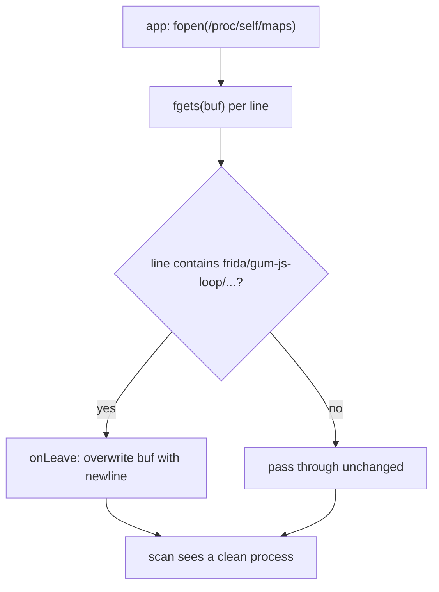

# Example: Faking-Proc-Reads-For-Frida-Detection

## Goal

Defeat the most common *native* Frida-detection primitive — scanning `/proc/self/maps` (or `/proc/self/task/*/status`) for Frida's own mapped libraries and thread names — by hooking the file-reading layer and filtering the tell-tale lines out. Belongs to [[Anti-Detection-And-Gadget-Mode]]. This complements the Java-layer root-detection template in that chapter; a native maps scan doesn't touch Java at all.

## Walkthrough

```javascript
const BAD = ["frida", "gum-js-loop", "gmain", "linjector", "gadget"];

// fgets() reads /proc/self/maps line by line; drop any line naming a Frida artifact.
const fgets = Module.findExportByName("libc.so", "fgets");
Interceptor.attach(fgets, {
    onEnter(args) { this.buf = args[0]; },
    onLeave(retval) {
        if (retval.isNull()) return;                 // EOF or error, nothing to scrub
        const line = this.buf.readCString();
        if (line && BAD.some(s => line.toLowerCase().includes(s))) {
            // Overwrite this line with an innocuous one of the same-or-shorter length.
            this.buf.writeUtf8String("\n");
            console.log("[*] scrubbed maps line: " + line.trim());
        }
    }
});
```

## Step by step

1. Detection code rarely calls the `open`/`read` syscalls directly — it uses `fopen`+`fgets` to walk `/proc/self/maps` a line at a time. Hooking `fgets` lets you inspect and rewrite each line *after* the kernel filled the buffer (hence `onLeave`, like `SSL_read` in [[Network-Interception]]).
2. Matching a small denylist of substrings (`frida`, the characteristic thread names `gum-js-loop`/`gmain`, the injector name) catches the lines that reveal instrumentation without disturbing legitimate mappings.
3. Rewriting the line to a bare newline is safe because the replacement is **no longer** than the original — writing a longer string would overflow the caller's fixed-size buffer. If you needed to preserve realistic content you'd substitute an equally-long benign mapping instead of blanking it.
4. This only covers the `fgets` path; a thorough check might also `readlink` `/proc/self/task/*/comm` or scan open ports — each is *another* function to hook the same way. The hard part, as [[Anti-Detection-And-Gadget-Mode]] stresses, is *finding which* check the app actually runs (via [[Static-Dynamic-Integration]]'s string-search-then-confirm loop), not the hooking itself.

## Diagram



## See also

- [[Anti-Detection-And-Gadget-Mode]]
- [[Native-Memory-And-ARM64]] — the `Interceptor.attach` + `onLeave` buffer-reading mechanics reused here.
- [[Static-Dynamic-Integration]] — locating the specific detection routine before hooking it.

## References

- [[Frida-Dynamic-Instrumentation-Bibliography|Bibliography]]
