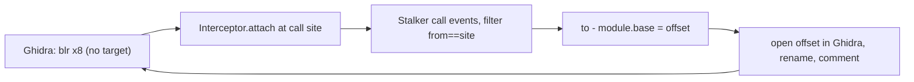

# Example: Resolving-An-Indirect-Call-With-Stalker

## Goal

Close the static/dynamic loop on the one thing a disassembler genuinely can't do: resolve an indirect call (`blr x8`) whose target is a runtime value. Use a tightly-scoped Stalker `call` trace to capture the concrete destination, map it back to a module offset, and hand it to Ghidra. Belongs to [[Static-Dynamic-Integration]]. This is the canonical "dynamic tells static something static could never compute" case.

## Walkthrough

Ghidra shows an opaque dispatch at `libapp.so + 0x51c0`:

```asm
; 0x51bc: ldr   x8, [x1, #0x30]   ; load a function pointer out of a vtable/dispatch table
; 0x51c0: blr   x8                ; call it — Ghidra has no idea where
```

Bracket a Stalker `call` trace around exactly that one instruction:

```javascript
const site = Module.findBaseAddress("libapp.so").add(0x51c0);
const mod = Process.getModuleByName("libapp.so");

Interceptor.attach(site, {
    onEnter() {
        const tid = Process.getCurrentThreadId();
        this.tid = tid;
        Stalker.follow(tid, {
            events: { call: true },
            onReceive(events) {
                Stalker.parse(events, { annotate: false }).forEach(([, from, to]) => {
                    if (from.equals(site)) {
                        const off = to.sub(mod.base);
                        console.log(`[*] blr x8 at 0x51c0 -> libapp.so+0x${off.toString(16)}`);
                    }
                });
            }
        });
    },
    onLeave() { Stalker.unfollow(this.tid); Stalker.flush(); }
});
```

## Step by step

1. Attaching at the call site and following the thread only for the duration of that call keeps Stalker's cost minimal (see [[Stalker-And-Code-Tracing]] on scoping `follow`/`unfollow` tightly) — you don't trace the whole app, just the single dispatch.
2. Filtering the `call` events to `from.equals(site)` isolates *this* indirect branch from every other call the thread makes in that window, so the log is one line per resolution.
3. Converting the absolute `to` address back to a **module-relative offset** (`to.sub(mod.base)`) is what makes it useful statically — that offset is a real function you can jump to in Ghidra, where a moment ago there was only `blr x8`.
4. Run it across several interactions: if the offset is always the same, it's effectively a direct call the compiler happened to route through a register; if it varies, you've mapped out a polymorphic dispatch table (Dart AOT's dispatch, a C++ vtable — see [[Flutter-Dart-AOT]]) and each distinct target is a real method to annotate.
5. The feedback half: rename each resolved target in Ghidra and add a comment noting it's the runtime target of the `blr` at `0x51c0` — the static database now records what only the running process could reveal.

## Diagram



## See also

- [[Static-Dynamic-Integration]]
- [[Stalker-And-Code-Tracing]] — the tracing engine used here.
- [[Control-Flow-Patterns]] in [[ARM64-Android]] — recognizing an indirect-branch dispatch in disassembly to begin with.

## References

- [[Frida-Dynamic-Instrumentation-Bibliography|Bibliography]]
