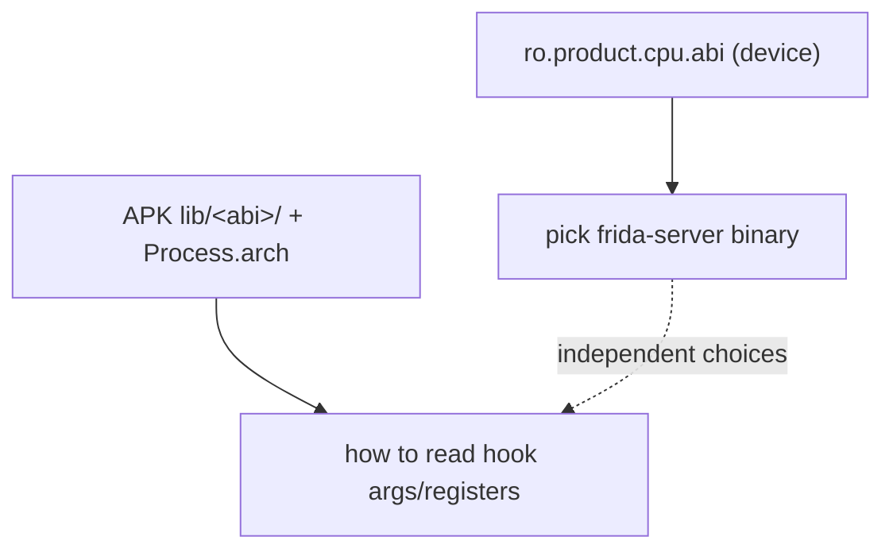

# Example: Matching-Frida-Server-To-The-Target-ABI

## Goal

Make concrete the distinction [[Android-ABIs-And-Emulation]] draws in the abstract: the `frida-server` binary must match the **device/emulator's own ABI**, while the ABI your *hooks* see is whichever one the target app's native code actually runs in. Belongs to [[Android-ABIs-And-Emulation]]. This is the step that silently wastes an hour when `frida-server` won't start or attaches but sees the "wrong" architecture.

## Walkthrough

```bash
# 1. What ABI is the DEVICE? This decides which frida-server binary to push.
adb shell getprop ro.product.cpu.abi          # e.g. x86_64  (a typical AVD)
adb shell getprop ro.product.cpu.abilist      # e.g. x86_64,arm64-v8a,armeabi-v7a

# 2. Push the frida-server built for THAT device ABI (x86_64 here), not the app's.
adb push frida-server-16.x.x-android-x86_64 /data/local/tmp/frida-server
adb shell "chmod 755 /data/local/tmp/frida-server"
adb shell "su -c /data/local/tmp/frida-server &"

# 3. What ABI does the APP's native code actually use? This decides how to read hook args.
adb shell run-as net.pluservice.tua ls lib/    # or unzip -l the APK: lib/arm64-v8a, lib/x86_64, ...
```

```javascript
// 4. Confirm from inside the process which architecture your hooks are dealing with.
console.log("[*] Process.arch = " + Process.arch);   // "arm64" or "x64" — governs args/register reading
Process.enumerateModules()
    .filter(m => m.name.endsWith(".so"))
    .slice(0, 5)
    .forEach(m => console.log(`    ${m.name} @ ${m.base}`));
```

## Step by step

1. **`frida-server` matches the device**, full stop: on an x86_64 AVD you run the x86_64 server even if you intend to analyze an arm64 app — the server is a normal process on that OS and must be that OS's architecture.
2. **The app's native ABI is a separate question.** An x86_64 AVD with `abilist` including `arm64-v8a` can run an arm64-only app under the platform's binary translator; then `Process.arch` inside that app reads `arm64`, and your `args[i]`/register reasoning must follow AAPCS64 (see [[Functions-And-Calling-Convention]] in [[ARM64-Android]]), *not* x86_64 — even though the server is x86_64.
3. `Process.arch` is the authoritative answer to "which calling convention do my hooks follow", because it reflects the architecture of the code Frida injected into, not the host. Check it before trusting any register-level reasoning.
4. If an app ships only `armeabi-v7a` (32-bit ARM), that can force an emulator/API-level choice all on its own — the reason [[Android-ABIs-And-Emulation]] treats ABI as an environment problem, not just a trivia point: you may not be able to run a 32-bit-only app on an arm64-only image at all.

## Diagram



## See also

- [[Android-ABIs-And-Emulation]]
- [[Frida-Server-Setup]] and [[Frida]] in [[Tools]] — the install/run mechanics referenced in the shell steps.
- [[ADB-AVD-Cheatsheet]] in [[Cheatsheets]] — the `adb`/`getprop` commands used above.

## References

- [[Frida-Dynamic-Instrumentation-Bibliography|Bibliography]]
