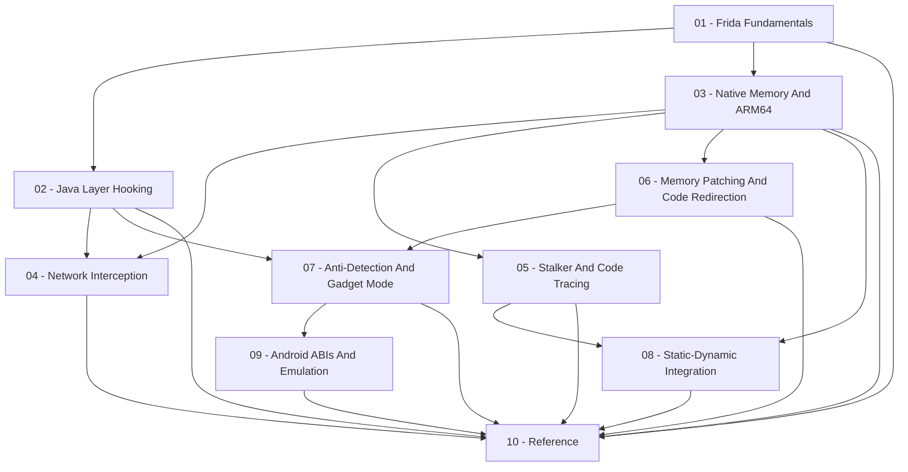

# Frida-Dynamic-Instrumentation

Instrumenting a **running** Android app with [Frida](https://frida.re/) instead of only reading it statically: hooking Java/Kotlin methods and native ARM64 functions, reading and writing process memory while the app is alive, and intercepting network traffic before it's encrypted or after it's decrypted. Where [[ARM64-Android]] and [[Dalvik-Bytecode]] cover reading an app cold from disassembly and smali, this topic covers the moment you stop guessing and just ask the running process — and, just as importantly, covers how the static skills from those two topics tell you *where* to hook and *how to interpret* what you get back at runtime. The three are complementary, not alternatives: static analysis without dynamic confirmation is a pile of hypotheses, and dynamic instrumentation without static analysis is poking at a black box with no idea what you're looking at.

> [!warning] Ethical use
>
> This material is for educational and personal-research purposes around reverse engineering and mobile security. Instrumenting, hooking, or intercepting traffic from a third-party app should always respect its license, terms of service, and applicable local regulations — this is about understanding how an app you're authorized to analyze behaves, not about attacking services you don't control.

## Map of this topic

| Section | Covers |
| --- | --- |
| [[Frida-Dynamic-Instrumentation-Reference\|Reference]] | glossary, bibliography, vault-wide reference-entry/example/snippet listings for this topic |

## Relevant standalone notes

Case studies, cheatsheets, tools, reading notes, and projects aren't scoped to this topic alone —
they live once, shared vault-wide. These are the ones that draw on Frida-Dynamic-Instrumentation:

- [[Tua-Case-Study]] in [[Case-Studies]]
- [[Frida-JS-API-Cheatsheet]] in [[Cheatsheets]]
- [[Frida]], [[Frida-Server-Setup]] in [[Tools]]

## Chapters

1. [[Frida-Fundamentals]] (`01-Frida-Fundamentals/`) — architecture (client/server split, GumJS), spawn vs. attach, the injected JavaScript runtime, and the shape of a basic script.
2. [[Java-Layer-Hooking]] (`02-Java-Layer-Hooking/`) — `Java.perform`/`Java.use`, hooking overloaded methods, replacing vs. observing an implementation, enumerating loaded classes.
3. [[Native-Memory-And-ARM64]] (`03-Native-Memory-And-ARM64/`) — `Interceptor.attach` on native exports, reading/writing process memory, and why [[Functions-And-Calling-Convention]] and [[Reading-Raw-Disassembly]] from [[ARM64-Android]] are what make `args[0..7]` and a memory dump meaningful instead of opaque numbers.
4. [[Network-Interception]] (`04-Network-Interception/`) — hooking OkHttp/`HttpsURLConnection` at the Java layer vs. hooking BoringSSL's `SSL_write`/`SSL_read` at the native layer, and why a Flutter app (see [[Flutter-Dart-AOT]]) usually forces you into the latter.
5. [[Stalker-And-Code-Tracing]] (`05-Stalker-And-Code-Tracing/`) — following a thread instruction-by-instruction or call-by-call at runtime, turning "which branch would be taken" hypotheses from [[Control-Flow-Patterns]] into ground truth for one real execution.
6. [[Memory-Patching-And-Code-Redirection]] (`06-Memory-Patching-And-Code-Redirection/`) — `Interceptor.replace`, `NativeCallback`/`NativeFunction`, and `Memory.patchCode` for actively changing behavior, not just observing it.
7. [[Anti-Detection-And-Gadget-Mode]] (`07-Anti-Detection-And-Gadget-Mode/`) — bypassing root/emulator and Frida-specific detection, and Frida Gadget for targets that can't be rooted at all.
8. [[Static-Dynamic-Integration]] (`08-Static-Dynamic-Integration/`) — closing the loop with [[ARM64-Android]]: dumping live/decrypted memory back out for static re-analysis, resolving indirect calls with Stalker, and feeding runtime findings back into a disassembler.
9. [[Android-ABIs-And-Emulation]] (`09-Android-ABIs-And-Emulation/`) — what an ABI is, why an AVD's own architecture and the ABIs it can run app native code in are two separate questions, why a genuinely 32-bit-ARM target can force an old, Play-Store-certified API level, and why `extractNativeLibs=false` makes repackaging a native library (e.g. Frida Gadget) fail installation if the new library isn't stored uncompressed.
10. [[Frida-Dynamic-Instrumentation-Reference|Reference]] (`10-Reference/`) — glossary, bibliography, and the aggregated examples/snippets/reference-entry listings for this topic.

## Where to start

1. Start with [[Frida-Fundamentals]] to get a script attached to a process at all.
2. [[Java-Layer-Hooking]] and [[Native-Memory-And-ARM64]] can be read in either order depending on whether the app you're targeting is a normal Java/Kotlin app or a Flutter/Dart-AOT one — see [[Flutter-Dart-AOT]] for why that distinction matters.
3. [[Network-Interception]] leans on both of the previous two.
4. [[Stalker-And-Code-Tracing]] and [[Memory-Patching-And-Code-Redirection]] extend [[Native-Memory-And-ARM64]] from observing to tracing and actively modifying behavior.
5. [[Anti-Detection-And-Gadget-Mode]] applies [[Java-Layer-Hooking]] and [[Memory-Patching-And-Code-Redirection]] to the single most common practical obstacle: an app that notices it's being analyzed.
6. [[Static-Dynamic-Integration]] is the capstone — the explicit workflow for feeding what Frida learns at runtime back into the static ARM64 analysis from [[ARM64-Android]], and vice versa.
7. [[Android-ABIs-And-Emulation]] is the one chapter that's more about environment than technique — read it whenever an emulator setup or an APK install is the thing standing between you and step 1, rather than after finishing the rest in order.
8. For a full, real-world investigation of one app at a time, see [[Case-Studies]].

## See also

- [[Home]]
- [[ARM64-Android]] — the static-analysis skills (registers, calling convention, memory layout) this topic constantly leans on to make sense of what a hook actually receives.
- [[Dalvik-Bytecode]] — reading the smali surface that tells you which classes/methods/native declarations exist to hook in the first place.
