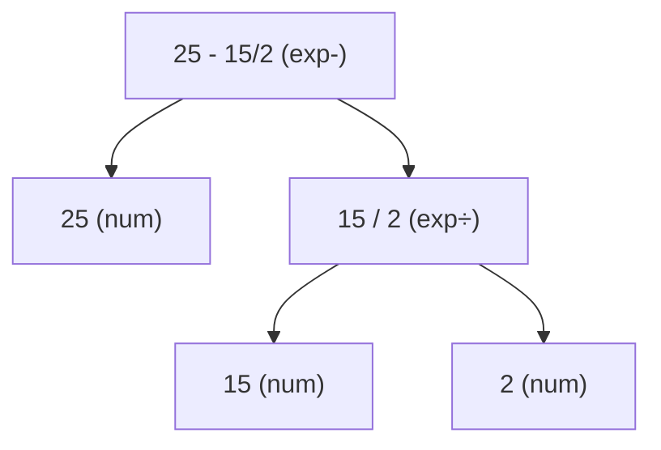

# Example: Deriving-An-Arithmetic-Expression

## Goal

Build a complete big-step **derivation tree** for one expression, so the abstract rules of [[Operational-Semantics]] and [[State-And-Expressions]] become a concrete, checkable proof that a program means a particular value. Also shows why the *parse* (syntax tree) is chosen before evaluating.

## Walkthrough

Evaluate `25 - 15 / 2` (parse `25 - [15 / 2]`) in any state, with rules `(num)`, `(exp-)` (side condition `n ≥ n′`), `(exp÷)` (side condition `n′ ≠ 0`, integer division):

```
                       15 → 15    2 → 2    2 ≠ 0    7 = 15 div 2
   25 → 25            ──────────────────────────────────────────── (exp÷)
   (num)                          15 / 2 → 7                          25 ≥ 7   18 = 25 − 7
  ────────────────────────────────────────────────────────────────────────────────────── (exp-)
                              25 - 15 / 2 → 18
```

## Step by step

1. The root construct is `-`, so the only applicable rule is `(exp-)`; it needs the values of both operands, so evaluation recurses into the sub-expressions.
2. The left operand `25` is a numeral → `(num)` axiom, a leaf: `25 → 25`.
3. The right operand `15 / 2` needs `(exp÷)`: evaluate `15` and `2` (two `(num)` leaves), check the side condition `2 ≠ 0`, then the premise `7 = 15 div 2` (integer division truncates). Result `7`.
4. Back at the root, check `(exp-)`'s side condition `25 ≥ 7` (so the result stays a natural), compute `18 = 25 − 7`. The whole tree proves `⟨25 - 15 / 2⟩ → 18`.
5. **Parse matters:** had we parsed `[25 - 15] / 2`, the tree (and the result, `5`) would differ — the derivation is built over the *syntax tree*, not the flat string. Unlike `+`, subtraction/division aren't associative, so the chosen tree is part of the meaning.

## Diagram



## See also

- [[Operational-Semantics]]
- [[State-And-Expressions]]
- [[Reading-Raw-Dalvik]] in [[Dalvik-Bytecode]] — the informal version: carrying a value across `const`/`div-int`/`sub-int` opcodes is walking this tree left-to-right.

## References

- [[Java-Fundamentals-Bibliography|Bibliography]]
