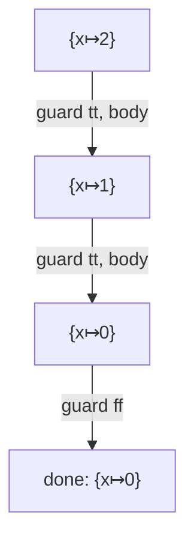

# Example: Evaluating-A-While-Loop

## Goal

Run the recursive `while` rules of [[Commands-And-Control-Flow]] to termination on a concrete state, so the "the loop's premise is the whole loop again, in a changed state" idea is visible as a finite chain of transitions — and line it up with the smali it compiles to.

## Walkthrough

`while (x>0) x = x-1;` from `σ = {x ↦ 2}`:

```
⟨while (x>0) x=x-1;, {x↦2}⟩
  →  (while-tt)   [ x>0 → tt ,  x-1 → 1 ,  assign → {x↦1} ]
⟨while (x>0) x=x-1;, {x↦1}⟩
  →  (while-tt)   [ x>0 → tt ,  x-1 → 0 ,  assign → {x↦0} ]
⟨while (x>0) x=x-1;, {x↦0}⟩
  →  (while-ff)   [ x>0 → ff ]
{x↦0}                                   ← terminal configuration
```

## Step by step

1. First step: the guard `x>0` evaluates to `tt` in `{x↦2}`, so `(while-tt)` applies. Its premises run the body once (`x = x-1` → `{x↦1}`) and then require a derivation of the **same** `while` command in the new state `{x↦1}`.
2. That sub-derivation repeats with `x=1` → `{x↦0}`.
3. In `{x↦0}` the guard is `ff`, so `(while-ff)` applies and yields the state unchanged — the terminal configuration `{x↦0}`.
4. The recursion terminates precisely because each iteration changes the state toward falsifying the guard. `while (x>0) x=x+1;` would instead produce an unending chain — an infinite derivation with no terminal configuration (a non-terminating program).

## Diagram



## See also

- [[Commands-And-Control-Flow]]
- [[Loop-As-Backward-Branch]] in [[ARM64-Android]] and [[Dalvik-Instructions]] in [[Dalvik-Bytecode]] — the compiled loop: a guard test plus a backward `goto`/branch, one iteration per back-edge, exactly matching each `(while-tt)` step here.

## References

- [[Java-Fundamentals-Bibliography|Bibliography]]
