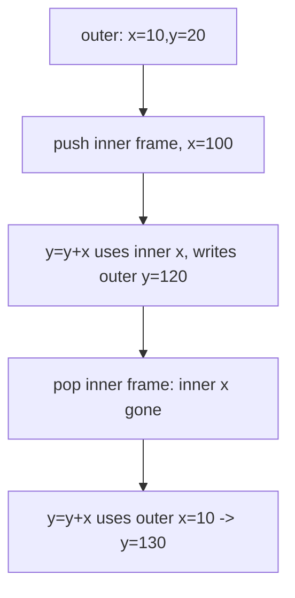

# Example: Nested-Blocks-And-Shadowing

## Goal

Evaluate a block with a nested block that **shadows** an outer variable, tracking the stack of frames push-by-push, so the "most recent binding wins, and locals vanish on block exit" rules of [[Declarations-And-Scope]] are concrete. Then note why Dalvik's flat register file makes this a *decompilation* problem.

## Walkthrough

```java
{ int x = 10; int y = 20;
  {                     // (1) enter inner block: push empty frame
    int x = 100;        // (2) declare inner x in the top frame
    y = y + x;          // (3)
  }                     // (4) exit inner block: pop top frame
  y = y + x;            // (5)
}
```

State (stack grows upward) after each labelled point:

```
(1)  ┌ ω        ┐         (2)  ┌ x↦100   ┐         (3)  ┌ x↦100   ┐
     │ x↦10 y↦20│              │ x↦10 y↦20│              │ x↦10 y↦120│
     └ Ω        ┘              └ Ω        ┘              └ Ω        ┘

(4)  ┌ x↦10 y↦120 ┐  (inner frame popped)     (5)  ┌ x↦10 y↦130 ┐
     └ Ω          ┘                                └ Ω          ┘
```

## Step by step

1. Entering the inner `{ }` pushes a fresh empty frame ω on top of the outer one.
2. `int x = 100;` binds `x` in the **top** frame — it shadows, not overwrites, the outer `x↦10`.
3. `y = y + x;` looks up both names top-down: `x` resolves to `100` (inner frame), `y` to `20` (outer frame, no inner binding). `σ[v/y]` modifies `y` in the **outer** frame (nearest binder) → `y↦120`.
4. Exiting the block pops the top frame: the inner `x↦100` is gone; the change to the outer `y` survives (it lived in the outer frame all along).
5. `y = y + x;` now sees `x↦10` (the outer, un-shadowed binding) → `y↦130`.

## Diagram



## See also

- [[Declarations-And-Scope]]
- [[Registers]] in [[Dalvik-Bytecode]] — Dalvik allocates registers once per method and resolves this scoping statically, so smali shows no push/pop; the *same* register number can stand for the outer and inner `x` in different regions, and separating them back out is part of reading decompiled code.

## References

- [[Java-Fundamentals-Bibliography|Bibliography]]
