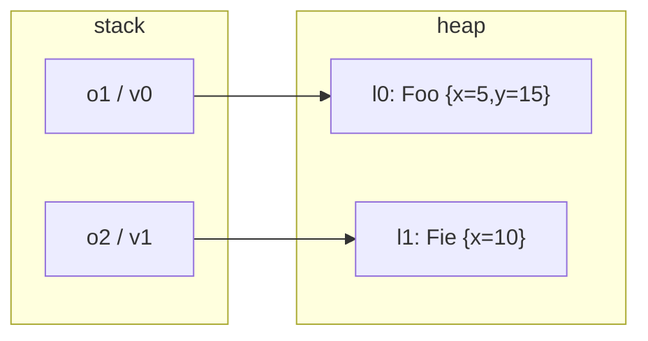

# Example: Objects-On-The-Heap

## Goal

Draw the stack/heap split for a two-object program and map every step to the smali it compiles to, making the [[Classes-And-Objects]] point concrete: **variables (stack) hold references; objects (heap) hold field values**. This is the model you read `new-instance`/`iget`/`iput` with.

## Walkthrough

```java
Foo o1 = new Foo;   Fie o2 = new Fie;
o1.x = 5;   o2.x = 10;
o1.y = o1.x + o2.x;
```

Final stack + heap:

```
   stack (current frame)          heap ζ
   o1 ─────────────►  l₀:  (Foo, { x↦5,  y↦15 })
   o2 ─────────────►  l₁:  (Fie, { x↦10 })
```

Compiled (sketch):

```smali
new-instance v0, LFoo;                 # allocate (Foo, template) at l0
invoke-direct {v0}, LFoo;-><init>()V   # run constructor;  v0 (stack) now holds ref l0
new-instance v1, LFie;
invoke-direct {v1}, LFie;-><init>()V   # v1 holds ref l1

const/4 v2, 0x5
iput v2, v0, LFoo;->x:I                # heap: l0's x := 5
const/16 v2, 0xa
iput v2, v1, LFie;->x:I                # heap: l1's x := 10

iget v2, v0, LFoo;->x:I                # read l0.x -> 5
iget v3, v1, LFie;->x:I                # read l1.x -> 10
add-int v2, v2, v3                     # 15  (on the stack)
iput v2, v0, LFoo;->y:I                # heap: l0's y := 15
```

## Step by step

1. Each `new-instance` allocates a heap object from its class's template (the `(c, ϕ)` of the `(new)` rule) and the following `<init>` runs the constructor; the register (`v0`/`v1`) ends up holding the **reference**, not the object.
2. `o1.x = 5;` is `iput` — it follows `v0`'s reference into the heap and updates that object's `x`. The stack register `v0` is unchanged; only the heap moves (exactly the `o.x = E;` rule).
3. `o1.x + o2.x` is two `iget`s (heap reads) into stack registers, then `add-int` on the stack; the sum is written back with a final `iput`.
4. If a third variable were assigned `o3 = o1;` (`move-object v4, v0`), `o3` and `o1` would hold the **same** reference `l₀` — mutating through one shows through the other. That aliasing is the whole reason a variable holds a reference, not a copy of the object.

## Diagram



## See also

- [[Classes-And-Objects]]
- [[Memory-Model]]
- [[Classes]] and [[Memory-And-Data-Structures]] in [[Dalvik-Bytecode]]/[[ARM64-Android]] — `new-instance`/`iget`/`iput` in full, and the native `ldr`/`str`-at-an-offset a field access becomes.

## References

- [[Java-Fundamentals-Bibliography|Bibliography]]
