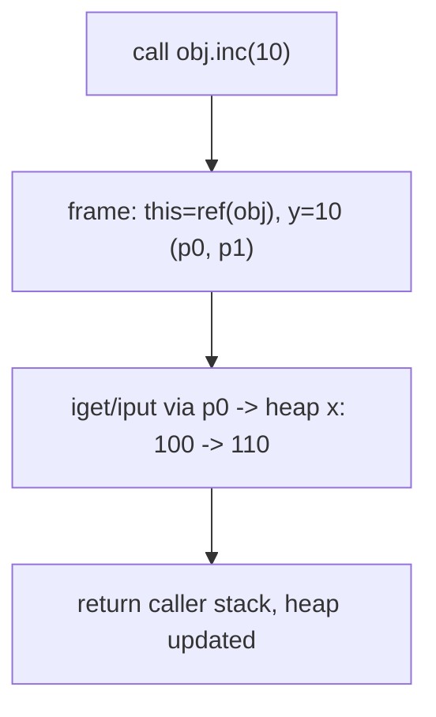

# Example: A-Method-Call-Frame

## Goal

Show the fresh `{parameter, this}` frame a method call runs in, and how a recursive call stacks another one — then map `this`/parameter directly onto Dalvik's `p0`/`p1`. This is the concrete form of the call rule in [[Methods-And-Recursion]] and the fact that **`p0` is `this`**.

## Walkthrough

```java
class Incr { public int x;
  public void inc(int y) { this.x = this.x + y; } }
// obj.inc(10);  with obj.x = 100
```

The call `obj.inc(10)` runs `this.x = this.x + y;` in this fresh single-frame stack:

```
   call frame σ′            heap ζ
   this ─────► σ(obj) ──►  (Incr, { x↦100 })
   y ↦ 10
```

After the body: heap object becomes `(Incr, {x↦110})`; the call returns the **original** caller stack with only the heap changed.

Compiled:

```smali
# instance method Incr.inc(int)  — registers: p0 = this, p1 = y
iget v0, p0, LIncr;->x:I     # this.x
add-int v0, v0, p1           # this.x + y
iput v0, p0, LIncr;->x:I     # this.x = ...
return-void
# call site:
const/16 v1, 0xa
invoke-virtual {v2, v1}, LIncr;->inc(I)V   # v2 = obj (receiver -> p0), v1 = 10 (-> p1)
```

## Step by step

1. The call rule builds a frame containing exactly two bindings: `y ↦ 10` (formal ← actual) and `this ↦ σ(obj)` (the receiver's reference). Nothing from the caller's locals is visible — a method can only reach the receiver's fields (via `this`, through the heap) and its own parameter.
2. `this.x` resolves via the heap using the `this` binding: `iget … p0 …`. The assignment writes back with `iput … p0 …`. Only the heap changes; the caller's stack is returned untouched.
3. **`p0` = `this`, `p1` = `y`.** At the call site, `invoke-virtual {v2, v1}` passes the receiver as the first argument register (→ `p0`) and `10` as the second (→ `p1`). This register→parameter mapping is the single most useful decoding fact for reading instance-method smali.
4. **Recursion** (`this.inc(y-1)`) fires the same rule again, pushing another `{y↦…, this↦σ(obj)}` frame — same object every level. Each `invoke` pushes a fresh register set with its own `p0`/`p1`; the heap effects accumulate and propagate back as each call returns.

## Diagram



## See also

- [[Methods-And-Recursion]]
- [[Memory-Model]]
- [[Methods]] in [[Dalvik-Bytecode]] — `invoke-*`, argument-register ordering, and `p0` as the receiver for non-static methods.

## References

- [[Java-Fundamentals-Bibliography|Bibliography]]
