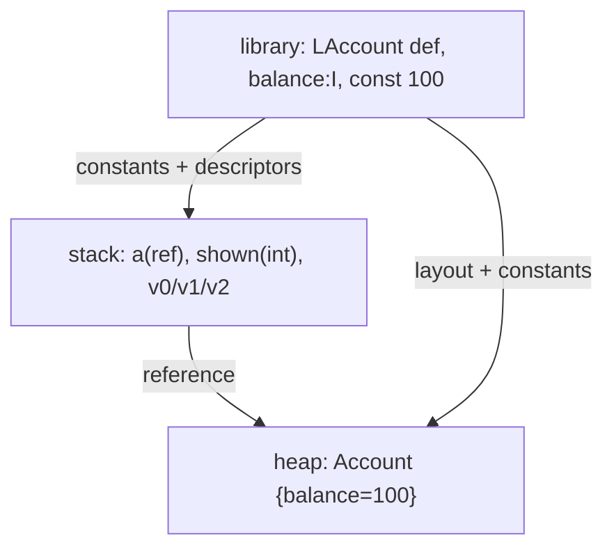

# Example: Tracing-A-Value-Through-The-Three-Regions

## Goal

Take one tiny program and label, for every value, **which of the three regions it lives in** — library (method area), stack, heap — then read the compiled smali as touching those same three regions. This is the [[Memory-Model]] synthesis made concrete, and the mental overlay to keep while reversing.

## Walkthrough

```java
class Account { public int balance; }
// in main:
Account a = new Account;   // (A)
a.balance = 100;           // (B)
int shown = a.balance;     // (C)
```

Region of each thing:

| Value / entity | Region | Why |
|---|---|---|
| the class `Account`, its field `balance:I`, method table | **library** (method area / ρc) | one definition shared by every instance; written at class load |
| the local `a` (a reference) and the local `shown` (an int) | **stack** (σ) | locals of `main`, die when `main` returns |
| the `Account` object `{balance↦100}` | **heap** (ζ) | created by `new`, reached only via the reference in `a` |
| the literal `100`, offsets/descriptors | **library** (constant pool) | compile-time constants baked into the class |

Compiled, annotated by region:

```smali
new-instance v0, LAccount;                  # heap: allocate object;   library: LAccount def consulted
invoke-direct {v0}, LAccount;-><init>()V     # stack: v0 now holds the reference
const/16 v1, 0x64                            # stack: 100 into a register (from library constant pool)
iput v1, v0, LAccount;->balance:I            # heap: object.balance := 100 (field from library)
iget v2, v0, LAccount;->balance:I            # heap read -> stack: v2 = 100  (== local 'shown')
```

## Step by step

1. `new-instance` allocates in the **heap**; it consults the **library** (the `LAccount` class definition) to know the object's size/field layout. The resulting reference lands in a **stack** register `v0` — the local `a`.
2. `const/16 v1, 0x64` loads the constant `100` (from the class's **constant pool**, part of the library) into a **stack** register.
3. `iput … LAccount;->balance:I` writes the value into the **heap** object; the field name and type come from the **library**. Stack `v0` (the reference) is unchanged — only the heap moves.
4. `iget` reads the field back out of the **heap** into a **stack** register (`shown`). One instruction, all three regions in play: `v0` (stack) points into the heap, the field descriptor is library, the result is stack.
5. The overlay to keep while reversing: any smali/native instruction is reading or writing **one** of these three regions. `iget/iput`/`ldr`-off-an-object = heap; register moves/parameters = stack; class/method/field/string references and code = library. Reflection and in-memory dex loading ([[Reflection-and-Runtime-Internals]]) are runtime *edits to the library region*.

## Diagram



## See also

- [[Memory-Model]]
- [[Classes-And-Objects]] and [[Methods-And-Recursion]]
- [[Reflection-and-Runtime-Internals]] in [[Dalvik-Bytecode]] — the runtime data areas this mirrors, and how reflection/dynamic loading manipulate the library region live.

## References

- [[Java-Fundamentals-Bibliography|Bibliography]]
