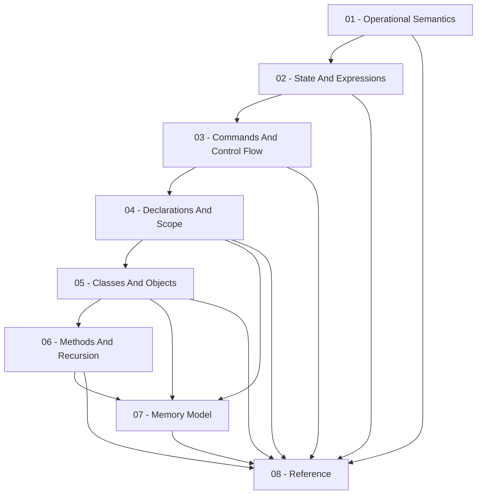

# Java-Fundamentals

The **fundamentals of Java** built up rigorously, from the ground the language actually stands on: a formal **operational semantics** of a Java core (expressions, commands, declarations, classes, objects, methods), following Barbuti–Mancarella–Turini's *Elementi di Semantica Operazionale*. The through-line is **memory** — how a running program is really just a set of transitions over three structures: the **class environment** (the "library" of loaded classes and their methods), the **stack** of frames (local variables, block nesting, method calls), and the **heap** (objects and the references that point at them). Getting these three straight is what makes both everyday Java and the reverse-engineering topics in this vault ([[Dalvik-Bytecode]], [[ARM64-Android]]) make sense: a `.dex` field access, an ARM64 `ldr` off an object pointer, a Frida hook reading `this` — all of it is this model, compiled down.

> [!info] Why operational semantics, not just "how to write Java"
> The point isn't syntax — it's a precise, checkable answer to *what a program means*: what state each construct produces from a given starting state. Once "meaning = a transition between states" is concrete, the memory model (library/stack/heap) stops being a metaphor and becomes the literal thing the rules manipulate.

## Map of this topic

| Section | Covers |
| --- | --- |
| [[Java-Fundamentals-Reference\|Reference]] | glossary, bibliography, vault-wide reference-entry/example/snippet listings for this topic |

## Relevant standalone notes

Case studies, cheatsheets, tools, reading notes, and projects aren't scoped to this topic alone — they live once, shared vault-wide. These draw on Java-Fundamentals:

- [[Dalvik-Bytecode]]'s [[Reflection-and-Runtime-Internals]] chapter is the runtime-internals counterpart to this topic's memory model (class loading, method area, stack frames) at the ART/bytecode level.

## Chapters

1. [[Operational-Semantics]] (`01-Operational-Semantics/`) — transition systems, configurations and terminal configurations, conditional rules, and big-step (natural) semantics with derivation trees; the machinery every later chapter's rules are written in.
2. [[State-And-Expressions]] (`02-State-And-Expressions/`) — the **state** as a function from names to values (a *frame*), and how an expression's value is computed relative to a state (`E[[E]]σ`); integer and boolean expressions.
3. [[Commands-And-Control-Flow]] (`03-Commands-And-Control-Flow/`) — commands as **state transitions**: assignment, blocks, `if`/`else`, `while`; blocked configurations as errors and non-termination.
4. [[Declarations-And-Scope]] (`04-Declarations-And-Scope/`) — declarations that introduce names, and why nested blocks force the state to become a **stack of frames**: local vs. global variables, and block entry/exit as push/pop.
5. [[Classes-And-Objects]] (`05-Classes-And-Objects/`) — classes as templates, objects as `(class, frame)` pairs living in the **heap**, `new`, and **references**: the split between a variable on the stack and the object it points at.
6. [[Methods-And-Recursion]] (`06-Methods-And-Recursion/`) — method declaration vs. invocation, formal vs. actual parameters, the `this` binding, and how recursion is just more frames on the stack, each with its own `this`.
7. [[Memory-Model]] (`07-Memory-Model/`) — the synthesis: **library (class environment / method area) + stack + heap** as the three memory regions of a running program, how they map onto the real JVM and ART, garbage collection, and the bridge to [[Dalvik-Bytecode]]/[[ARM64-Android]].
8. [[Java-Fundamentals-Reference|Reference]] (`08-Reference/`) — glossary, bibliography, and the aggregated examples/snippets/reference-entry listings for this topic.

## Where to start

1. Read [[Operational-Semantics]] first — every other chapter's rules are written in its notation, and its "meaning = transition between states" idea is the spine of the whole topic.
2. [[State-And-Expressions]] and [[Commands-And-Control-Flow]] build the imperative core (variables, assignment, control flow) on top of a single flat state.
3. [[Declarations-And-Scope]] is the pivot: it's where the state stops being one table and becomes a **stack** of frames — the first of the three memory regions.
4. [[Classes-And-Objects]] and [[Methods-And-Recursion]] add the **heap** and the **class environment**, completing the three-region model.
5. [[Memory-Model]] ties them together and connects the abstract model to how the JVM and Android's ART actually lay memory out — the natural hand-off into [[Dalvik-Bytecode]] and [[ARM64-Android]].

## See also

- [[Home]]
- [[Dalvik-Bytecode]] — the same runtime concepts (class loading, method area, stack frames, heap objects) at the level of the bytecode ART actually executes.
- [[ARM64-Android]] — what a field access / method call / object pointer looks like once compiled all the way down to registers and memory.
