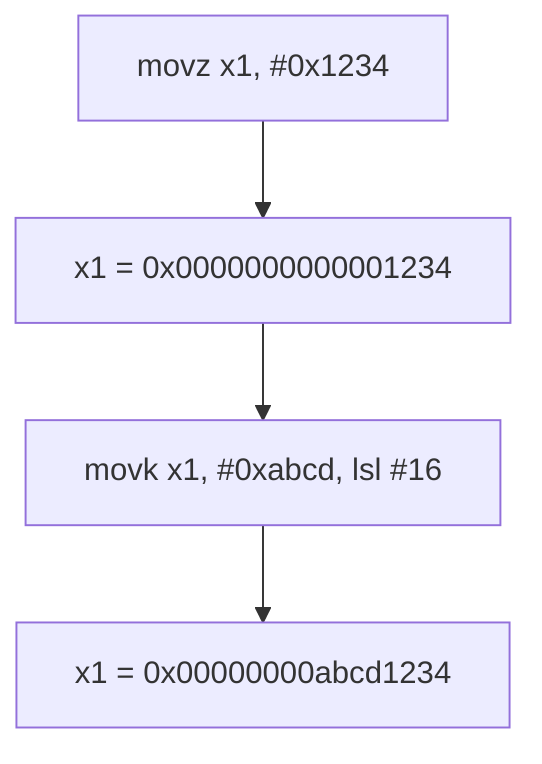

# Example: Basic-Arithmetic-And-Moves

## Goal

Show how ARM64 loads constants into registers — unlike x86, there's no single instruction that can
encode an arbitrary 64-bit immediate, because every instruction is a fixed 32 bits wide. Belongs to
[[Registers-And-Data]].

## Walkthrough

```asm
mov   w0, #5          ; small immediate: encodes directly, w0 = 5
movz  x1, #0x1234              ; move-zero: x1 = 0x0000000000001234 (clears the rest)
movk  x1, #0xabcd, lsl #16     ; move-keep: x1 = 0x00000000abcd1234 (only bits [31:16] touched)
movn  x2, #0                   ; move-NOT:  x2 = NOT(0) = 0xffffffffffffffff, i.e. -1
```

`movz`/`movk`/`movn` each set (or clear) one 16-bit chunk of the destination at a time, selected by
`lsl #0/16/32/48`. A 64-bit constant that doesn't fit a single `mov` pseudo-instruction's encoding
gets built from a `movz` (which zeroes the rest of the register) followed by up to three `movk`s
(which only patch their own 16-bit chunk, leaving the rest alone). Disassemblers usually fold an
obvious `movz`+`movk*` run back into a single `mov x1, #0xabcd00001234`-style comment for
readability — but the underlying bytes are still separate instructions.

`movn` is how small *negative* constants get built cheaply: `movn x2, #0` is literally "load
`0xFFFFFFFFFFFFFFFF`", i.e. `-1`, in one instruction instead of four.

## Step by step

1. `mov w0, #5` — immediate small enough to encode in the instruction itself (12-bit immediate
   field, optionally shifted); this is really `movz` under the hood too, the assembler just picked
   the friendlier mnemonic.
2. `movz x1, #0x1234` — zero out `x1`, then place `0x1234` in bits `[15:0]`.
3. `movk x1, #0xabcd, lsl #16` — leave bits `[15:0]` and `[63:32]` untouched, overwrite bits
   `[31:16]` with `0xabcd`.
4. `movn x2, #0` — bitwise-NOT the (zero-extended) immediate into the register: a cheap way to
   produce `-1` or other small negative constants without a literal pool load.

## Diagram



## See also

- [[Registers-And-Data]]
- [[Register-Width-And-Sign-Extension]]

## References

- [[ARM64-Android-Bibliography|Bibliography]]
