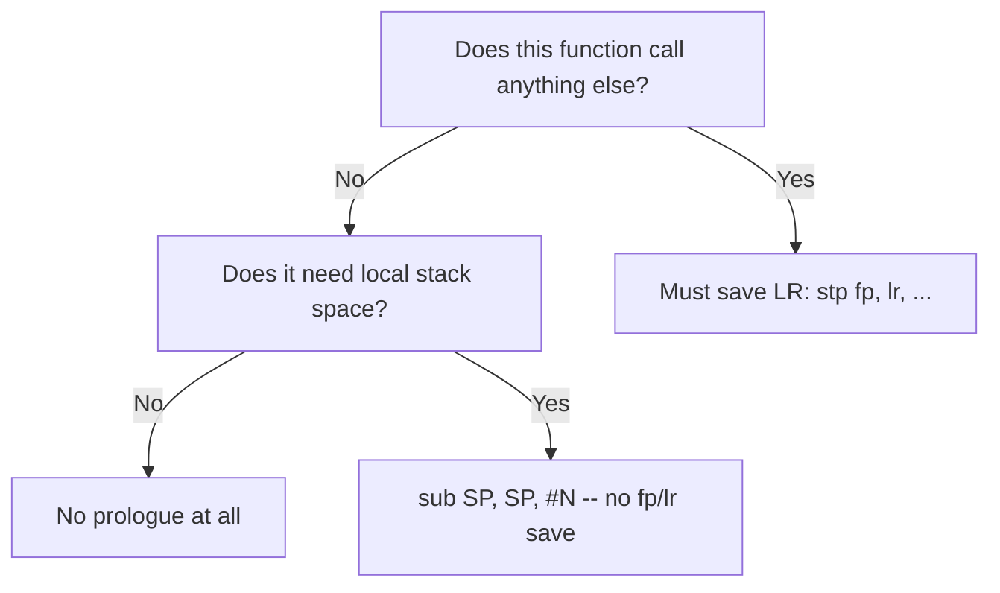

# Example: Leaf-Function-Prologue-Epilogue

## Goal

Show the full spectrum from "no prologue at all" to "minimal prologue for local space only,"
purely under the standard AAPCS64 convention (no runtime bookkeeping). Belongs to
[[Functions-And-Calling-Convention]].

## Walkthrough

```c
// (a) true leaf, no locals
int square(int x) { return x * x; }

// (b) leaf, but needs stack-local scratch space
void fill_buffer(char *buf) {
    char tmp[32];
    memset(tmp, 0, sizeof(tmp));
    memcpy(buf, tmp, sizeof(tmp));
}
```

```asm
square:
    mul     w0, w0, w0
    ret

fill_buffer:
    sub     sp, sp, #0x20     ; reserve 32 bytes for `tmp` -- no fp/lr save needed, it's still a leaf
    mov     x1, sp
    ; ... calls to memset/memcpy would make this NOT a leaf anymore in reality;
    ; assume they're inlined here for illustration ...
    add     sp, sp, #0x20
    ret
```

## Step by step

1. `square` calls nothing, needs no extra stack — the entire function is prologue-free. If you see
   a function start directly with the "real work" instruction, check first whether it even *calls*
   anything before assuming something's missing.
2. `fill_buffer` still calls nothing (in this illustration) but needs 32 bytes of scratch space —
   so it adjusts `SP` directly, without ever touching `X29`/`X30`, because it never needs to
   preserve a return address across a nested call.
3. The moment a function calls something else for real, `LR` must be saved (a nested `bl` would
   overwrite it) — that's the trigger for the full `stp x29, x30, ...` prologue in
   [[Stack-Frame-With-Locals]].

## Diagram



## See also

- [[Functions-And-Calling-Convention]]
- [[Registers-And-Data]]

## References

- [[ARM64-Android-Bibliography|Bibliography]]
