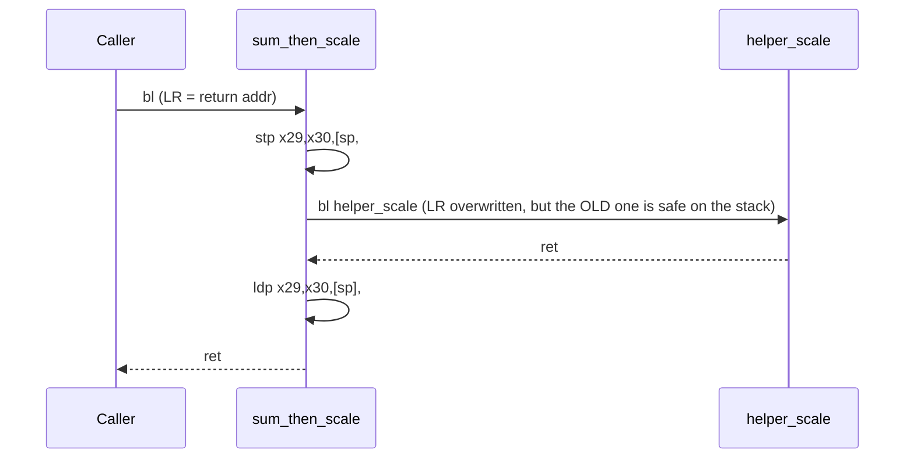

# Example: Stack-Frame-With-Locals

## Goal

Walk a full non-leaf AAPCS64 function: callee-saved register spills, a nested call, and correct
teardown. Belongs to [[Functions-And-Calling-Convention]].

## Walkthrough

```c
int sum_then_scale(int *arr, int n, int factor) {
    int total = 0;
    for (int i = 0; i < n; i++) total += arr[i];
    return helper_scale(total, factor);   // some other function, not inlined
}
```

```asm
sum_then_scale:
    stp     x29, x30, [sp, #-0x20]!   ; save FP/LR, allocate 0x20-byte frame
    mov     x29, sp
    stp     x19, x20, [sp, #0x10]     ; spill x19 (loop accumulator), x20 (n), both callee-saved
    mov     x19, wzr                  ; total = 0
    mov     x20, w1                   ; keep n around across the loop
    mov     x21, x0                   ; keep arr's pointer (x21 also callee-saved, omitted spill for brevity)
    mov     w22, w2                   ; keep factor across the call below

.Lloop:
    cmp     w23, w20                  ; i (w23) < n ?
    b.ge    .Ldone
    ldr     w24, [x21, w23, sxtw #2]
    add     w19, w19, w24
    add     w23, w23, #1
    b       .Lloop

.Ldone:
    mov     w0, w19
    mov     w1, w22
    bl      helper_scale              ; LR is safely saved on the stack, so this doesn't corrupt it
    ldp     x19, x20, [sp, #0x10]     ; restore callee-saved regs before returning
    ldp     x29, x30, [sp], #0x20
    ret
```

## Step by step

1. `stp x29, x30, [sp, #-0x20]!` does two jobs at once: allocates the frame (`SP -= 0x20`) and
   saves both `FP` and `LR` into it, in a single instruction — this pairing is universal enough
   that seeing `stp x29, x30, [sp, #-N]!` is essentially synonymous with "function entry."
2. Any callee-saved register (`X19`-`X28`) the function plans to overwrite gets spilled right after
   — the ABI's promise to the caller ("I'll put these back") has to be kept explicitly.
3. The `bl helper_scale` in the middle is exactly why this function needed to save `LR` in the
   first place: without the earlier `stp`, this call would have clobbered the *original* caller's
   return address.
4. Teardown is the mirror image, in reverse order: restore callee-saved registers, then restore
   `FP`/`LR` and deallocate the frame in one `ldp ..., [sp], #0x20`, then `ret`.

## Diagram



## See also

- [[Functions-And-Calling-Convention]]
- [[Leaf-Function-Prologue-Epilogue]]
- [[Control-Flow-Patterns]]

## References

- [[ARM64-Android-Bibliography|Bibliography]]
