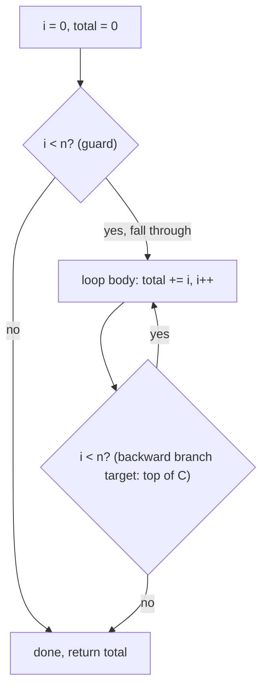

# Example: Loop-As-Backward-Branch

## Goal

Show a `for` loop compiled with the common "test rotated to the bottom" shape, so the loop body
only pays for one branch per iteration instead of two. Belongs to [[Control-Flow-Patterns]].

## Walkthrough

```c
int sum_range(int n) {
    int total = 0;
    for (int i = 0; i < n; i++) total += i;
    return total;
}
```

```asm
sum_range:
    mov     w1, #0            ; total = 0
    mov     w2, #0            ; i = 0
    cmp     w2, w0            ; guard: does the loop run at all?
    b.ge    .Ldone
.Lloop:
    add     w1, w1, w2        ; total += i
    add     w2, w2, #1        ; i++
    cmp     w2, w0            ; i < n ?
    b.lt    .Lloop            ; BACKWARD branch -> this is the loop
.Ldone:
    mov     w0, w1
    ret
```

## Step by step

1. The initial `cmp w2, w0` / `b.ge .Ldone` **before** the loop body is the "does this loop run at
   all" guard — without it, `n <= 0` would incorrectly execute the body once. Its presence is a
   strong hint the source loop's exit condition is checked *before* every iteration (`while`/`for`,
   not `do/while`).
2. Inside `.Lloop`, the body runs, then increments, then re-tests, then `b.lt .Lloop` branches
   **backward** — this single instruction is the entire "is this a loop" signal; nothing else
   distinguishes a loop body from any other block of straight-line code.
3. This "test at the bottom, guard before the top" shape is called **loop rotation**: it costs one
   extra guard branch overall but only one branch per iteration thereafter, instead of a naive
   test-at-the-top translation that would branch twice per iteration (once to check, once to jump
   back). Seeing a near-duplicate comparison both before `.Lloop` and at the bottom of it is the
   signature of this optimization, not of two different loops.

## Diagram



## See also

- [[Control-Flow-Patterns]]
- [[If-Else-As-Branches]]

## References

- [[ARM64-Android-Bibliography|Bibliography]]
