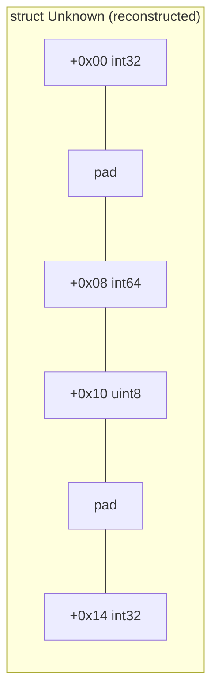

# Example: Struct-Field-Access

## Goal

Show how to reconstruct a plausible C struct layout purely from the offsets a function touches —
the everyday task in NDK-library reversing where no debug info survives. Belongs to
[[Memory-And-Data-Structures]].

## Walkthrough

```asm
; unknown function operating on x0 = some struct pointer
ldr   w1, [x0]           ; offset 0x0, 4 bytes
ldr   x2, [x0, #8]       ; offset 0x8, 8 bytes  (note the gap: 0x4..0x7 is padding)
ldrb  w3, [x0, #0x10]    ; offset 0x10, 1 byte
ldr   w4, [x0, #0x14]    ; offset 0x14, 4 bytes
```

## Step by step

1. A 4-byte read at offset `0` suggests a leading `int32_t`/`float`/enum-sized field.
2. The next read is an 8-byte value at offset `8`, **not** `4` — on a 64-bit target, an 8-byte field
   is naturally aligned to an 8-byte boundary, so the compiler padded bytes `4..7`. Seeing a gap
   like this is usually a stronger signal of "alignment padding" than of "there's a hidden field
   here" — though a real hidden/reserved field is also possible and worth flagging as a hypothesis
   to check against other functions touching the same struct.
3. A 1-byte read at `0x10` right after an 8-byte field lining up exactly (`8 + 8 = 0x10`) confirms
   the previous field's size.
4. The 4-byte read at `0x14`, not `0x11`, again reflects alignment — a `int32_t` field wants 4-byte
   alignment, and `0x11..0x13` would violate that, so the compiler inserted 3 bytes of padding.

Putting it together, a plausible struct:

```c
struct Unknown {
    int32_t field_00;    // + 0x00
    // 4 bytes padding
    int64_t field_08;    // + 0x08
    uint8_t  field_10;   // + 0x10
    // 3 bytes padding
    int32_t field_14;    // + 0x14
};
```

Cross-checking this hypothesis against every other function touching the same base pointer type
(same offsets should always mean the same field) is how you gain confidence in a layout without
source or debug symbols.

## Diagram



## See also

- [[Memory-And-Data-Structures]]
- [[Android-Native-Internals]]

## References

- [[ARM64-Android-Bibliography|Bibliography]]
