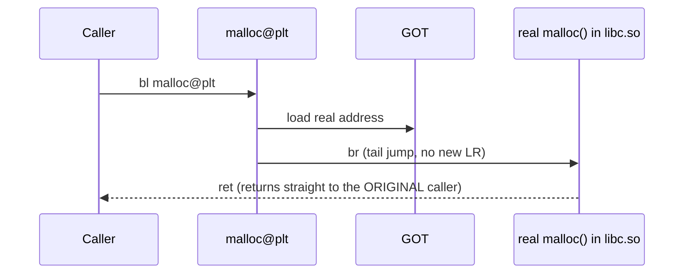

# Example: PLT-Stub-And-Indirect-Call

## Goal

Show why a call to a function in another shared object (e.g. `libc.so`'s `malloc`) doesn't look
like a normal `bl` to that function's real body. Belongs to [[Android-Native-Internals]].

## Walkthrough

```asm
; caller's code:
bl      malloc@plt          ; disassembler-friendly label for "the PLT stub for malloc"

; the PLT stub itself, at the address that label resolves to:
malloc@plt:
    adrp    x16, #page_of_got_entry
    ldr     x17, [x16, #got_entry_offset]   ; load the REAL address of malloc from the GOT
    br      x17                             ; jump there -- tail call, LR is untouched
```

## Step by step

1. From the caller's point of view, this is an ordinary `bl` — nothing distinguishes calling a
   local function from calling one that turns out to be external, at the call site itself.
2. The target address, though, is a tiny stub (often just three instructions: compute the GOT
   entry's address, load it, branch) rather than `malloc`'s actual body.
3. `br` (not `bl`) at the end of the stub is deliberate: it's a **tail jump**, not a nested call — no
   new return address needs to be saved, because when `malloc` eventually returns, it should return
   directly to whoever called `malloc@plt` in the first place, not back into the stub.
4. The GOT entry itself is filled in by the dynamic linker — either **lazily** (first call resolves
   it, subsequent calls hit the real address directly, common on desktop Linux but less so on
   modern Android) or **eagerly at load time** (`RELRO`/`BIND_NOW`-style, increasingly the default
   on Android for security — no lazy-binding stub indirection to attack). Which scheme is in play
   affects whether you'll see a resolver stub the *first* time through, but doesn't change the
   steady-state shape above.

## Diagram



## See also

- [[Android-Native-Internals]]
- [[Functions-And-Calling-Convention]]

## References

- [[ARM64-Android-Bibliography|Bibliography]]
