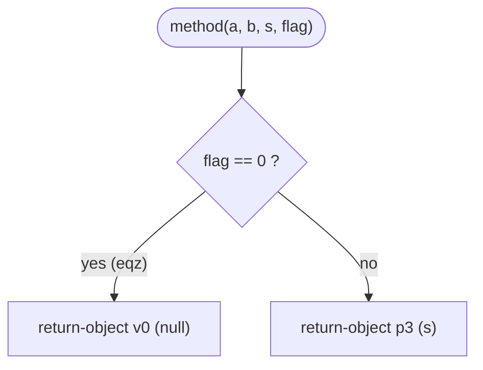

# Example: Method with Parameters

A guided example with several parameters of different types and a reference return type.

## Goal

Translate to smali:

```java
public class Example {
    public Object method(int a, int b, String s, boolean flag) {
        if (flag) {
            return s;
        }
        return null;
    }
}
```

## Generated smali

```smali
.class public LExample;
.super Ljava/lang/Object;

.method public constructor <init>()V
    .locals 0
    invoke-direct {p0}, Ljava/lang/Object;-><init>()V
    return-void
.end method

.method public method(IILjava/lang/String;Z)Ljava/lang/Object;
    .locals 1
    # p0 = this, p1 = a, p2 = b, p3 = s, p4 = flag
    if-eqz p4, :cond_0
    return-object p3
    :cond_0
    const/4 v0, 0x0
    return-object v0
.end method
```

## Step by step

1. The signature `(IILjava/lang/String;Z)Ljava/lang/Object;` encodes, with no separators, the four parameters and the return type — see [[Types]] for the full descriptor table.
2. With `.locals 1` the parameters stay `p1`..`p4` (plus `p0` = `this`); `.registers` isn't needed here since there's no index arithmetic to worry about.
3. `if-eqz p4, :cond_0` jumps to the label if `flag` (a `boolean`, `Z`) is `0` (false).
4. `return-object` returns a reference (used for `String`/`Object`/any reference type), as opposed to `return` (32-bit primitives) or `return-wide` (64-bit primitives, `long`/`double`).

> [!tip] The `return-*` family
> `return-void` (no value), `return` (primitive ≤32 bit), `return-wide` (`long`/`double`), `return-object` (reference). Pick the one matching the return type declared in the signature — see [[Dalvik-Instructions|Instructions]].

## Diagram



## See also

- [[Types]] — descriptors and full signature syntax
- [[Registers]]
- [[Methods]]

## References

- [[Dalvik-Bytecode-Bibliography|Bibliography]]
