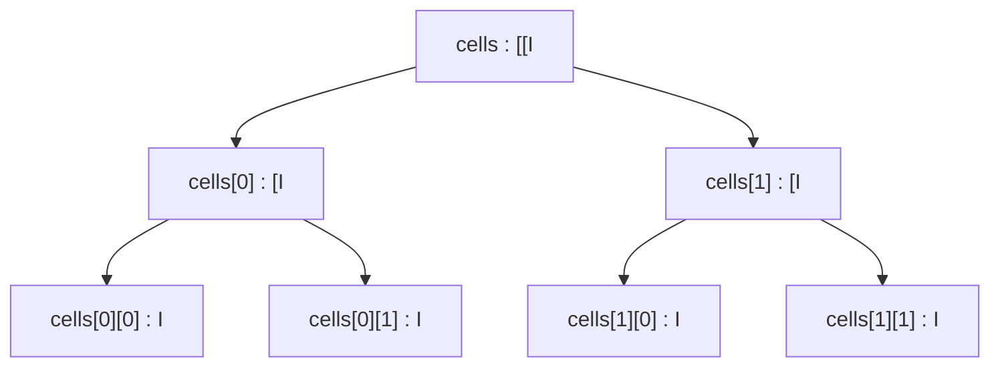

# Example: Multidimensional Arrays

How arrays and multi-dimensional arrays are declared and used in smali, building on the syntax introduced in [[Types]].

## Java source

```java
public class Grid {
    private int[][] cells;

    public Grid(int rows, int columns) {
        cells = new int[rows][columns];
    }

    public void set(int r, int c, int value) {
        cells[r][c] = value;
    }
}
```

## Generated smali

```smali
.class public LGrid;
.super Ljava/lang/Object;

.field private cells:[[I

.method public constructor <init>(II)V
    .locals 1
    invoke-direct {p0}, Ljava/lang/Object;-><init>()V
    filled-new-array {p1, p2}, [I
    move-result-object v0
    # (simplified: real bytecode would build each row array
    #  individually; the key concept here is the [[I descriptor)
    iput-object v0, p0, LGrid;->cells:[[I
    return-void
.end method

.method public set(III)V
    .locals 2
    iget-object v0, p0, LGrid;->cells:[[I
    aget-object v0, v0, p1
    aput v1, v0, p2
.end method
```

## Step by step

1. The `int[][]` field becomes `.field private cells:[[I` — two `[` for two dimensions ([[Types]]).
2. `new-array` allocates a single-dimension array; multi-dimensional arrays are really arrays-of-arrays (each row is an independent `[I`).
3. `aget-object`/`aput` access elements: first the "row" (`[I`) is fetched with `aget-object`, then the element is written with `aput` (see [[Dalvik-Instructions|Instructions]]).

> [!note] Simplified for clarity
> The constructor example is simplified to stay readable: real bytecode generated by `javac`/`d8` for multi-dimensional arrays is more verbose (often using `filled-new-array` or explicit loops). The goal here is to make the type descriptors and the `aget`/`aput` instructions clear, not to reproduce a real compiler's output byte-for-byte.

## Diagram



## See also

- [[Types]] — array descriptors
- [[Registers]]

## References

- [[Dalvik-Bytecode-Bibliography|Bibliography]]
