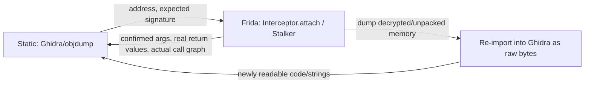

# Static-Dynamic-Integration

## In short

Every previous chapter used static ARM64 analysis ([[ARM64-Android]]) to *aim* a Frida hook. This chapter is about the traffic going the other way: using Frida to pull data **out of a live process** — a decrypted buffer, an unpacked library, a resolved indirect-call target — and feed it back into a disassembler for further static work, closing the loop between the two techniques instead of only ever going static → dynamic.

## Explanation

### The loop, as a whole



Neither side is "the real analysis" — static analysis without ground truth is a pile of untested hypotheses (see [[Reading-Raw-Disassembly]]'s whole premise), and dynamic instrumentation without static analysis is poking at addresses with no idea what they mean. The workflow below is this loop made concrete.

### Turning a static offset into a live hook, and back

This direction is already covered in [[Native-Memory-And-ARM64]]: `Module.findBaseAddress(name).add(staticOffset)`. The part worth adding here is the *feedback* half — once a hook confirms what a function actually does (its real argument values, its real return value across several calls), that's exactly the annotation that belongs back in Ghidra: rename the function, add a comment with an observed sample input/output pair, retype a parameter you now know is really a `char*` and not a raw `int`. Static analysis benefits permanently from a fact dynamic analysis only had to establish once.

### Dumping in-memory code/data that doesn't exist on disk

The single highest-value integration technique: some code or data genuinely does not exist anywhere in the on-disk APK/`.so` in a form a disassembler can read — a packer that decrypts a real `.so` into memory at runtime, a JIT-compiled method, or (per [[Flutter-Dart-AOT]]) a Dart AOT snapshot whose object pool entries are only ever materialized as live objects. Frida can dump the **live, already-decrypted/already-materialized** memory region straight to a file, which Ghidra can then load as a raw binary at the correct base address — turning something statically unreadable into something statically readable:

```javascript
// dump-module.js — run once the target region is confirmed live/decrypted
function dumpRegion(moduleName, outputTag) {
    const mod = Process.findModuleByName(moduleName);
    if (mod === null) {
        console.log(`[!] ${moduleName} not loaded yet`);
        return;
    }
    const bytes = Memory.readByteArray(mod.base, mod.size);
    send({ type: "dump", module: moduleName, base: mod.base.toString(), tag: outputTag }, bytes);
    console.log(`[*] Dumped ${moduleName} (${mod.size} bytes) from base ${mod.base}`);
}

rpc.exports = {
    dump(moduleName, tag) { dumpRegion(moduleName, tag); }
};
```

The host side (Python, via `frida.core.Session.get_script().on("message", ...)`) writes the `data` bytes it receives to a file. That file, loaded into Ghidra with **"Load as raw binary"** at the base address printed above, is now a statically-analyzable image of whatever was only ever visible at runtime — including a self-decrypting packer's true payload, or a partially-JIT'd region.

### Resolving indirect calls Ghidra can't follow

Vtable dispatch, Dart AOT's global dispatch table, and any function-pointer-table pattern all produce a disassembly where the actual call target is a runtime value Ghidra has no way to compute statically — it just shows `blr x8` with no destination. `Stalker`'s `call` events (see [[Stalker-And-Code-Tracing]]) resolve this for free: run the flow once, read the concrete `to` address out of the trace, and now you have a real function to open in Ghidra where before there was only an opaque indirect branch.

### Reading strings that a decompiler can't reconstruct

This is the [[Native-Memory-And-ARM64]] technique, restated as part of the loop rather than in isolation: a decompiler shows you the *decrypt/build routine*, but not its output, since the output never existed as a static constant. Hooking the point right after that routine runs and reading the result with `Memory.readUtf8String`/`Memory.readCString` is the fastest way to get the plaintext — faster than manually simulating whatever transform the routine performs, and immune to mistakes in that manual simulation.

## Worked example

A three-step loop against a hypothetical packed native library: confirm a suspected unpacking routine actually runs, dump the now-decrypted `.text` region, and reopen it in Ghidra.

```javascript
// Step 1 — confirm the suspected unpack routine (found via strings/symbols in Ghidra) actually executes
const unpackFn = Module.findExportByName("libprotected.so", "JNI_OnLoad");
Interceptor.attach(unpackFn, {
    onLeave() {
        console.log("[*] JNI_OnLoad returned — library should be unpacked in memory now");

        // Step 2 — dump the now-decrypted module
        const mod = Process.findModuleByName("libprotected.so");
        const bytes = Memory.readByteArray(mod.base, mod.size);
        send({ type: "dump", base: mod.base.toString() }, bytes);
    }
});
```

```python
# host.py — receives the dump and writes it to disk for Ghidra
def on_message(message, data):
    if message["type"] == "send" and message["payload"].get("type") == "dump":
        with open("libprotected.unpacked.bin", "wb") as f:
            f.write(data)
        print(f"[*] Wrote unpacked dump, load into Ghidra at base {message['payload']['base']}")
```

## More examples

- [[Frida-JS-API-Cheatsheet]] in [[Frida-Dynamic-Instrumentation-Cheatsheets|Cheatsheets]].

## See also

- [[Native-Memory-And-ARM64]]
- [[Stalker-And-Code-Tracing]]
- [[Reading-Raw-Disassembly]] in [[ARM64-Android]] — the static-reading discipline this chapter's dumps and confirmations feed back into.
- [[Objdump-And-Readelf]] and [[Ghidra]] in [[ARM64-Android-Tools|ARM64-Android's Tools]] — where a dumped region actually gets opened.

## References

- [[Frida-Dynamic-Instrumentation-Bibliography|Bibliography]]

## Flashcards
#flashcards

Why is dumping a live memory region sometimes the only way to get code into a disassembler at all?::Some code (a packer's decrypted payload, a JIT-compiled method, a Dart AOT object pool entry) never exists in that readable form anywhere in the on-disk file — it's only ever materialized in memory at runtime, so a static read of the file misses it entirely; dumping the live region is the only way to capture it.

How does Stalker help with an indirect call a disassembler shows as `blr x8` with no resolvable target?::Stalker's `call` events record the actual runtime destination address every time the indirect branch executes, turning an opaque "call through a register" into a concrete function address you can open directly in the disassembler.

What's the "feedback" half of the static/dynamic loop, concretely?::Taking something confirmed at runtime — a function's real argument values, its real return value, a resolved indirect-call target, a decrypted memory dump — and writing it back into the static analysis (renaming a function in Ghidra, retyping a parameter, loading a raw dump at the correct base address) so future static reading benefits from it permanently.
